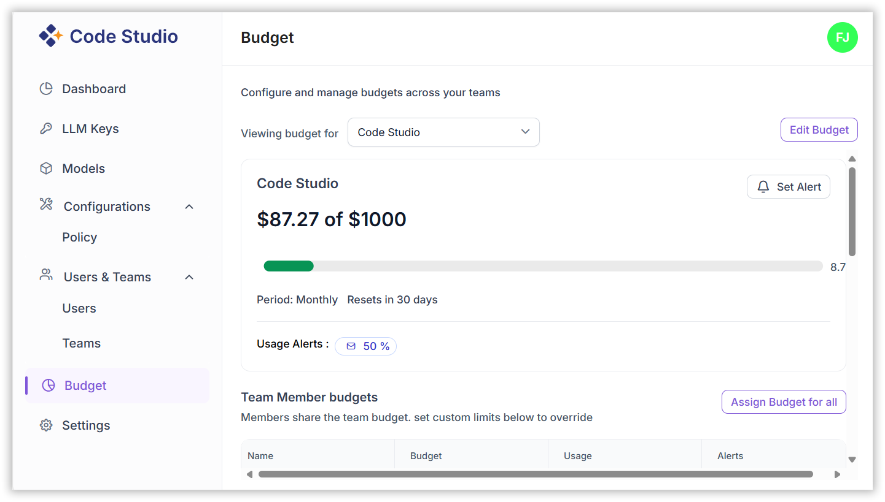
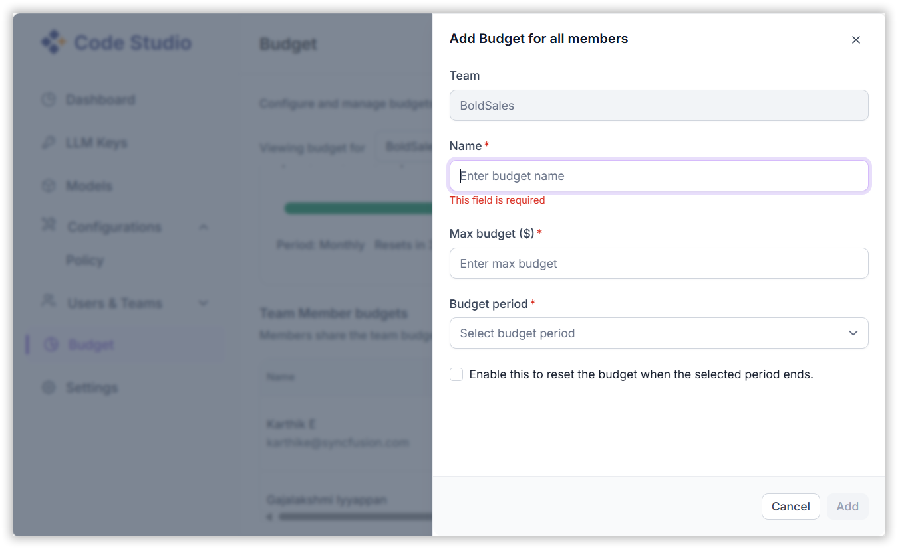

# Create Budget

The Budget feature in Code Studio enables administrators to allocate and monitor AI usage budgets for teams and individual users. This helps organizations manage costs effectively and optimize AI resource utilization.

> **Note**: Only admins and Team Leads can edit and assign budget for all.

## 1. Team Budget Setup

**Steps:**

- Open the **Budget** window.
- Select the desired **Team**.
- Set the **Maximum Budget** for the team.
- Choose the **Budget Period**:
  - Monthly
  - Quarterly
  - Half-Yearly
  - Annually
- (Optional) Enable **Auto-Renewal** by checking the box. This will automatically reset the budget at the end of each period.

## 2. Individual User Budget Allocation

**Steps:**

- Within the selected team, give the user’s name to edit budget limit.
- For each user:
  - Set the **Maximum Budget**.
  - Define the **Budget Period**.
- Monitor usage and adjust as needed.

## Usage Alerts

Administrators can set up alerts to notify when budget usage exceeds a defined threshold.

**Steps:**

- Open the **Edit usage Alert**.
- Set the **Usage Threshold** (e.g., 50%).
- Enter the **Email Subject Prefix** (required).
- Specify the **Recipients** for the alert (e.g., team leads or finance managers). An alert email will be sent to the recipient.
- Click **Update** to activate the alert.

🔔 Alerts help proactively manage budget overruns and ensure timely action.

