# Create Budget

The Budget feature in Code Studio enables administrators to allocate and monitor AI usage budgets for teams and individual users. This helps organizations manage costs effectively and optimize AI resource utilization.

> **Note**: Only admins can edit and assign budget for all.

## 1. Team Budget Setup

**Steps:**

- Open the **Code Studio** page and navigate to the **Budget** page from the left sidebar.

   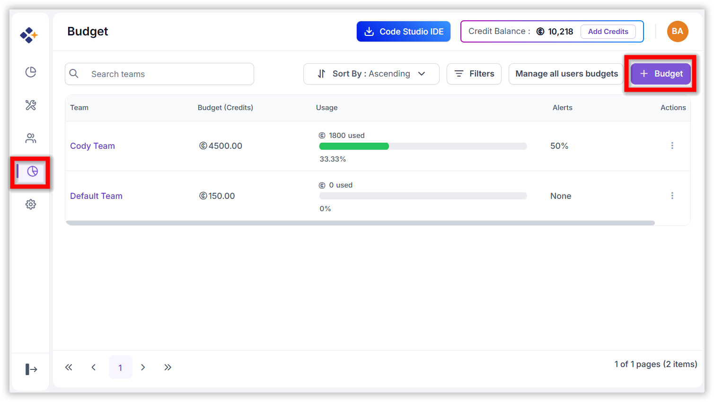

- Click the **“Budget”** button on the top right of the page.
- Open the **Add Budget** dialog box.

   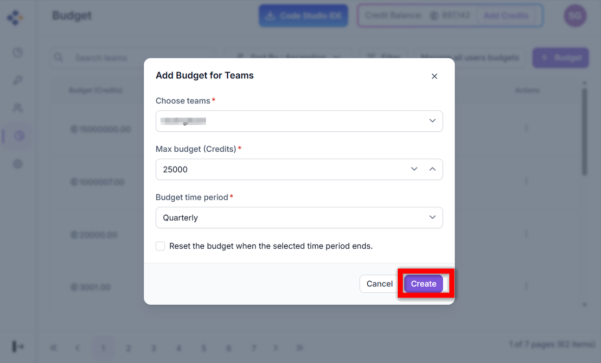

- Choose the desired **Team** in the team selection field.
- Set the **Maximum Budget** for the team.
- Choose the **Budget Period**:
  - Monthly
  - Quarterly
  - Half-Yearly
  - Annually
- (Optional) Enable **Auto-Renewal** and set the **Reset amount**. This will automatically reset the budget at the end of each period.
- Click the **“Create”** button to add the team budget.

## 2. Individual User Budget Allocation

**Steps:**

- Click **“Manage All users budgets”** on the top right of the page.

   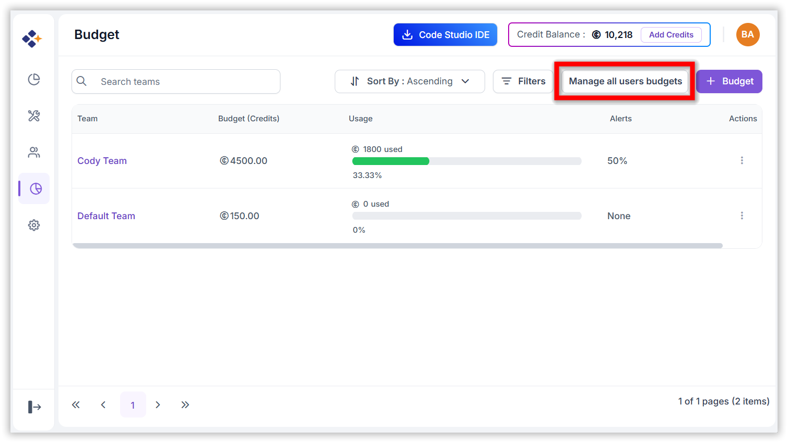

- All users are listed in the table.
- For a user, open the **Context Menu** and click **“Add Budget”**.

   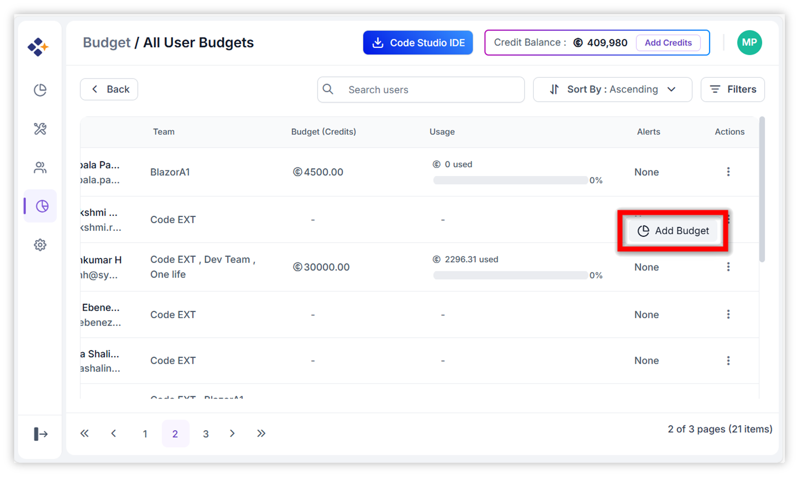

- Now the **Budget Dialog Box** will be open:
  - Set the **Maximum Budget**.
  - Choose the **Budget Period**.
- Click the **“Add”** button to assign the budget to the user.

   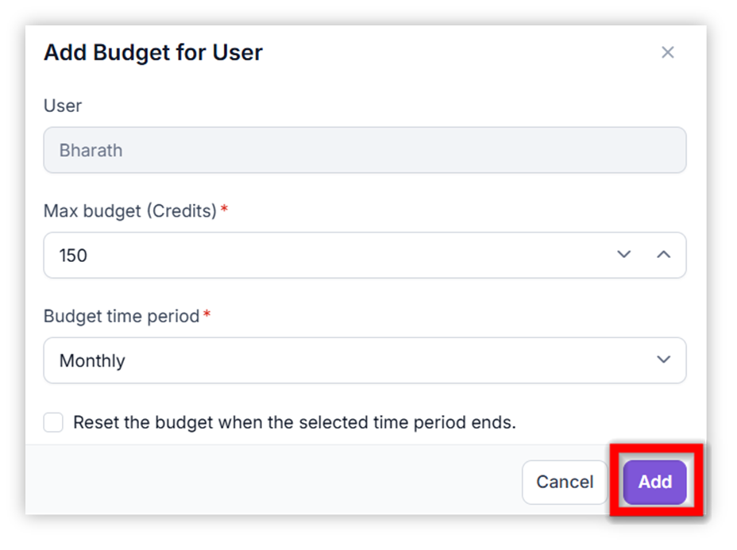

## 3. Team Members Budget Setup

**Steps:**

- Click on the desired **Team** to go to its details page.

   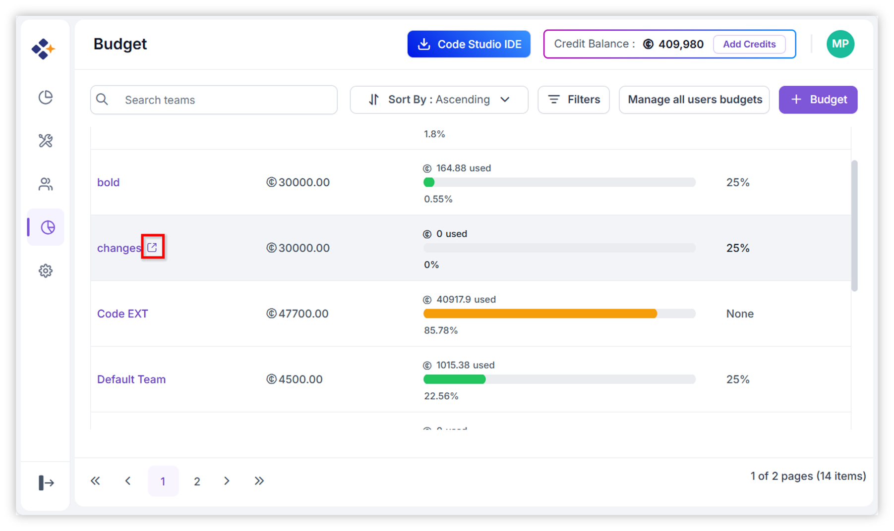

- The selected team members are listed in the grid.
- Open the **Context Menu** and click **“Add Budget”**.
- Now the **Budget Dialog Box** will be open:
  - Set the **Maximum Budget**.
  - Choose the **Budget Period**.
- Click the **“Add”** button to assign the budget to the team member.

   

## 4. Bulk Budget Setup for Users

**Steps:**

- Select multiple users by clicking the checkboxes in the users grid table.

   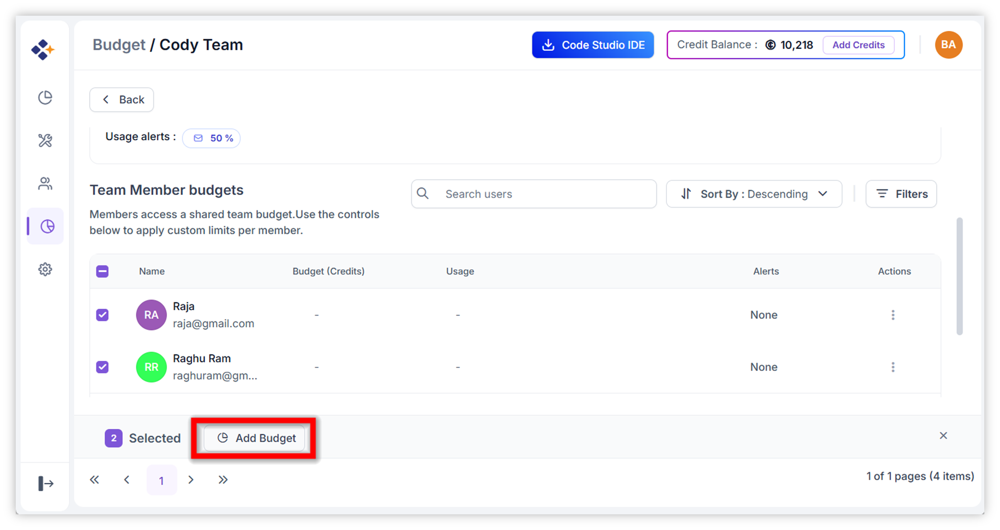

- Click **“Add Budget”** (appears after selecting users).
- In the **Bulk Budget** dialog box:
  - Set the **Maximum Budget**.
  - Choose the **Budget Period**.
- Click the **“Add”** button to assign budgets to all selected users.

   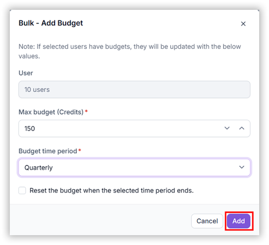

> **Note**: If selected users already have budgets, they will be **updated** with the new values.

## 5. Edit Budget

**Steps:**

- Click **“Edit Budget”** from the context menu of a team or user.
- Modify the **Maximum Budget**, **Budget Period**, or **Reset amount** (if applicable).
- Click **Update** to save the changes.

   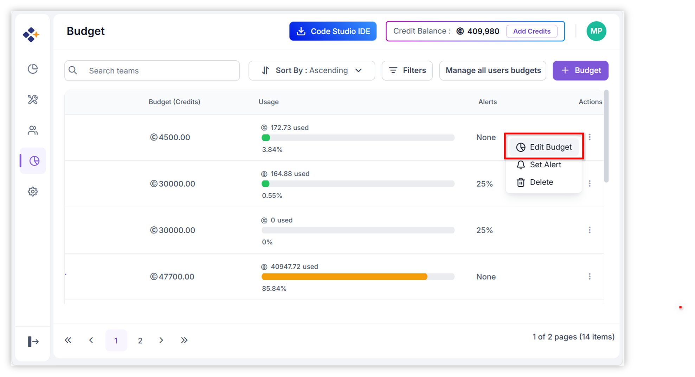

## 6. Delete Budget

### 6.1 Delete Team Budget

**Steps:**

- Click **“Delete”** in the context menu.
- In the **Delete Dialog Box**, click **“Delete”** to confirm.

   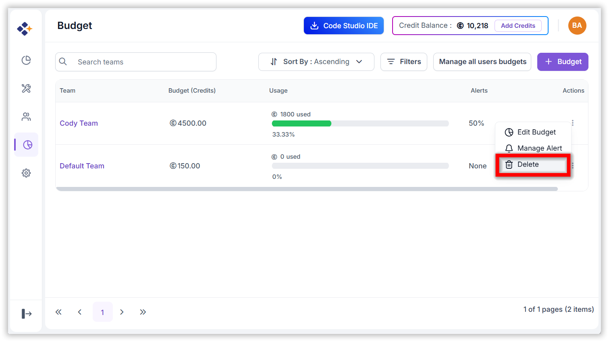

### 6.2 Delete User Budget

**Steps:**

- Click **“Edit Budget”** from the user’s context menu.
- In the **Edit Budget** dialog, click **“Delete”**.
- In the **Delete Dialog Box**, click **“Delete”** to confirm.

   

## 7. Usage Alerts

Administrators can set up alerts for a team or a specific user to notify us when budget usage exceeds a defined threshold.

**Steps:**

- Click **“Set Alert”** from the context menu to open the Alert dialog box.  
  *(If an alert is already set, click **“Manage Alert”** instead.)*

   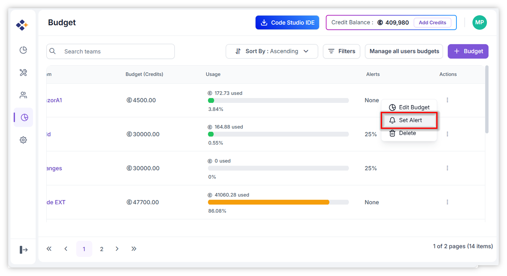

- Set the **Usage Threshold** (e.g., 50%).
- Enter the **Email Subject** (required).
- Specify the **Recipients** for the alert (e.g., team lead or manager). An alert email will be sent to these recipients.
- Click **Set** to activate the alert.

   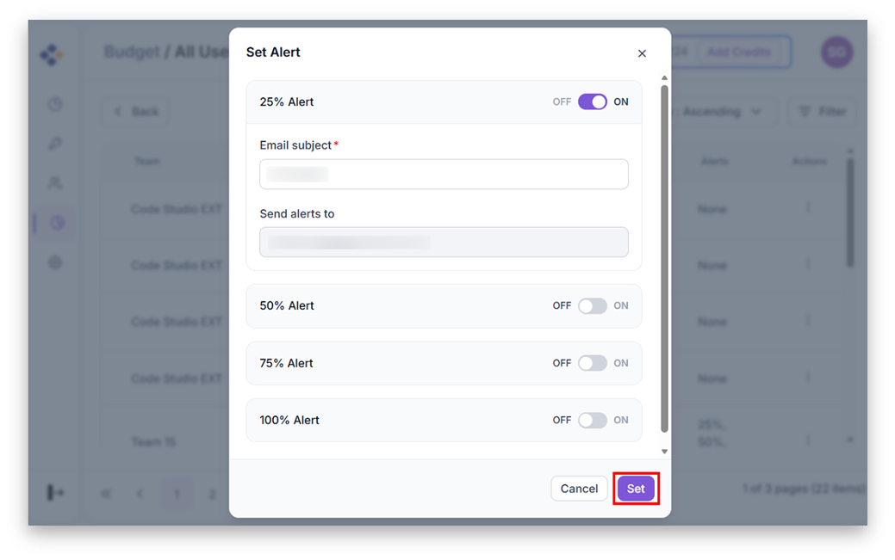

   🔔 Alerts help proactively manage budget overruns and ensure timely action.

