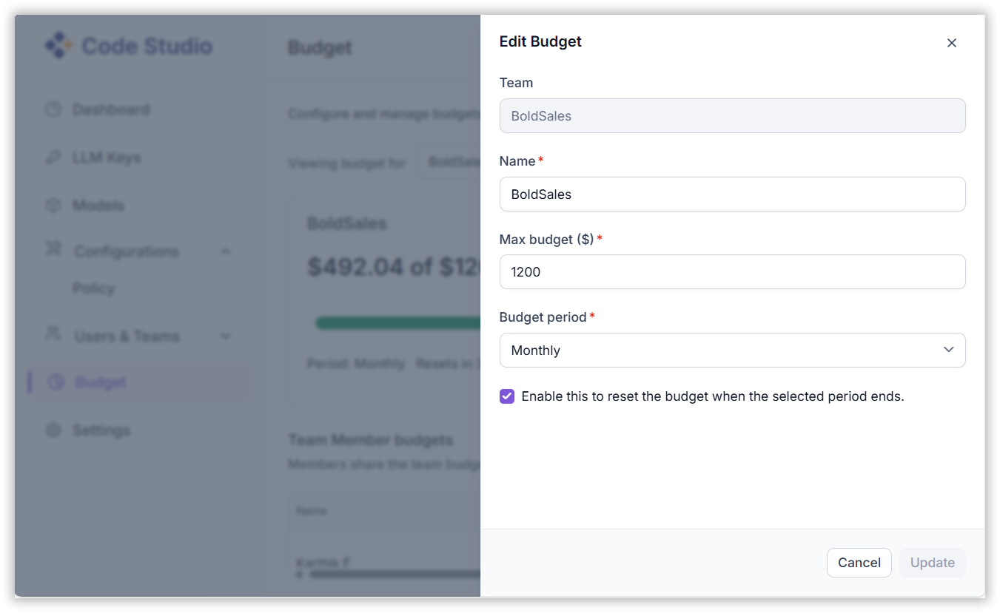
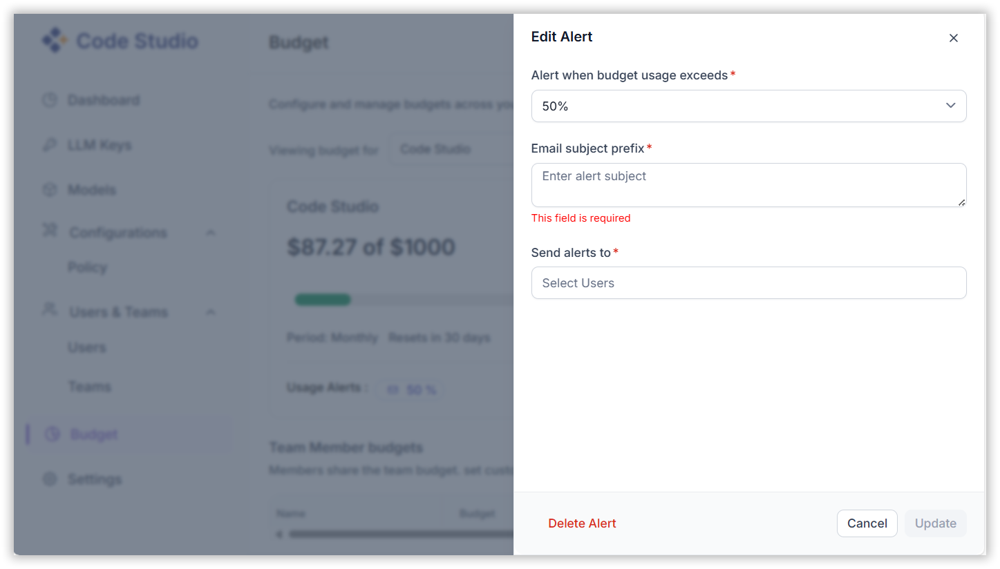

## Budget

The **Budget** feature in Code Studio enables administrators to allocate and monitor AI usage budgets for teams and individual users. This helps organizations manage costs effectively and optimize AI resource utilization.

---

### When to Use

- Allocate AI usage budgets to teams or individual users.
- Control spending on Premium and BYOK models.
- Prevent overspending with auto-renewal and usage alerts.
- Track and optimize credit consumption across your organization.

---

### Feature Overview

<table>
  <thead>
    <tr>
      <th>Feature</th>
      <th>Purpose</th>
      <th>Key Actions</th>
    </tr>
  </thead>
  <tbody>
    <tr>
      <td><strong>Team Budget Setup</strong></td>
      <td>Allocate budget for a team</td>
      <td>Select Team → Set Maximum Budget → Choose Period (Monthly/Quarterly/Half-Yearly/Annually) → Enable Auto-Renewal (optional)</td>
    </tr>
    <tr>
      <td><strong>User Budget</strong></td>
      <td>Assign budget to individual users</td>
      <td>Select Team → Choose User → Set Budget Limit → Define Period → Monitor Usage</td>
    </tr>
    <tr>
      <td><strong>Usage Alerts</strong></td>
      <td>Notify when usage exceeds threshold</td>
      <td>Set Threshold (%) → Add Email Subject Prefix → Specify Recipients → Click Update</td>
    </tr>
  </tbody>
</table>

> **Note:** Only Admins and Team Leads can edit and assign budgets.

### Prerequisites

- Administrator or Team Lead role.
- Active teams and users in Code Studio.
- Billing card on file (credits are deducted from usage).
- Understanding of credit conversion: **1 USD = 150 credits**

### Steps

#### Step 1: Team Budget Setup

1. Open the **Budget** window.
2. Select the desired **Team**.
3. Set the **Maximum Budget** for the team.

We have calculated the total budget in credits, based on the combined costs of the Premium Model and the BYOK (Bring Your Own Key) Model. The conversion rate used is 1 USD = 150 credits. 

**Budget Summary Example:**

- **Total Budget Allocated**: 4,500 credits

**1. BYOK Model**
- Dollar Amount: \$23  
- Conversion Rate: 1 USD = 150 credits  
- Total BYOK Cost: 23 × 150 = **3,450 credits**

**2. Premium Model**
- Dollar Amount: \$7  
- Total Premium Cost: **1,050 credits**

**Combined Total Cost**:  
**3,450 (BYOK) + 1,050 (Premium) = 4,500 credits**

4. Choose the **Budget Period**:
   - Monthly
   - Quarterly
   - Half-Yearly
   - Annually

5. *(Optional)* Enable **Auto-Renewal** to reset the budget at the end of each period.

#### Step 2: Individual User Budget Allocation

1. Within the selected team, choose the user to edit their budget.
2. Set the **Maximum Budget**.
3. Define the **Budget Period**.
4. Monitor usage and adjust as needed.

#### Step 3: Usage Alerts

Admins can set up alerts to notify when budget usage exceeds a defined threshold.

1. Open **Edit Usage Alert**.
2. Set the **Usage Threshold** (e.g., 50%).
3. Enter the **Email Subject Prefix**.
4. Specify the **Recipients** (e.g., team leads or managers).
5. Click **Update** to activate the alert.

> 🔔 **Alerts help proactively manage budget overruns and ensure timely action.**

### Validation

- **Team Budget**: Appears in Budget Overview with correct total, period, and auto-renew status.
- **User Budget**: Displays under team with per-user cap and usage bar.
- **Credit Math**:
  - \$1 = 150 credits
  - 4,500 credits = ~$30 total spend allowed
- **Auto-Renew**: Budget resets at the end of the selected period (e.g., monthly).

### Troubleshooting

- **Budget not saving**  
  → Entered non-numeric value or missing period  
  → *Fix*: Use numbers only; select a period

- **Team not in dropdown**  
  → Team not created or you lack access  
  → *Fix*: Create team in **Users & Teams**; check your role

- **Usage not deducting from budget**  
  → BYOK model not tracked or credits disabled  
  → *Fix*: Ensure BYOK key is active; check **Billing** tab

- **No alert email received**  
  → Threshold too high or recipients misspelled  
  → *Fix*: Lower to 50% for testing; verify email addresses

- **Auto-renewal not resetting**  
  → Feature disabled or period misaligned  
  → *Fix*: Re-enable toggle; wait until exact period boundary (e.g., midnight UTC)

- **User exceeds budget but still works**  
  → Soft limit (warning only) or alert misconfigured  
  → *Fix*: Budgets are flexible — use alerts + manual enforcement

- **Can’t find Budget tab**  
  → You’re not an Admin or Team Lead  
  → *Fix*: Ask Admin to assign the correct role

