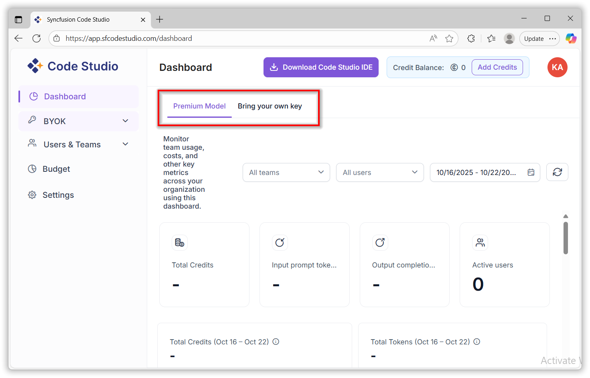

# Dashboard

The **Code Studio Dashboard** provides a centralized interface for monitoring and analyzing usage metrics across your organization. It enables administrators and team leads to track token consumption, request volumes, latency, and cost metrics—both at the organizational and individual levels.

## When to Use

- Track token usage, costs, requests, and response times across your organization, teams, or individual users.
- Generate reports for budgeting, performance reviews, or monthly trend analysis.
- Identify top users or models to optimize spending and resource allocation.
- Spot performance issues using latency trends or detect unusual activity.

**Who can use it?**  
Administrators and Team Leads (Users have limited view).

## Prerequisites

- Active Code Studio account.
- Administrator or Team Lead role for full access.
- At least one model active in Premium or BYOK (Bring Your Own Keys) mode.
- Modern browser (Chrome, Firefox, Edge).

## Steps

### 1: Navigate to the Dashboard

- Go to **Dashboard**
- Select tab: **Premium** or **BYOK**

### 2: Check Summary Cards

View key stats at the top:

- **Total Cost** – Money spent in the selected period
- **Input Prompt Tokens** – Tokens used in your prompts
- **Output Completion Tokens** – Tokens in model responses
- **Active Users** – Number of users who made requests

### 3. Explore the charts

The dashboard presents a visual summary of the following metrics:

- **Total Cost**: Cumulative cost incurred by the organization, team or individual user.

- **Total Tokens**: Total number of tokens consumed.

- **Total Requests**: Number of API or model requests made.

- **Average Latency**: Mean response time across all requests.

- **Top 5 Users by Token Usage**: Identifies the most active users.

- **Top 5 Models by Token Usage**: Highlights the most utilized models.

- **Individual User Metrics**: Detailed usage statistics per user.

## 4. Team & User Monitoring

You can monitor:

- **Organization-wide usage**: Aggregated data across all teams.
- **Team-specific usage**: Filter data by individual teams.
- **User-specific usage**: Drill down into individual user activity.

## 5. Date Range Filtering

- Select custom date ranges to analyze token usage and other metrics over time.
- Useful for monthly reporting, trend analysis, and budget tracking.

## 6: Analyze Top Usage

- Review the “Top 5 Users” and “Top 5 Models” sections to identify high-usage patterns.
- Use this data to optimize resource allocation or investigate anomalies.

## Validation

- **Summary cards** update when you change filters.
- **Charts** reflect the selected team, user, and date range.
- **User role**: Total Tokens Chart is not visible for regular users.
- **Hover tooltips** show exact numbers and time periods.
- **Grid** matches applied filters (e.g., only selected team’s data).

## Troubleshooting

- **Dashboard is blank or says “No data”**  
  → No activity in the selected date range or wrong tab  
  → **Fix**: Pick a busier date or switch between **Premium** and **BYOK**

- **Charts don’t update after filtering**  
  → Browser cache or slow connection  
  → **Fix**: Press `Ctrl + Shift + R` (hard refresh)

- **Total Tokens Chart is missing**  
  → You’re logged in as a regular User  
  → **Fix**: Use an **Admin** or **Team Lead** account

- **Top 5 Users or Models list is empty**  
  → Fewer than 5 active in the time period  
  → **Fix**: Widen the date range or wait for more usage

- **Latency shows “N/A”**  
  → No requests in the selected time  
  → **Fix**: Choose a period with activity

- **Grid shows wrong users or teams**  
  → Filter didn’t apply fully  
  → **Fix**: Re-select **Team** or **User**, wait a few seconds

- **Cost shows \$0.00 even with usage**  
  → Using **BYOK** mode (you manage billing)  
  → **Fix**: Cost tracking only works in **Premium** mode
