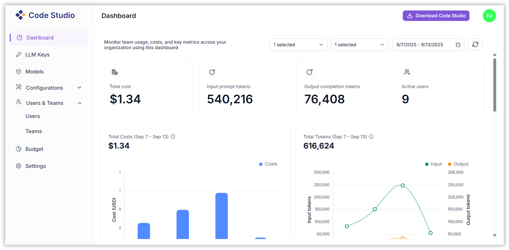

# Dashboard

The Code Studios Dashboard provides a centralized interface for monitoring and analyzing usage metrics across your organization. It enables administrators and team leads to track token consumption, request volumes, latency, and cost metrics, both at the organizational and individual levels.

## 1. Graphical Overview

The dashboard presents a visual summary of the following metrics:

- **Total Credits**: Total Credits accumulated by the organization, team, or individual user.

- **Total Tokens**: Total number of tokens consumed.

- **Total Requests**: Number of API or model requests made.

- **Average Latency**: Mean response time across all requests.

- **Top 5 Users by Token Usage**: Identifies the most active users.

- **Top 5 Models by Token Usage**: Highlights the most utilized models.

- **Individual User Metrics**: Detailed usage statistics per user.

## 2. Team & User Monitoring

You can monitor:

- **Organization-wide usage**: Aggregated data across all teams.
- **Team-specific usage**: Filter data by individual teams.
- **User-specific usage**: Drill down into individual user activity.

## 3. Date Range Filtering

- Select custom date ranges to analyze token usage and other metrics over time.
- Useful for monthly reporting, trend analysis, and budget tracking.

## 4. How to Use the Dashboard?

### Step 1: Navigate to the Dashboard

- Go to [Dashboard](https://app.sfcodestudio.com/dashboard)

### Step 2: Review Summary Metrics

- Separate graphical widgets for premium model and BYOK model.
- Observe the graphical widgets displaying cost, tokens, requests, and latency.
- Hover over charts for detailed tooltips and breakdowns.

### Step 3: Filter by Team or User

- Use the filter options to select:
  - All Teams
  - Specific Team
  - Individual User
  -	Multiple Users
-	The dashboard will refresh to show metrics for the selected filter.

### Step 4: Set Date Range

- Click the date selector to choose a start and end date.
- The dashboard will refresh to show metrics for the selected period.

### Step 5: Analyze Top Usage

- Review the “Top 5 Users” and “Top 5 Models” sections to identify high-usage patterns.
- Use this data to optimize resource allocation or investigate anomalies.

## 5. Best Practices

- **Regular Monitoring**: Check the dashboard weekly to stay on top of usage trends.
- **Budget Control**: Use cost and token data to manage spending.
- **Performance Optimization**: Track latency to identify performance bottlenecks.
- **User Accountability**: Monitor individual usage to ensure fair and efficient use of resources.
