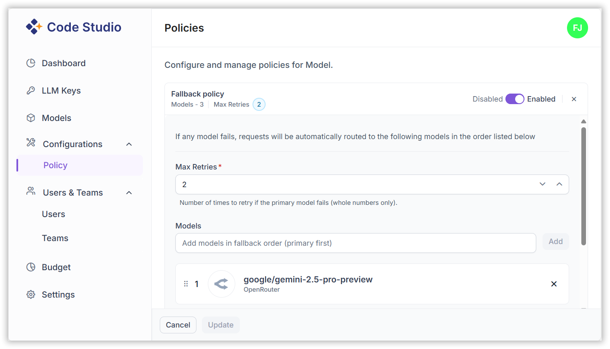

# Fallback Policy Configuration

Fallback Policies in Code Studio ensure uninterrupted AI workflows by automatically rerouting requests to alternative models when the primary model fails. This feature improves reliability, success rates, and cost efficiency.

## Prerequisites

1. You must be an **Admin**
    - Only admins are authorized to create and manage fallback policies.
2.  **Bring Your Own Key (BYOK)** must be configured
    - A valid API key from a supported AI provider should be configured.
    - Learn how to configure BYOK, see [BYOK configuration](/code-studio/enterprise-server/providersandmodels)

## 1. How Fallback Works ?

1. The request is first sent to the primary model. 
2. If the request fails (due to timeout, error, etc.), the system automatically retries using the next model in the fallback list.  
3. This process continues until a model successfully returns a result or the retry limit is reached.

✅ **Benefits**:
- Prevents stalled workflows  
- Increases success rates  
- Reduces costs by only paying for successful responses  

## 2. Configuring Fallback Policies

**Steps**:

1. Hover over the **Key** icon in the left sidebar and select the **Fallback Policy** from the menu.  

2. Turn on the **Fallback Policy** toggle to enable this feature. 

3. Click the pencil icon to edit your fallback options, including Max retries and the list of models.

4. Add models in the desired Fallback Order:

   - Select models from available providers.  
   - Arrange them in priority order.
     
  

5. If you want to remove a model, just click the **Close** icon next to it.

6. Click **Update** to save the configuration.

> **Note**: You can edit the model list and reorder them anytime to optimize fallback behavior for BYOK models.

## 3. Best Practices

- Choose models with varied capabilities and reliability to ensure coverage.  
- Limit retries to avoid unnecessary costs.  
- Regularly review fallback performance and adjust model order accordingly.
