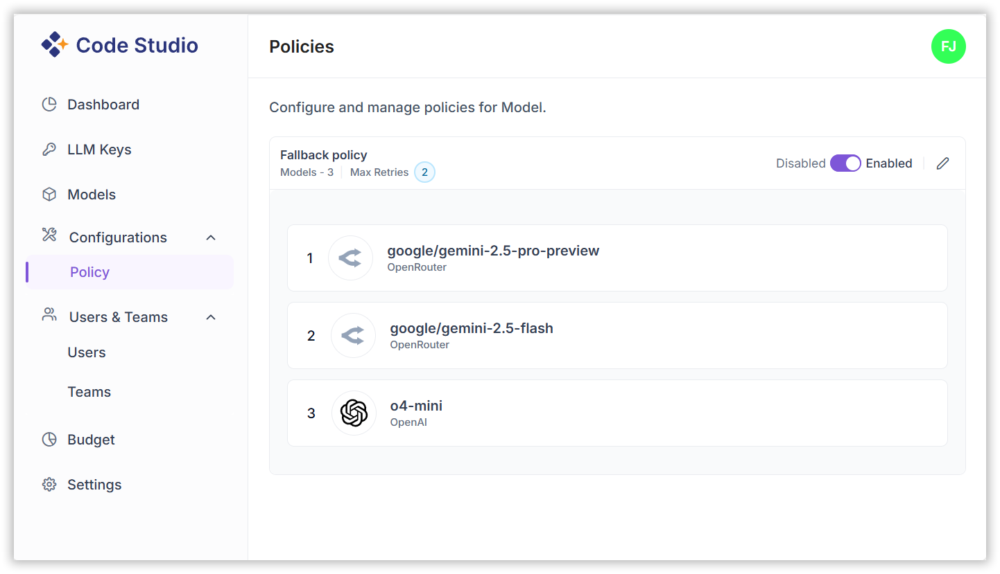

# Fallback Policy Configuration

Fallback Policies in Code Studio ensure uninterrupted AI workflows by automatically rerouting requests to alternative models when the primary model fails. This feature improves reliability, success rates, and cost efficiency.

> **Note**: Only admins can Configure and manage policies for Model.

## 1. How Fallback Works

1. A request is sent to the primary model.  
2. If the request fails (due to timeout, error, etc.), the system automatically retries using the next model in the fallback list.  
3. This process continues until a model successfully returns a result or the retry limit is reached.

✅ **Benefits**:
- Prevents stalled workflows  
- Increases success rates  
- Reduces costs by only paying for successful responses  

## 2. Configuring Fallback Policies

**Steps**:

1. Go to the fallback Policies page under the BYOK section.  

2. Enable the Fallback Policy toggle.  
3. Click on edit and set the Maximum Number of Retries.  
4. Add models in the desired Fallback Order:
   - Select models from available providers.  
   - Arrange them in priority order.  

> **Note**: You can edit the model list and reorder them anytime to optimize fallback behavior for BYOK models.

## 3. Best Practices

- Choose models with varied capabilities and reliability to ensure coverage.  
- Limit retries to avoid unnecessary costs.  
- Regularly review fallback performance and adjust model order accordingly.
