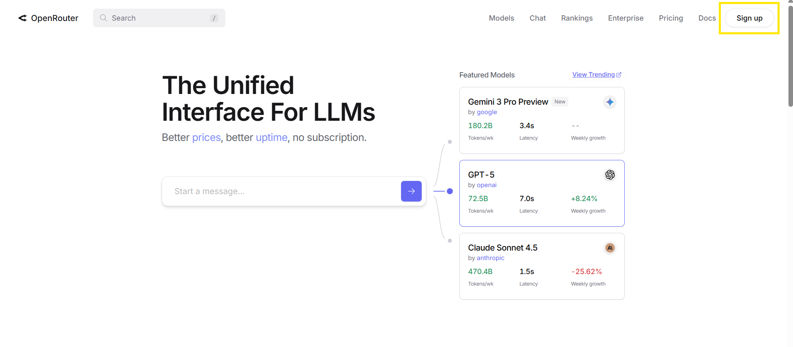
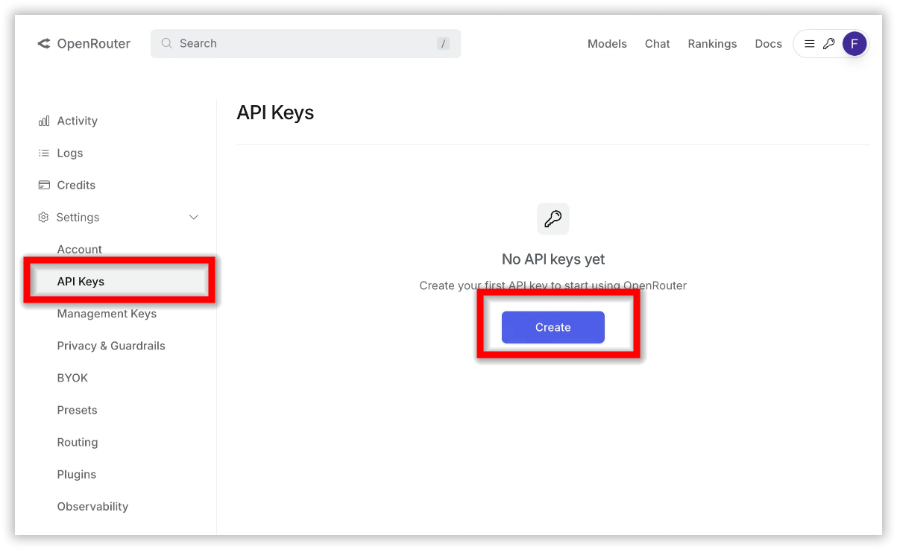
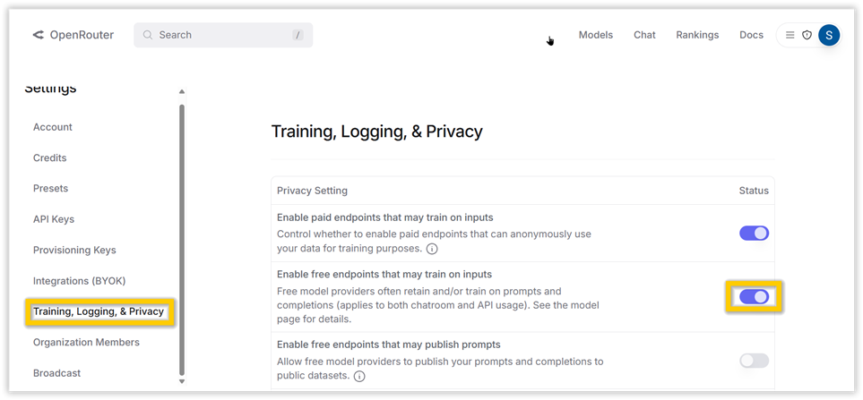

# Use OpenRouter Free Models in Syncfusion Code Studio
 
## Why this Matters
AI model costs can add up quickly during development. This guide shows you how to use Code Studio effectively while minimizing or eliminating costs through free models.
 
## When to use
- You need instant access for coding models with no token limits.
- You're experimenting with agent workflows, tool calling, or repository-scale reasoning.
- You want a no-cost setup for quick iterations before moving to paid providers.
 
## Prerequisites
 
### 1. Create a free OpenRouter account.
- Go to [openrouter.ai](https://openrouter.ai/).
- Sign in or create an account.

 
### 2. Create an OpenRouter API key.
- Open your API Keys page.
- Click →Create a new key.
- Copy the key.

 
## OpenRouter Free Tier Models
 
OpenRouter's free tier unlocks powerful, hosted models that are free (with fair usage limits to keep things sustainable). It's perfect for testing and prototyping without cost. You can easily connect the free models to Code Studio by following this [Configuration steps](/code-studio/enterprise-server/providersandmodels).
 
 
**Note:** These free models generally deliver about 60% proper results, so use them for prototyping and non-sensitive tasks rather than production.
 
## Privacy Settings for Free Endpoints
 
Some OpenRouter free endpoints require enabling a privacy setting that allows training on inputs.
 
In your OpenRouter account,
1. Open the settings.
2. Click → Privacy & Guardrails.
3. Toggle → "Enable free endpoints that may train on inputs".

 
**Guidelines for Safe Usage**
- Enabling this may allow OpenRouter or the model provider to train your prompts/outputs.
- Do not submit sensitive or proprietary data when using these endpoints.
- If you cannot enable this setting for compliance reasons, choose a model that does not require it or use a paid/private endpoint.