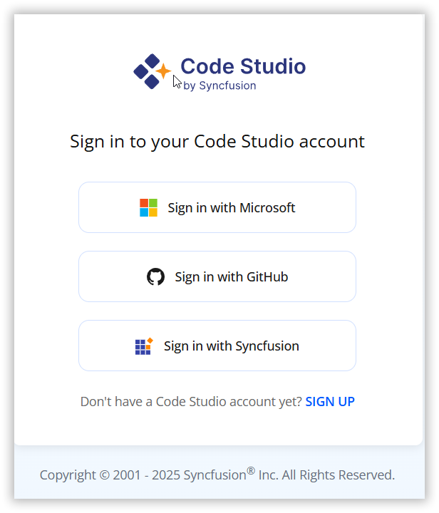
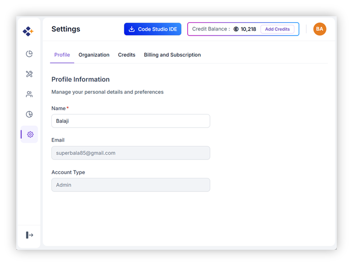
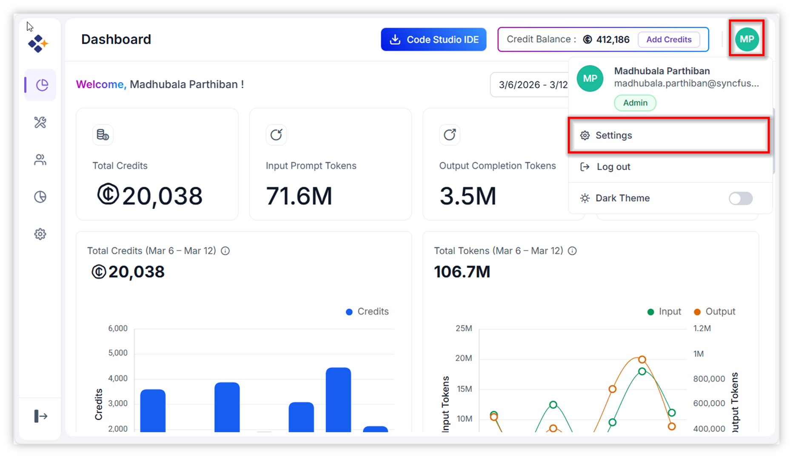

# Getting Started

## Start using Code Studio

### 1. Create and Access Your Account

To start using Code Studio, visit:  
🔗 https://app.sfcodestudio.com

**Sign-In Options**  
You can sign in using one of the following methods:

- **Microsoft Account**: Use your personal, work, or school Microsoft credentials.  
- **GitHub Account**: Sign in with your GitHub credentials.  
- **Syncfusion Account**: Use your existing Syncfusion login.

> **Note**: If you don’t have an account, click “SIGN UP” to create one.

### 2. Accessing the Dashboard

Once signed in:

- You’ll be directed to the Dashboard.  
- Click on your **Profile Icon** to access:
  - **Settings**
  - **Download Code Studio**
- From the profile menu, click **Download Code Studio** to get the setup file.

### 3. Managing Settings

Click on **Settings** to:

- Update your **Profile Information**  
- Configure your **Organization Settings**

