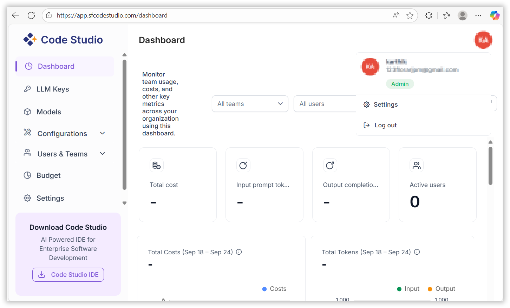

# Getting Started with Code Studio

## When to Use

Use **Code Studio** when you need a cloud-based IDE to write, run, debug, and deploy code with built-in AI assistance, team collaboration, and pay-as-you-go LLM billing—perfect for single users, startups, or enterprises that want VS Code in the browser without managing servers.

## Prerequisites

- A modern browser:
  - Chrome
  - Edge
  - Firefox
  - Safari  
  *(Latest two versions recommended)*

- Internet connection:
  - ≥ 10 Mbps recommended

- One of the following accounts:
  - Microsoft account (personal, work, or school)
  - GitHub account
  - Existing Syncfusion account

- *(Optional)* Credit card for AI usage beyond the free tier.

Start using Code Studio

### 1. Create and Access Your Account

To start using Code Studio, visit: [Syncfusion Code Studio](https://www.syncfusion.com/code-studio/).
- Explore the platform’s features and capabilities, then click the "Get Started Now" button to launch your coding experience.

**Sign-In Options**  
You can sign in using one of the following methods:

- **Microsoft Account**: Use your personal, work, or school Microsoft credentials.  
- **GitHub Account**: Sign in with your GitHub credentials.  
- **Syncfusion Account**: Use your existing Syncfusion login.

> **Note**: If you don’t have an account, click **“SIGN UP”** to create one.

**Profile Details:** Provide the name you’d like to display on your Code Studio profile.

**Organization Details:** Enter the name of your organization.

Choose your operating system from the available options, then click the **"Download Code Studio"** button to get the application.

### 2. Accessing the Dashboard

Once signed in:

- You’ll be directed to the Dashboard.  
- Click on your **Profile Icon** to access **Settings**
  

### 3. Managing Settings

Click on **Settings** to:

- Update your **Profile Information**  
- Configure your **Organization Settings**

### 4. Validation

You're ready when:

- You see your **name/avatar** in the top-right corner.
- Successful login redirects to the **Dashboard** (URL ends with `/dashboard`).
- Opening **Settings → Profile** displays the data you just saved.

### 5. Troubleshooting

- **Microsoft “Stay signed in?” loop**  
  → Click **No**  
  → Wait **5 seconds**  
  → Refresh the page

- **GitHub “Authorization failed”**  
  → Go to **GitHub → Settings → Applications**  
  → Revoke **“Syncfusion”**  
  → Retry login

- **“No organization found” banner**  
  → Go to **Settings → Organization**  
  → Click **Create Organization**  
  → Refresh the page

- **BYOK / Budgets tabs missing**  
  → Ask your organization **Owner**  
  → Navigate to **Users & Teams**  
  → Request to be promoted to **Owner**