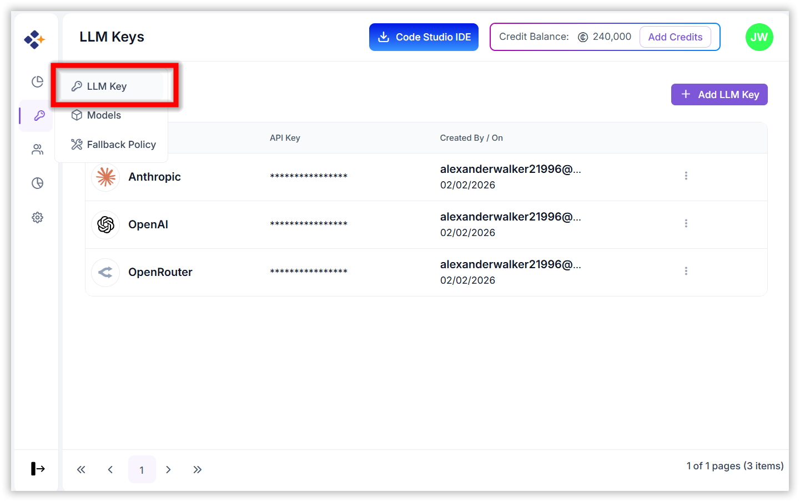
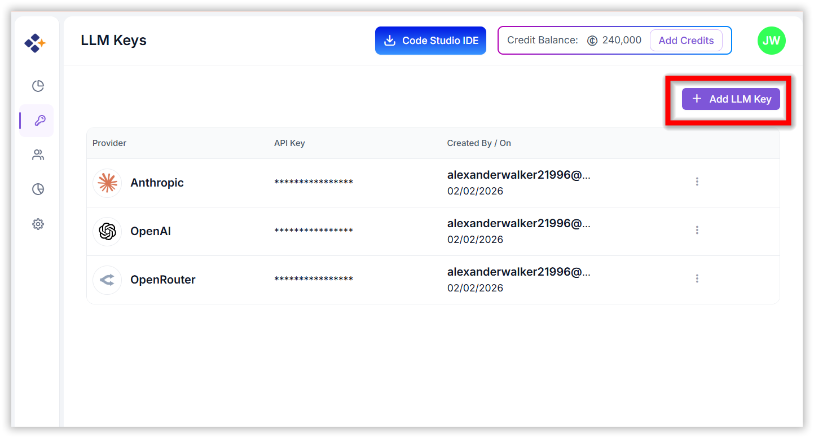
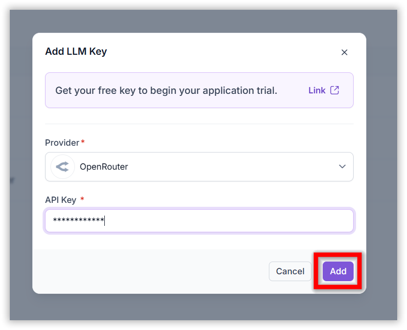
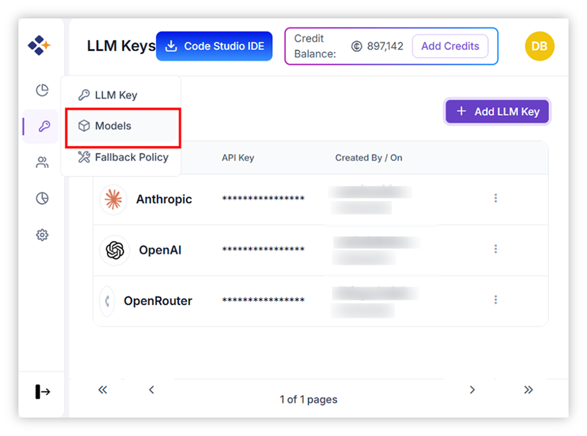
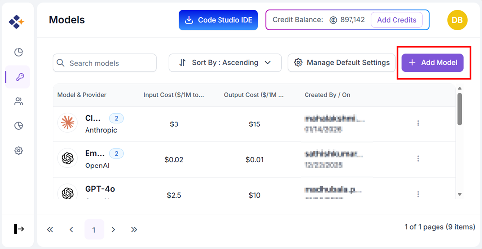
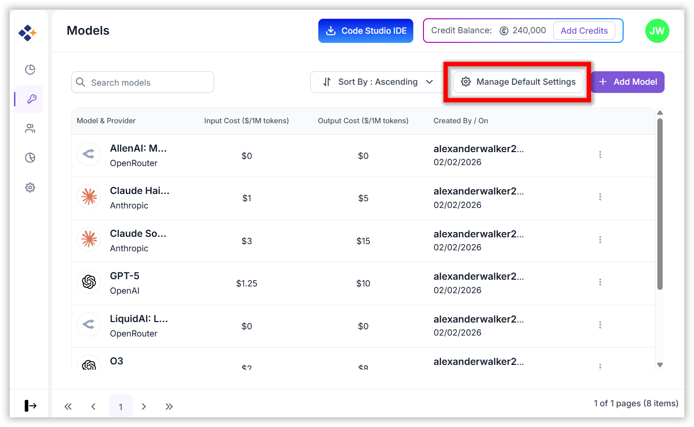
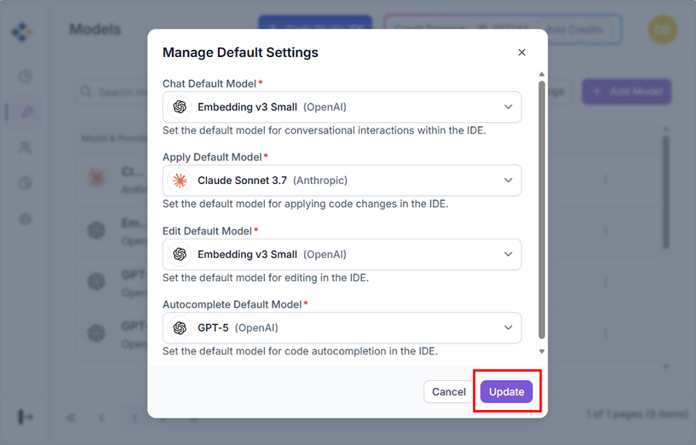

# Configure LLM Providers and Models

This guide provides step-by-step instructions for administrators to configure Large Language Model (LLM) providers and manage models within Code Studio.

> **Note**: Only admins can configure LLM providers and models.

## Prerequisites
- You need an active account on Code Studio
- OpenRouter API Key - Follow the detailed instructions [here](/code-studio/enterprise-server/freemodel) to obtain an OpenRouter API key and the list of recommended free models for integration.

---
## 1. Adding an LLM Provider
To integrate an LLM provider into Code Studio:

### Steps
1. Navigate to the **LLM Keys** page under the **BYOK** section.

   

2. Click **"Add LLM Key"**.

   

3. In the dialog box:
   - **Provider Name:** Enter the name of the LLM provider (e.g., OpenAI, Anthropic).
   - **API Key:** Paste the API key provided by the LLM service.
4. Click **Add** to save the provider.

   

✅ Once added, the provider becomes available for model selection.

---
## 2. Adding BYOK Models
To add a model under a configured provider:

### Steps
1. Go to the **Models** page under the BYOK section.

   

2. Use the search bar to look for a specific model.
3. Click **"Add Model"**.

   

4. In the form:
   - **Provider:** Select from the list of configured providers.
   - **Model:** Choose from the dropdown list of models available under the selected provider. Each model lists its input and output cost.
   - **Modes:** Select one or more modes in which the model should be used. This is a multi-select field.
5. Click **Add** to include the model in your BYOK model list.
6. Click **Manage Default Settings** to customize which AI models are used for IDE functionalities like chat, edit, apply, and autocomplete.

   

7. Select default models for each mode from the dropdown. Click **Update** to save settings.

   
