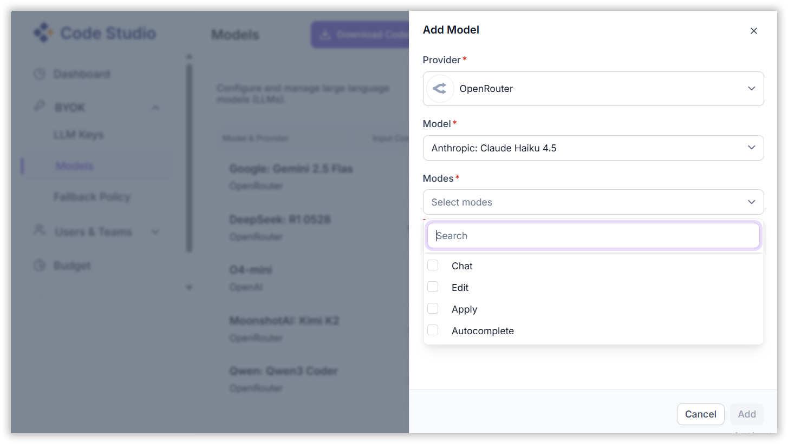

# Configure LLM Providers and Models

This guide provides step-by-step instructions for administrators to configure Large Language Model (LLM) providers and manage models within Code Studio.

> **Note**: Only admins can configure LLM providers and models.

## Prerequisites
- You need an active account on Code Studio
- OpenRouter API Key - Follow the detailed instructions [here](/code-studio/enterprise-server/freemodel) to obtain an OpenRouter API key and the list of recommended free models for integration.

## 1. Adding an LLM Provider

To integrate an LLM provider into Code Studio:

**Steps:**

1. Navigate to the **LLM keys** page under the BYOK section. 
2. Click on **“Add LLM Key”**.  
3. In the dialog box:
   - **Provider Name**: Enter the name of the LLM provider (e.g., OpenAI, Anthropic).  
   - **API Key**: Paste the API key provided by the LLM service.  
4. Click **“Add”** to save the provider.
  

✅ Once added, the provider will be available for model selection.

## 2. Adding BYOK Models

To add a model under a configured provider:

**Steps:**

1. Go to the **Models** page under the BYOK section. 
2. Use the **search bar** to look for a specific model.  
3. Click **“Add Model”**.  
4. In the form:
   - **Provider**: Select from the list of configured providers.  
   - **Model**: Choose from the dropdown list of models available under the selected provider. Each model will list with the input cost and the output cost.
   - **Modes**: Select one or more modes in which the model should be used. This is a multi-select field, allowing you to choose multiple modes for a single model.
   
5. Click Add to include the model in your BYOK model list.
  
6. Click Manage Default Settings to customize which AI models are used for key IDE functionalities like chat, edit, apply, and autocomplete.

