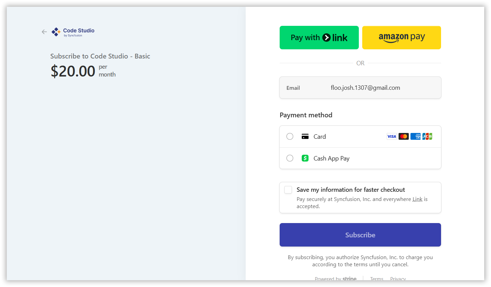
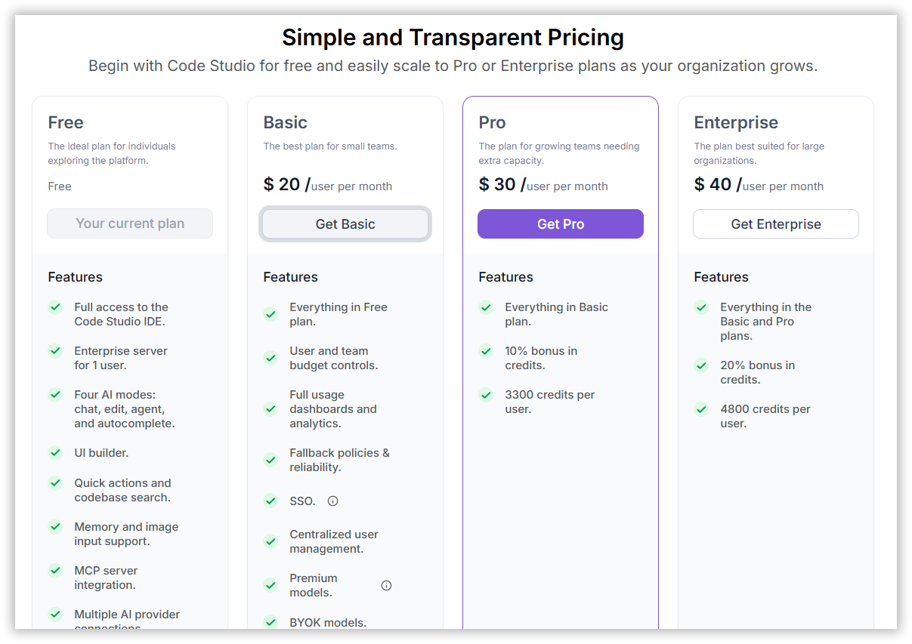
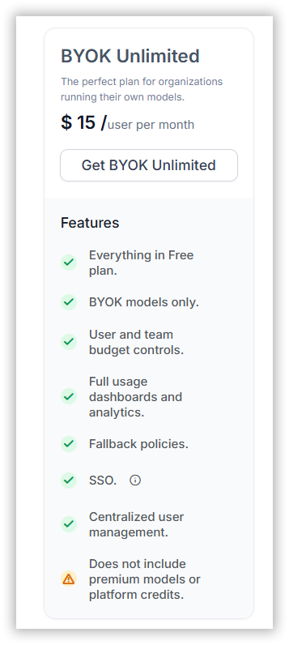
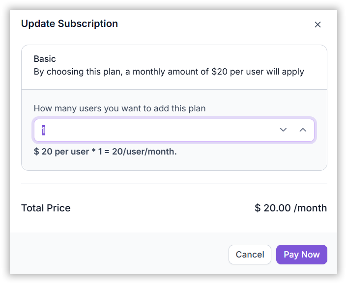

## Settings

The **Settings** page in Code Studio allows users to manage personal details, organization settings, credits, and subscription preferences. It is divided into four tabs:

### Tabs

#### Profile

Update personal information such as:

- **Name** – Editable field for display name.
- **Email** – Registered email address (read-only).
- **Account Type** – Displays the user role (Admin, Team Lead, or User).

Click **Update** to save changes.

#### Organization

Configure organization-level settings (visible only to Admins).

#### Credits

View and manage available credits for usage.

#### Billing and Subscription

Manage subscription plans and payment details.

### When to Use

- Update your display name or view your email and role.
- **Admins**: Change organization name or ID.
- **Admins**: Check credit balance, buy more credits, or review payment history.
- **Admins**: View, upgrade, or manage subscription plans and billing details.

### Prerequisites

- Active Code Studio account.
- Administrator role for full access to all tabs.
- Valid payment method (card or Cash App) for buying credits or upgrading plans.
- Internet-connected browser.

## Steps

### Open Settings

Click your profile icon (top right) → **Settings**  
Tabs appear: Profile, Organization, Credits, Billing and Subscription

### Step 1: Profile

The **Profile** tab centralizes personal information like Name, Email, and Account Type.  
Users can only edit their **Name**.

**Steps:**

- Navigate to **Settings → Profile**
- Click **Update** to edit your name  
  → A toast message confirms successful update

### Step 2: Organization

The **Organization** tab centralizes organization information like Organization Name and ID.  
Users can only edit the **Organization Name**.

**Steps:**

- Navigate to **Settings → Organization**
- Click **Update** to edit organization name  
  → A toast message confirms successful update

### Step 3: Credits

The **Credits** tab allows administrators to monitor and manage the organization’s usage credits.  
Every dollar converts to **150 credits**, which decrease as users submit prompts, launch agents, or perform token-based tasks.

#### Features and Descriptions:

- **Remaining Balance** – Displays current available credits
- **Add-on Credits** – Quick purchase options: \$50, \$100, \$500
- **Payment History** – Shows transaction details: ID, status, date, amount

> **Note:** Only admins can view and manage credits usage.

## 1. Features

### 1. Remaining Credit Balance

Displays the current balance so teams always know how many credits remain before usage is interrupted.  
Provides a quick summary of each plan available for an organization.

### 2. Add-on Credits

Provides three quick-purchase buttons—\$50, \$100, and \$500—for fast top-ups.  
Selecting a preset highlights it and enables the **Buy Credits** button.

### 3. Payment History

Lists every top-up with:
- Serial number
- Status (e.g., Paid, Pending, Failed)
- Date
- Amount

Helps confirm successful purchases and maintain accurate financial records.

## 2. How to Use the Credits

### Step 1: Navigate to the Credits

Go to **Settings → Credits**

### Step 2: Select the Credit

- Choose a preset amount or enter a custom value under **Custom Amount**
- Click **Buy Credits** to submit the purchase and complete payment

### Step 3: Make Payment

- **Card** – Securely pay using a credit or debit card

- **Pay with Link** – Click the button to get a payment link

Confirm the payment to activate or update the credits.

### Step 4: Verify Credits

Return to the **Credits** page and verify:
- Updated balance
- New entry in **Payment History**

## Step 4: Billing and Subscription

The **Billing Plans** page helps you understand what your organization is paying for and how to adjust plans when your needs change.  
It keeps all billing information in one place so administrators can easily:

- Review plan details
- Manage payments
- Make informed decisions about upgrades or downgrades

### 1. Plan Overview

Provides a quick summary of each plan available for an organization.

<table border="1" cellpadding="8" cellspacing="0">
  <thead>
    <tr>
      <th>Plan</th>
      <th>Cost per User</th>
      <th>Key Features</th>
    </tr>
  </thead>
  <tbody>
    <tr>
      <td>Free</td>
      <td>$0</td>
      <td>IDE access, Enterprise server for 1 user, 4 AI modes, UI builder, MCP server integration, Quick actions and codebase search, Memory and image input support.</td>
    </tr>
    <tr>
      <td>Basic</td>
      <td>$20/month</td>
      <td>Premium & BYOK models, team dashboards, fallback policies, Team-wide credit pooling, Custom credit recharge, 2000 credits per user</td>
    </tr>
    <tr>
      <td>Pro</td>
      <td>$30/month</td>
      <td>Everything in Basic + 10% bonus in credit, 3300 credits per user.</td>
    </tr>
    <tr>
      <td>Enterprise</td>
      <td>$40/month</td>
      <td>Everything in Pro + 20% bonus in credit, 4800 credits per user.</td>
    </tr>
    <tr>
      <td>BYOK Unlimited</td>
      <td>$15/month</td>
      <td>BYOK models only, budget controls, dashboards, SSO, centralized management</td>
    </tr>
  </tbody>
</table>

## How to Use Billing and Subscription

### Step 1: Navigate to Billing

- Go to the **Billing and Subscription** page in Settings.

### Step 2: Choose a Plan

- View available plans and their features.
- Compare pricing, credits, and features to select the best fit.

### Step 3: Update Subscription

- Choose a plan and set the user count for your team.
- Confirm selection and proceed.

### Step 4: Make Payment

- **Card**: Securely pay using a credit or debit card.
- **Cash App Pay**: Use Cash App for quick and easy payments.

- Confirm the payment to activate or update the subscription.

### Step 5: Verify Subscription

- Check the **Billing and Subscription** page to confirm the updated plan.
- Click **Manage Subscription** to modify existing plans.

## Validation

- **Profile**: Name change appears in top-right avatar and team lists.
- **Organization**: New name shows in header and invites.
- **Credits**:
  - Balance increases after purchase.
  - New row in Payment History with Paid status.
- **Billing**:
  - Plan name updates in header.
  - Invoice emailed within 5 minutes of payment.
  - Manage Subscription shows correct user count and next bill date.

## Troubleshooting

- **“Update failed” on name change**  
  → Name too long or contains invalid characters  
  → **Fix**: Use 2–50 letters, numbers, spaces.

- **Payment failed or stuck on “Pending”**  
  → Card declined or network issue  
  → **Fix**: Try another card; check bank; retry after 10 minutes.

- **Credits not added after payment**  
  → Payment succeeded but sync delayed  
  → **Fix**: Refresh page; check Payment History; contact support if missing after 1 hour.

- **Wrong plan showing after upgrade**  
  → Cache or partial sync  
  → **Fix**: Log out and back in; hard refresh (`Ctrl + Shift + R`).

- **“Pay with Link” not working**  
  → Link expired or blocked by browser  
  → **Fix**: Generate new link; allow pop-ups.

- **Can’t change organization name**  
  → Name already taken or not Admin  
  → **Fix**: Choose unique name; verify Admin role.

