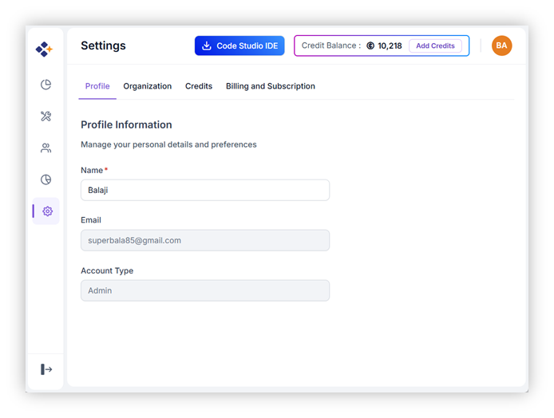
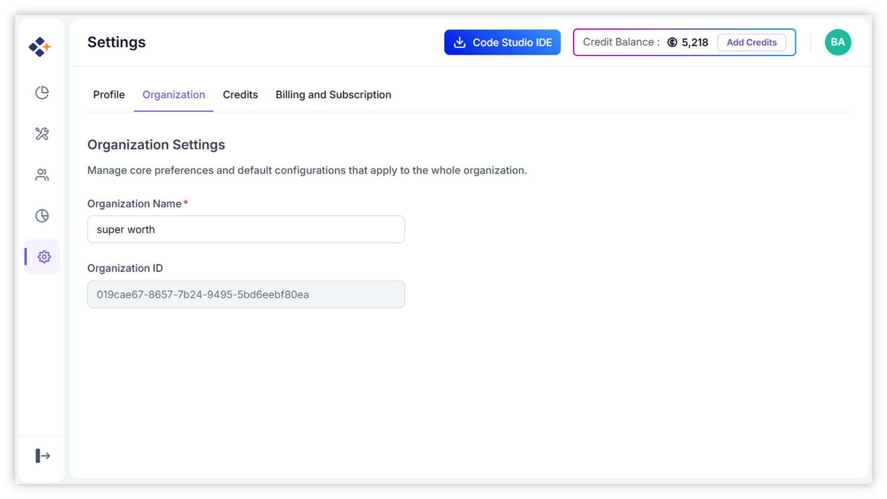
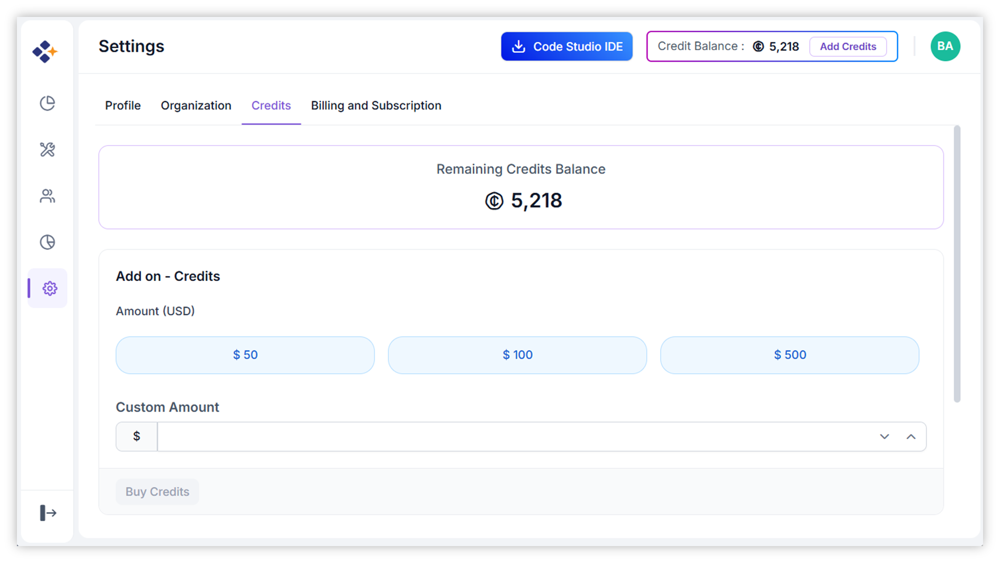
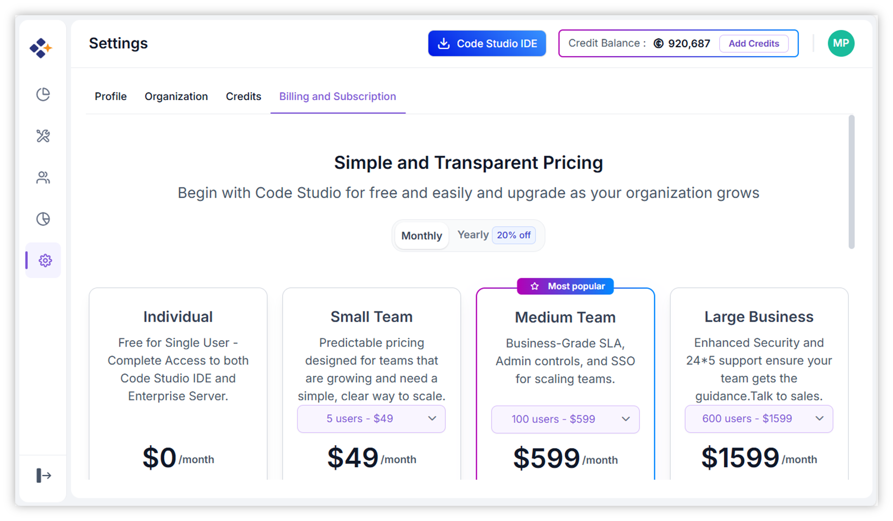

# Settings

The Settings area centralizes account and organization configuration for Code Studio Enterprise. Use it to manage your profile, organization details, credits, and billing/subscription plans.

## How to Access

- Open the [Code Studio page](https://app.sfcodestudio.com) and navigate to Settings from the left sidebar
- Select one of the tabs: Profile, Organization, Credits, or Billing & Subscription

## 1. Profile

- View user name, email address, and account type

## 2. Organization

- View organization name and organization ID
- Share the organization ID with your admins when requesting access or support

## 3. Credits

Add-on credits fund model usage across your organization.

- Pricing: $1 = 100 credits
- Preset amounts: $50, $100, $500
- Custom amount: Enter a custom value as needed
- Purchase flow: Click Buy credits to proceed to the payment page and complete checkout. Credits are applied after successful payment.

## 4. Billing & Subscription

-	Billing Cycle: Yearly and Monthly.
-	Available 20% offer for yearly.
-	Available plans: Individual, Small Team, Medium Team and Large Business.
- After subscription the current subscription details and billing cycle will be displayed.
- Manage your subscription plan, billing cycle, and invoices.
- The credit balance will be displayed on the top of the page.

<table border="1" cellpadding="8" cellspacing="0">
  <thead>
    <tr>
      <th>Plan</th>
      <th>Seat and Costs [monthly]</th>
      <th>Seat and Costs [20% yearly]</th>
      <th>Key Features</th>
    </tr>
  </thead>
  <tbody>
    <tr>
      <td>Free</td>
      <td>$0</td>
      <td>$0</td>
      <td>
        <ul>
          <li>Full access to Code Studio IDE & Enterprise Server</li>
          <li>Five AI modes: Chat, Edit, Agent, Plan, Autocomplete</li>
          <li>Image input support</li>
          <li>MCP server integration</li>
          <li>Multiple AI provider connections</li>
          <li>UI builder</li>
          <li>Quick actions & codebase search</li>
          <li>Custom credit recharge</li>
        </ul>
      </td>
    </tr>
    <tr>
      <td>Small Team</td>
      <td>
        5 users - $49/month 
        25 users - $149/month 
        50 users - $299/month
      </td>
      <td>
        5 users - $39/month 
        25 users - $119/month 
        50 users - $239/month
      </td>
      <td>
        <ul>
          <li>All Individual features</li>
          <li>2,000 starter credits (first month, paid buckets only)</li>
          <li>Premium models</li>
          <li>User & team budget controls</li>
          <li>Full usage dashboards & analytics</li>
          <li>Fallback policies & reliability</li>
          <li>Centralized user management</li>
          <li>SSO</li>
          <li>Team-wide credit pooling</li>
          <li>Custom credit recharge</li>
        </ul>
      </td>
    </tr>
    <tr>
      <td>Medium Team</td>
      <td>
        100 users - $599/month 
        200 users - $799/month 
        300 users - $999/month 
        400 users - $1199/month 
        500 users - $1399/month
      </td>
      <td>
        100 users - $479/month 
        200 users - $639/month 
        300 users - $799/month 
        400 users - $959/month 
        500 users - $1119/month
      </td>
      <td>
        <ul>
          <li>All Small Team features</li>
          <li>10,000 starter credits (first month, team-level)</li>
          <li>Advanced admin controls</li>
          <li>Priority email & chat support</li>
        </ul>
      </td>
    </tr>
    <tr>
      <td>Large Business</td>
      <td>
        600 users - $1599/month 
        700 users - $1749/month 
        800 users - $1899/month 
        900 users - $2049/month 
        1000 users - $2399/month
      </td>
      <td>
        600 users - $1279/month 
        700 users - $1399/month 
        800 users - $1519/month 
        900 users - $1639/month 
        1000 users - $1919/month
      </td>
      <td>
        <ul>
          <li>All Medium Team features</li>
          <li>5,000 starter credits (first month, team-level)</li>
          <li>24/5 priority support</li>
        </ul>
      </td>
    </tr>
  </tbody>
</table>