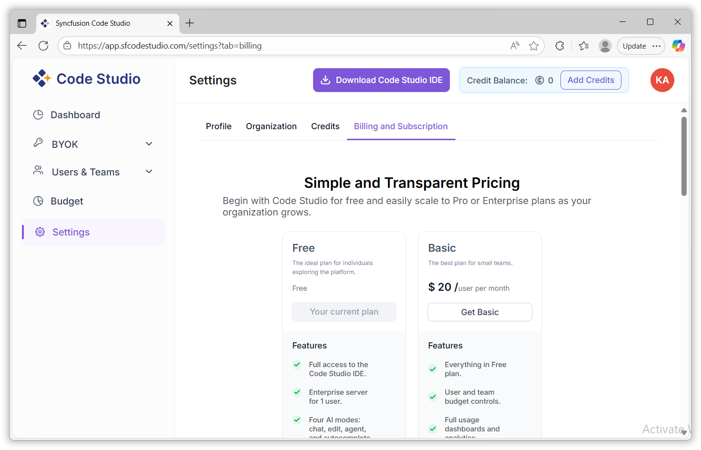

# Settings

The Settings area centralizes account and organization configuration for Code Studio Enterprise. Use it to manage your profile, organization details, credits, and billing/subscription plans.

## How to Access

- Open the [Code Studio page](https://app.sfcodestudio.com) and navigate to Settings from the left sidebar
- Select one of the tabs: Profile, Organization, Credits, or Billing & Subscription

## 1. Profile

- View user name, email address, and account type

## 2. Organization

- View organization name and organization ID
- Share the organization ID with your admins when requesting access or support

## 3. Credits

Add-on credits fund model usage across your organization.

- Pricing: $1 = 100 credits
- Preset amounts: $50, $100, $500
- Custom amount: Enter a custom value as needed
- Purchase flow: Click Buy credits to proceed to the payment page and complete checkout. Credits are applied after successful payment.

## 4. Billing & Subscription

- Available plans: Free, Basic, Pro, Enterprise,BYOK-unlimited.
- BYOK plan: $15 per month subscription
- After subscription the current subscription details and billing cycle will be displayed.
- Manage your subscription plan, billing cycle, and invoices.
- The credit balance will be displayed on the top of the page.

<table border="1" cellpadding="8" cellspacing="0">
  <thead>
    <tr>
      <th>Plan</th>
      <th>Cost per User</th>
      <th>Key Features</th>
    </tr>
  </thead>
  <tbody>
    <tr>
      <td>Free</td>
      <td>$0</td>
      <td>IDE access, Enterprise server for 1 user, 4 AI models, UI builder, MCP server integration, Quick actions and codebase search.</td>
    </tr>
    <tr>
      <td>Basic</td>
      <td>$20/month</td>
      <td>Premium & BYOK models, team dashboards, fallback policies, Team-wide credit pooling, Custom credit recharge, 2000 credits per user</td>
    </tr>
    <tr>
      <td>Pro</td>
      <td>$30/month</td>
      <td>Everything in Basic + 10% bonus in credit, 3300 credits per user.</td>
    </tr>
    <tr>
      <td>Enterprise</td>
      <td>$40/month</td>
      <td>Everything in Pro + 20% bonus in credit, 4800 credits per user.</td>
    </tr>
    <tr>
      <td>BYOK Unlimited</td>
      <td>$15/month</td>
      <td>BYOK models only, budget controls, dashboards, SSO, centralized management</td>
    </tr>
  </tbody>
</table>