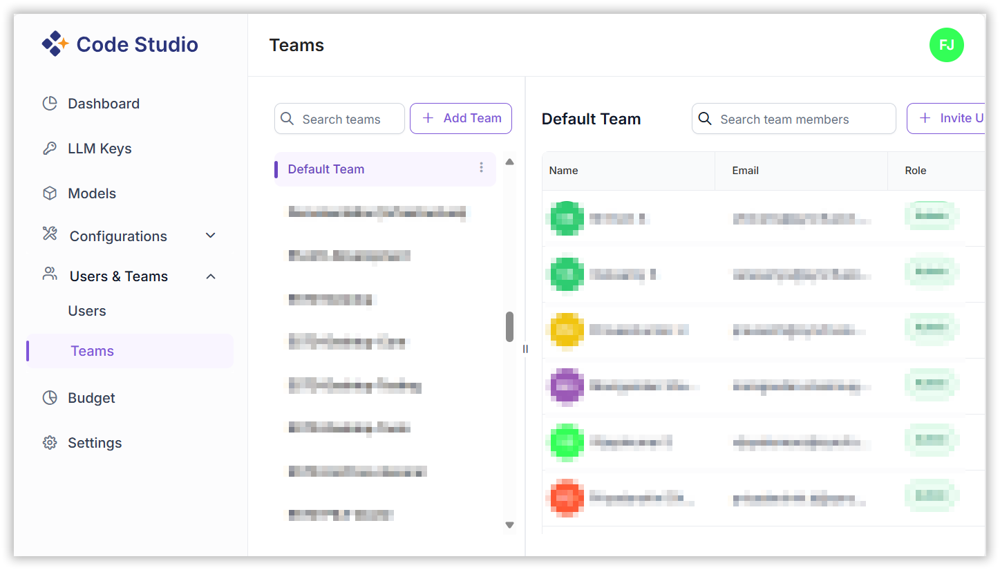
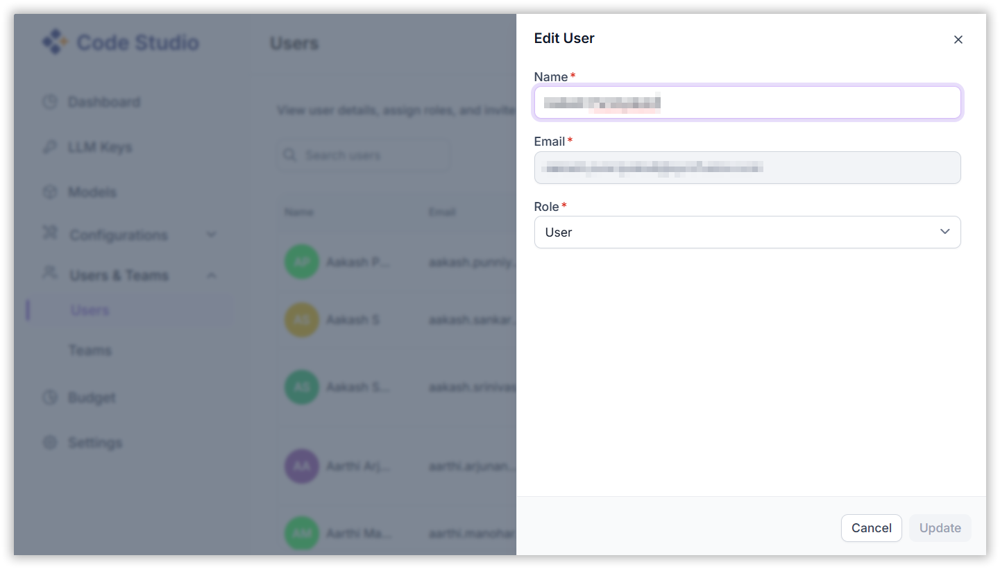

# User & Teams

Code Studio empowers administrators and team leads to manage organization members, assign roles, and organize users into teams for seamless collaboration and governance.

## 1. Key Benefits

- **Role Assignment**: Assign roles such as Admin, Team Lead, or User to match your organizational hierarchy.
- **Team Creation**: Easily create and manage teams with intuitive controls.
- **Usage Visibility**: Monitor usage and spending at both team and individual levels.
- **Streamlined Control**: Centralized management for onboarding, governance, and collaboration.

> **Note**: Only Admins and Team Leads can manage users and teams. Regular users do not have permission to make changes to team or user settings.

## 2. Teams Management

### Team List Panel

- Located on the left side of the interface.
- Displays all existing teams, such as:
  - BoldAgent Backend Team
  - BoldAgent Frontend Team
  - BoldBI-AI

### Selecting a Team

- Click on a team name to view its details.
- The selected team (e.g., BoldBI-AI-CodeStudio) will display its members and management options.

### Team Actions

Accessible via the context menu (three-dot icon):

- **Add Team**: Add a new team.
- **Rename Team**: Update the team name.
- **Add Team Member**: Invite new users to the team.
- **Set Team Owner**: Assign ownership for accountability.
- **Delete Team**: Remove the team from the organization.

## 3. User Management

### Viewing Members

- The right panel shows team members.
- Each member can be managed individually.

### Adding Members

1. Click **“Invite User”** from the context menu.
2. Select the team from the dropdown.
3. Choose the role (Admin, Team Lead, User).
4. Enter the user’s email address.
5. Send the invitation. The user will be added upon acceptance.

### Editing or Removing Members

- Use the team panel to:
- **Edit** user's name or user's role.
- **Remove** users from the team.

## 4. Best Practices

- **Maintain Clear Roles**: Assign roles based on responsibilities.
- **Audit Teams Regularly**: Ensure team structures reflect current projects.
- **Monitor Usage**: Use integrated analytics to track activity and spending.
- **Secure Onboarding**: Verify user details before sending invitations.
