# User & Teams

Code Studio empowers administrators and team leads to manage organization members, assign roles, and organize users into teams for seamless collaboration and governance.

## 1. Key Benefits
- **Role Assignment:** Assign roles such as Admin, Team Lead, or User to match your organizational hierarchy.
- **Team Creation:** Easily create and manage teams with intuitive controls.
- **Usage Visibility:** Monitor usage and spending at both team and individual levels.
- **Streamlined Control:** Centralized management for onboarding, governance, and collaboration.

> **Note:** Only Admins can make changes in team or user settings. Regular users and Team Leads can view but not edit.

## 2. User Management

### Viewing Members
- Navigate to the Users page under the Users and Teams section.

   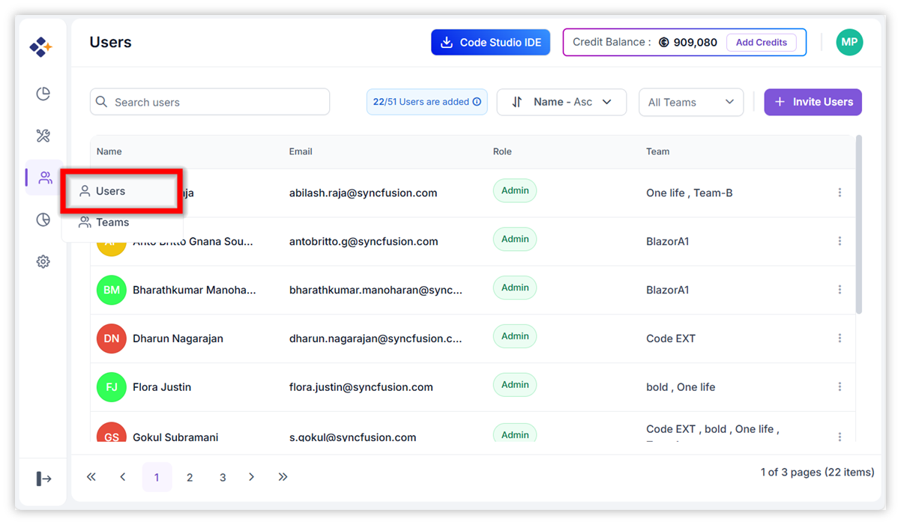

- Grid displays all users in the organization.
- Use the search bar to look for specific users.

### Adding Members
1. Click **"Invite Users"**.

   

2. Select the team from the dropdown to invite a user to an existing team. If you want invite user for new team, click **"Add Team"**.

   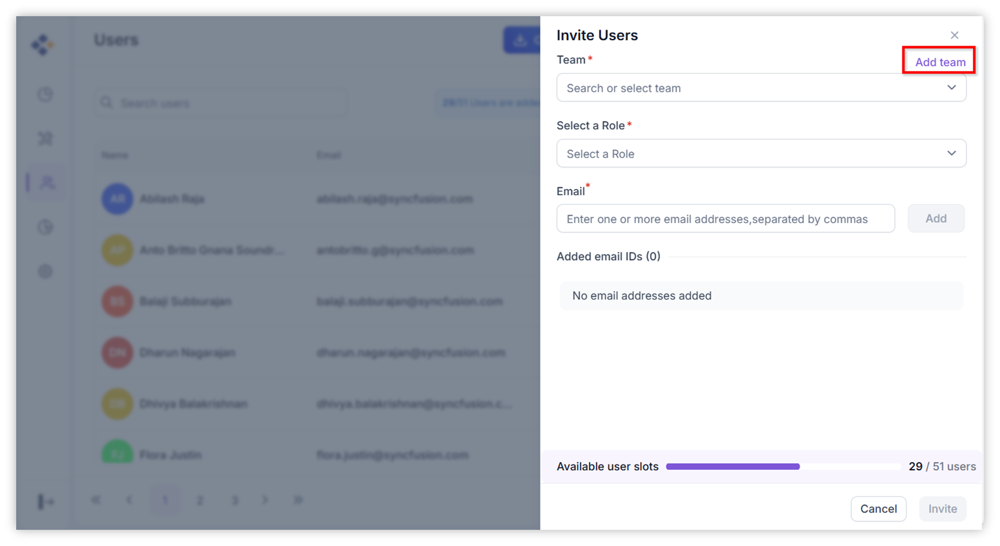

3. On clicking Add Team, it will open Add Team dialog, enter the team name and click **"Add Team"**.

   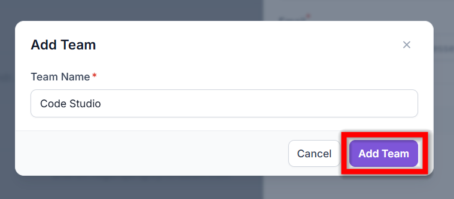

4. Choose the role (Admin, Team Lead, User).
5. Enter the user’s email address.
6. Send the invitation by clicking the **Invite** button.The user will be added upon acceptance.

   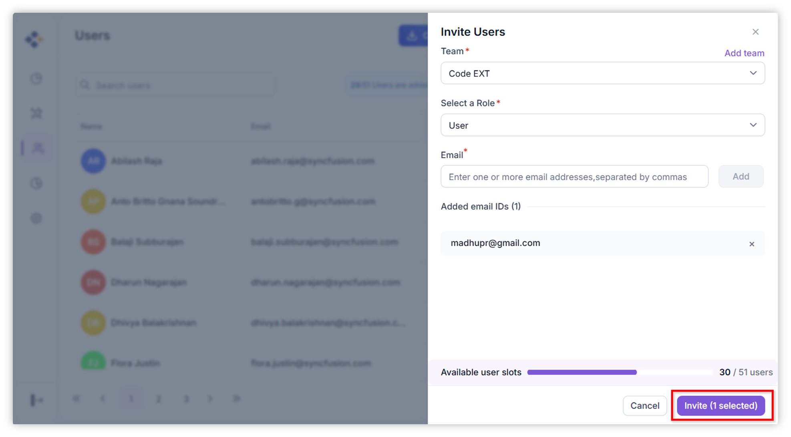

> **Note:** Only Admins and Team Leads can invite users.

### Editing or Removing Members
Use the context menu to:

 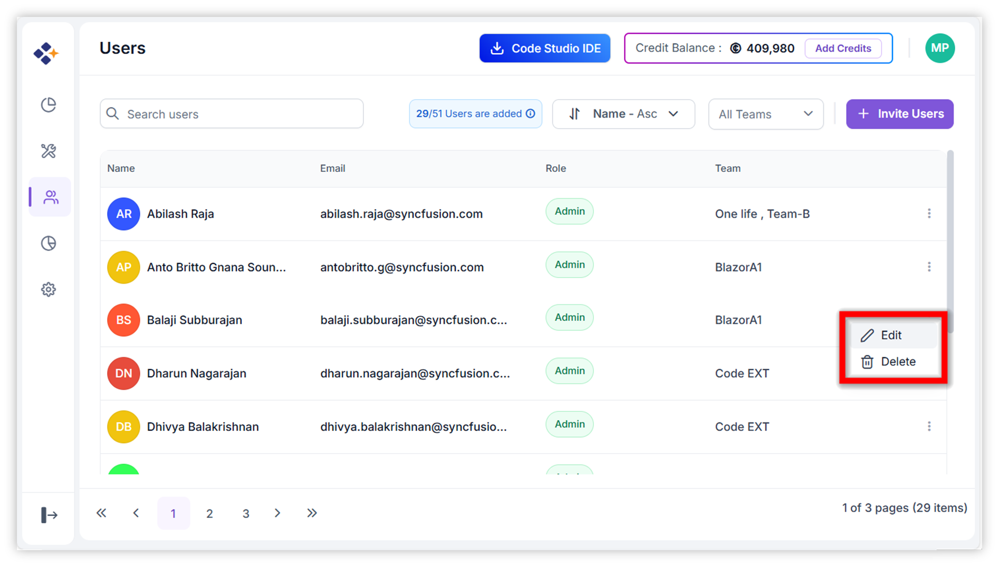

- **Edit:** Update a user's name or role.
- **Delete:** Remove a user from the organization.

 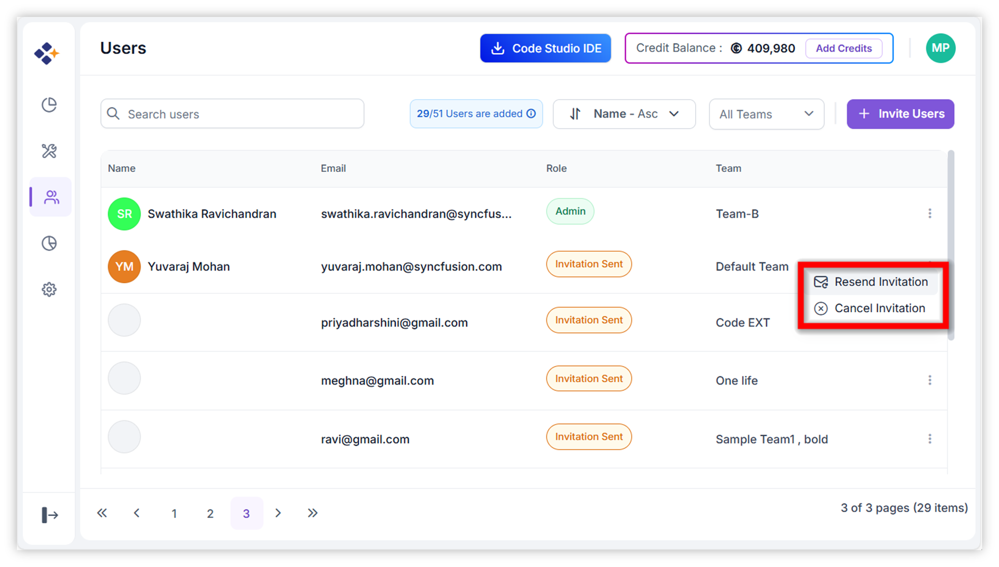

   
- **Resend Invitation:** We can Resend Invitation for users who have not yet accepted their initial invitation. This is helpful when the original email was lost or has expired.

- **Cancel Invitation:** Cancel Invitation for users who are still in the “Invitation Sent” state and have not yet joined the organization. Use this option when you no longer want the invited user to join the organization. Once the invitation is canceled, the user will be removed from the invited users list.

   
## 3. Teams Management

### Team List Panel
- Navigate to the Teams page under the Users and Teams section.

   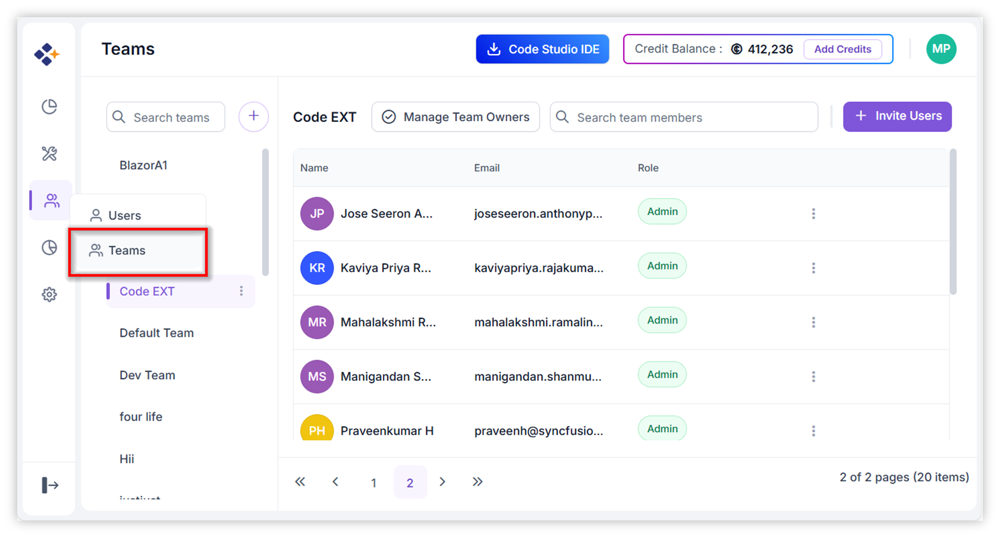

- Displays all existing teams as sidebar list items and selected team members in a grid.

### Add New Team
- Click the **Add** button to create a new team.

   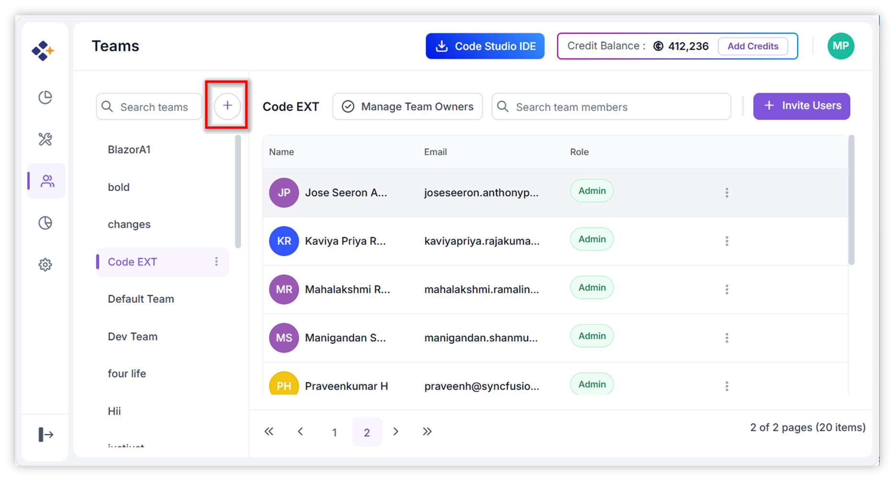

### Selecting a Team
- Select teams in the sidebar list to view members.

   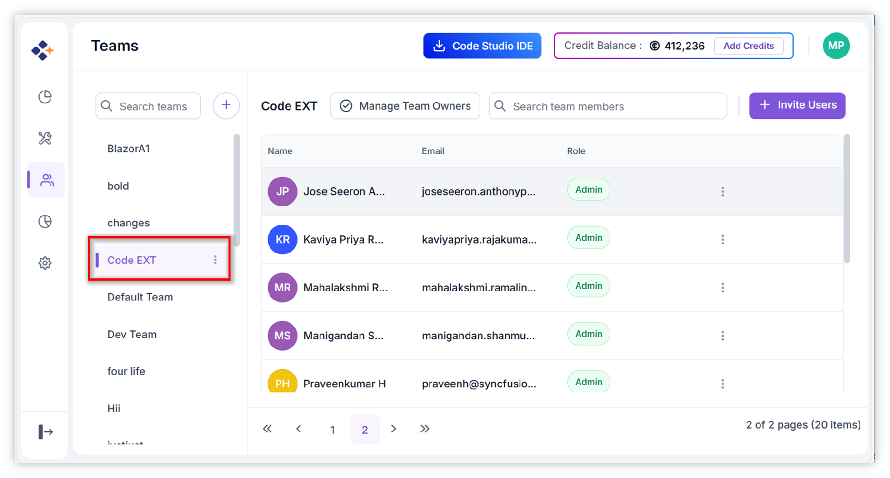

- Use the search bar to filter teams.
- The selected team (e.g., **BoldBI-AI-CodeStudio**) displays its members in the grid.

### Team Actions
Accessible via the context menu (three-dot icon):
- **Rename Team** – Update the team name.

   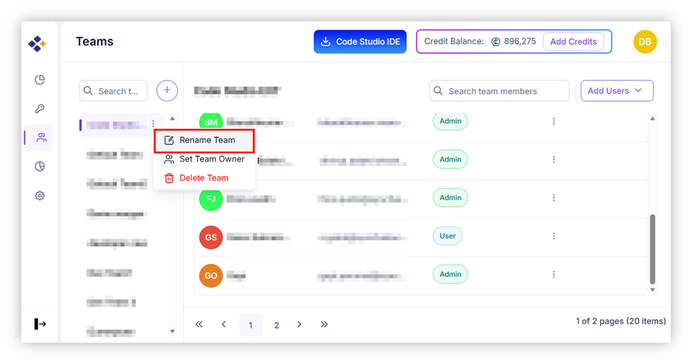

- **Set Team Owner** – Assign ownership.

   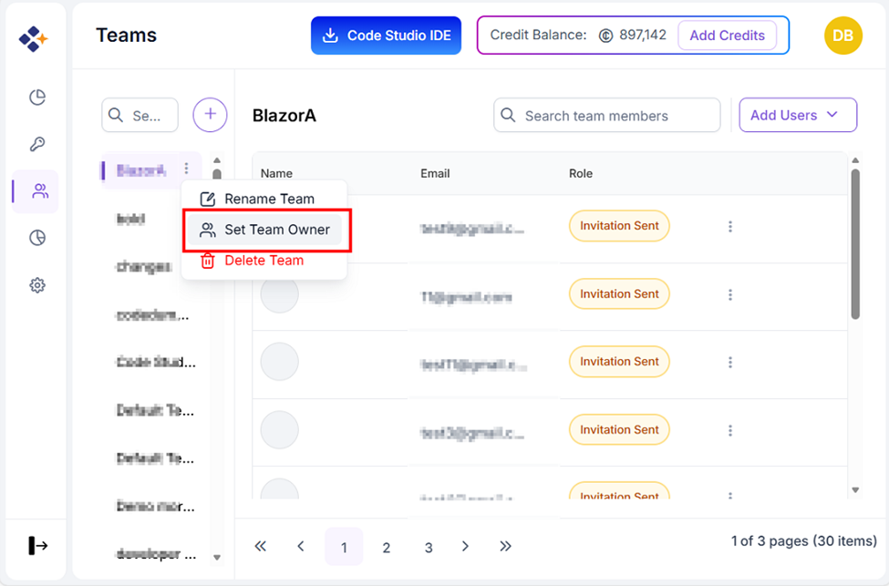

- **Delete Team** – Remove the team.

   

- **Change Team** – Move a user from one team to another.

   

- **Remove Memeber** – Remove user from selected Team.

   

### Add Team Members
- Click **Add Users** dropdown button to add users for selected team

   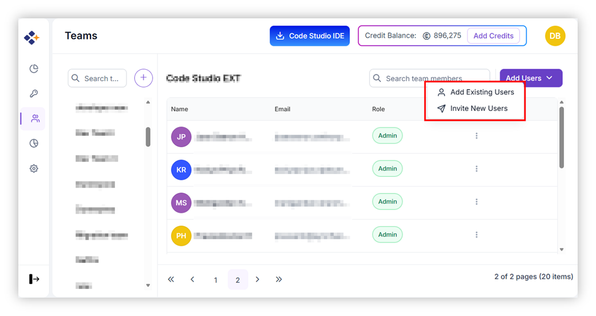

- **Add Existing Users:** Add existing organization users to the selected team.

   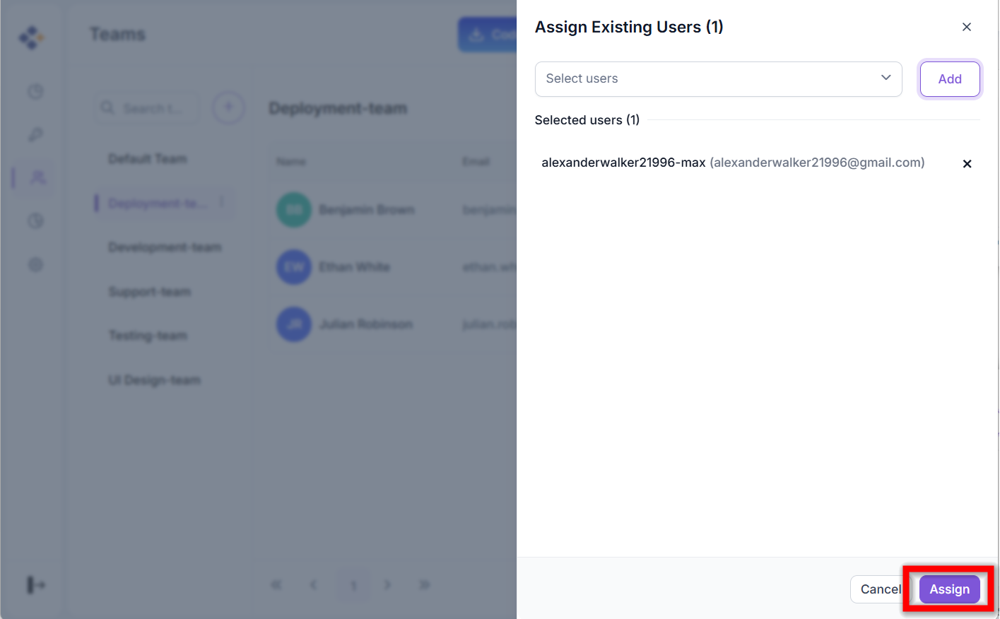

- **Invite New Users:** Send an invite link through email to new users.

   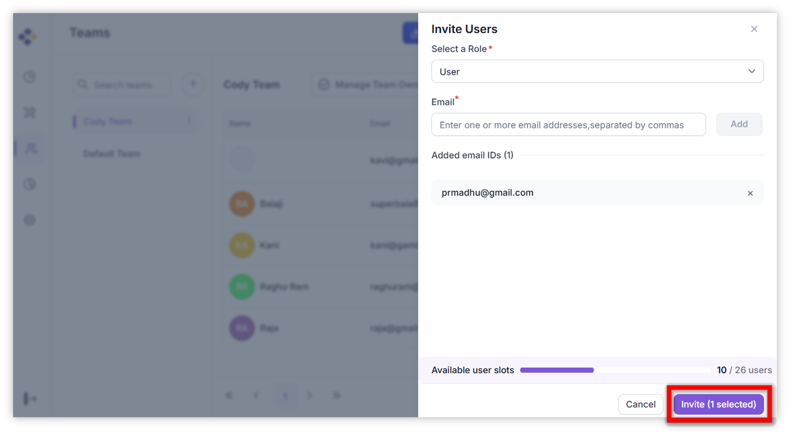

## 4. Best Practices
- **Maintain Clear Roles:** Assign roles based on responsibilities.
- **Audit Teams Regularly:** Ensure team structures reflect current projects.
- **Monitor Usage:** Use integrated analytics to track activity and spending.
- **Secure Onboarding:** Verify user details before sending invitations.
