# User & Teams

Code Studio empowers administrators and team leads to manage organization members, assign roles, and organize users into teams for seamless collaboration and governance.

## 1. Key Benefits
- **Role Assignment:** Assign roles such as Admin, Team Lead, or User to match your organizational hierarchy.
- **Team Creation:** Easily create and manage teams with intuitive controls.
- **Usage Visibility:** Monitor usage and spending at both team and individual levels.
- **Streamlined Control:** Centralized management for onboarding, governance, and collaboration.

> **Note:** Only Admins can make changes user settings. Admin and Team Owner can make changes in teams settings. Users and Team Leads only view user and team settings.

## 2. User Management

### Viewing Members
- Navigate to the Users page under the Users and Teams section.

   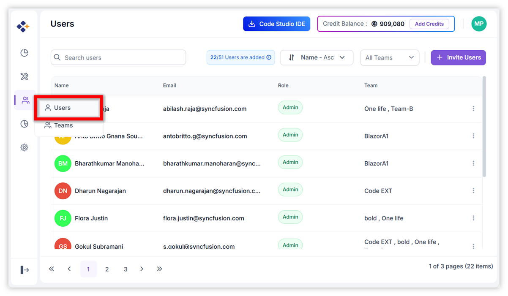

- Grid displays all users in the organization.
- Use the search bar to look for specific users.

### Adding Members
1. Click **"Invite Users"**.

   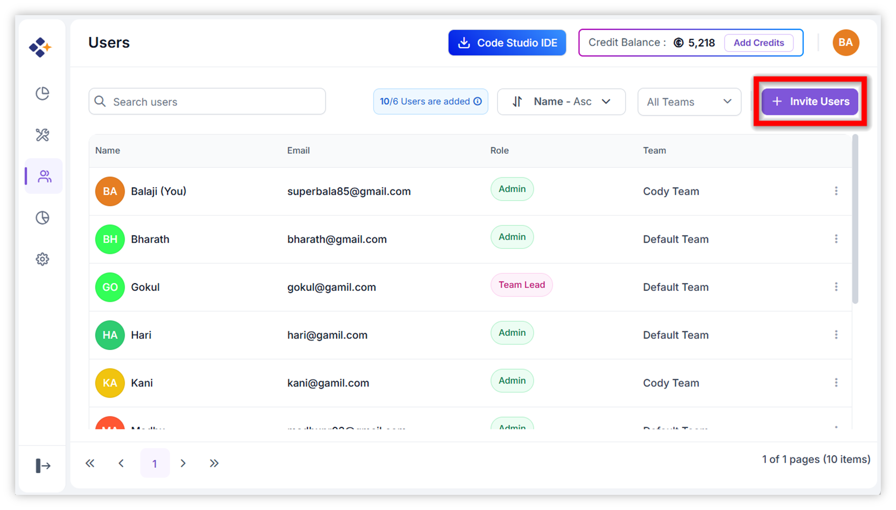

2. Select the team from the dropdown to invite a user to an existing team. If you want invite user for new team, click **"Add Team"**.

   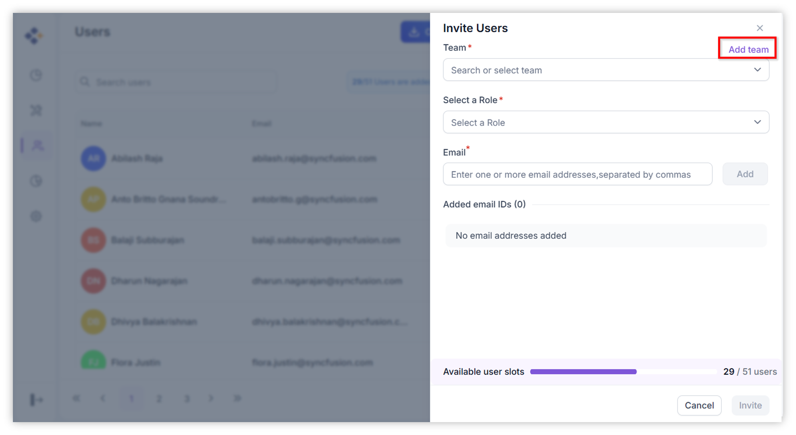

3. On clicking Add Team, it will open Add Team dialog, enter the team name and click **"Add Team"**.

   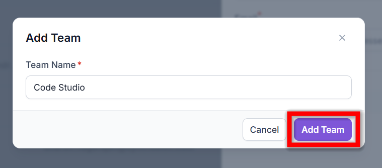

4. Choose the role (Admin, Team Lead, User).
5. Enter the user’s email address.
6. Send the invitation by clicking the **Invite** button.The user will be added upon acceptance.

   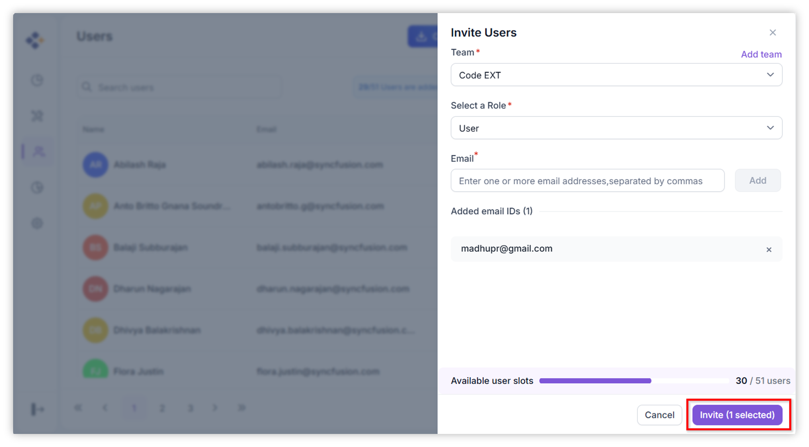

> **Note:** Admins, Team Leads and Team Owners can only invite users.

### Editing or Removing Members
Use the context menu to:

- **Edit:** Update a user's name or role.

- **Delete:** Remove a user from the organization.
   
   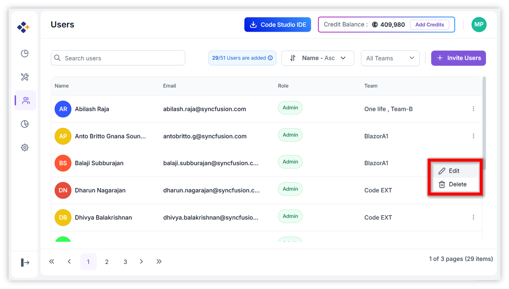
  
-  **Resend Invitation:** We can Resend Invitation for users who have not yet accepted their initial invitation. This is helpful when the original email was lost or has expired.

-  **Cancel Invitation:** Cancel Invitation for users who are still in the “Invitation Sent” state and have not yet joined the organization. Use this option when you no longer want the invited user to join the organization. Once the invitation is canceled, the user will be removed from the invited users list.

   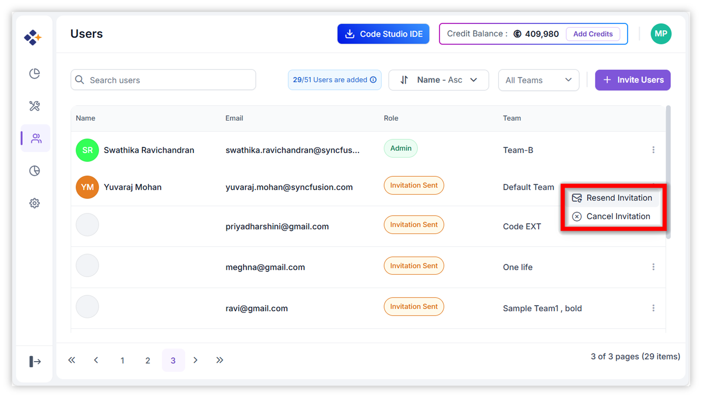

   
## 3. Teams Management

### Team List Panel
- Navigate to the Teams page under the Users and Teams section.

   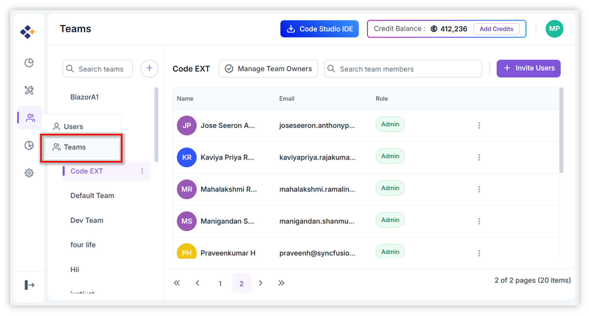

- Displays all existing teams as sidebar list items and selected team members in a grid.

### Add New Team
- Click the **Add** button to create a new team.

   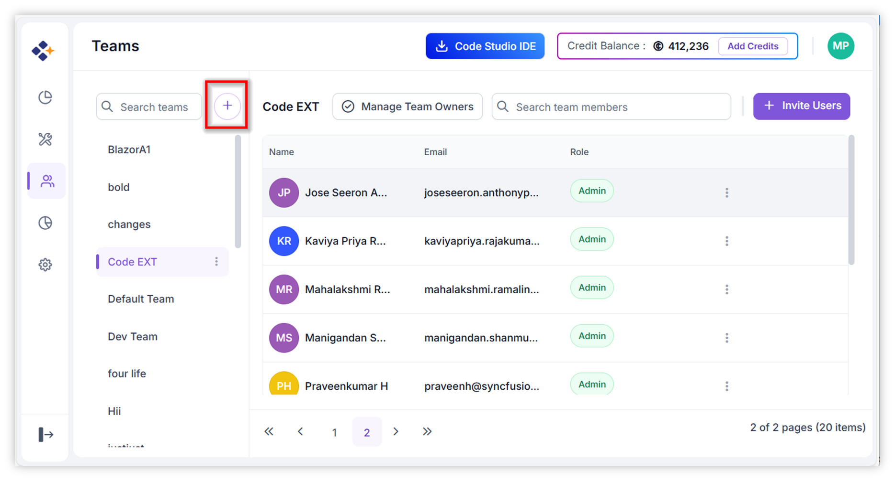

### Selecting a Team
- Select teams in the sidebar list to view members.
- Use the search bar to filter teams.
- The selected team (e.g., **development-team**) displays its members in the grid.

   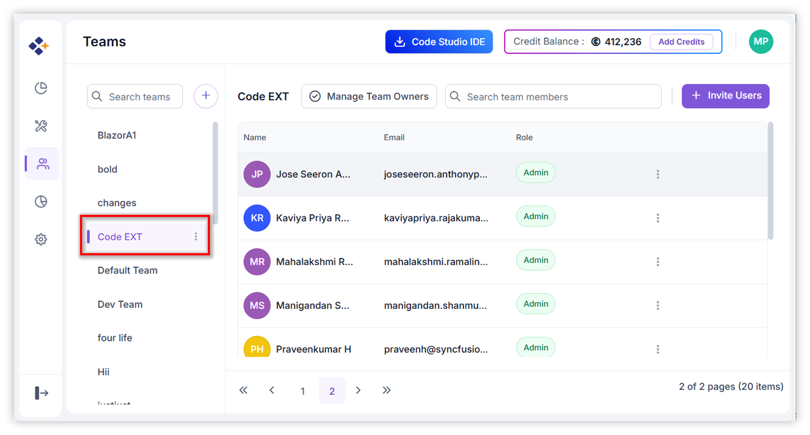

### Team Actions
Accessible via the context menu (three-dot icon):
- **Rename Team** – Update the team name.

- **Delete Team** – Remove the team.

   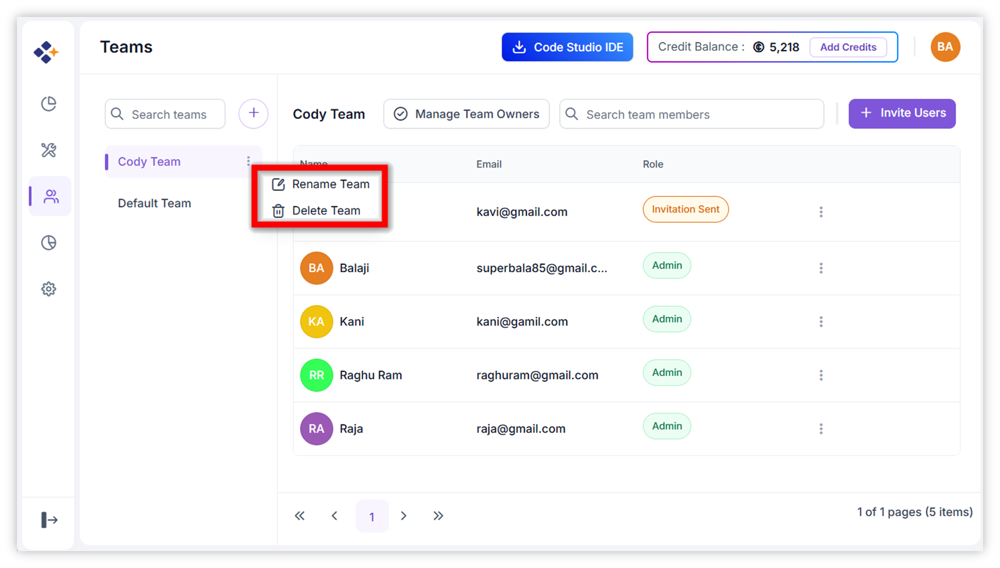

To manage a team member, click the three‑dot menu next to their name. From this menu, you can choose actions such as changing the user’s team or removing the member from the current team.

- **Change Team** – Move a user from one team to another.

- **Remove Memeber** – Remove user from selected Team.

   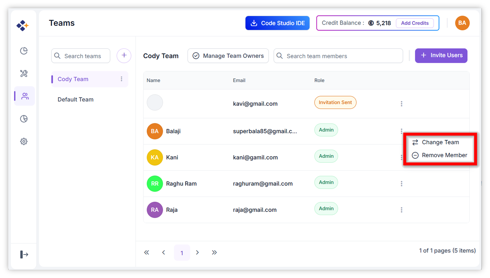

### Invite New Users
- Send an invite link through email to new users.

   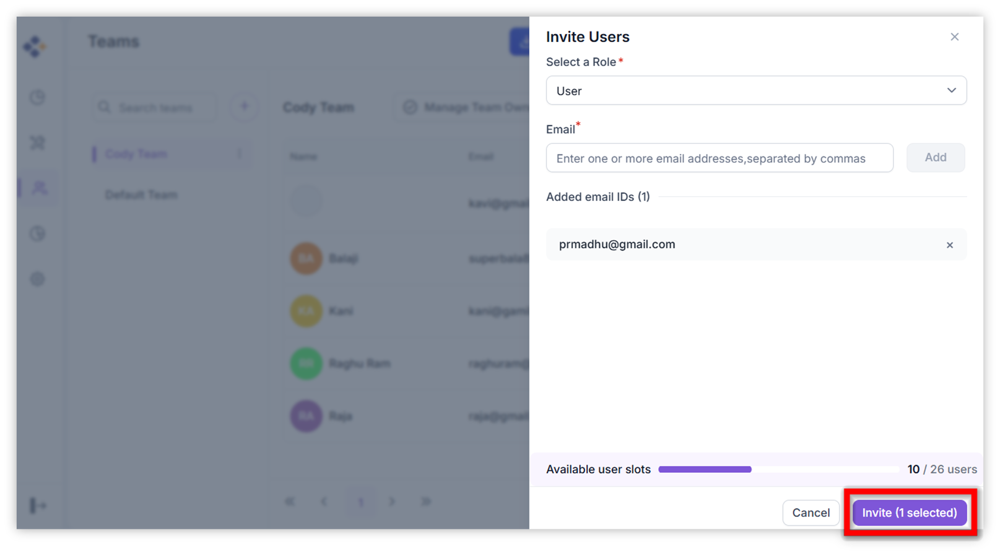

### Manage Team Owners

The **Manage Team Owners** feature allows administrators to assign selected team leaders as Team Owners so they can monitor work, manage editable access, maintain team structure, and support operations more effectively. 

#### Purpose of Team Owners
- **Visibility:** They can see and track activity in their teams.
- **Control:** They can edit and manage across those teams and ensure teams are properly structured.
- **Accountability:** They act as the authority responsible for team-level decisions

> **Note:** Team Owners are not limited to a single team. They can be assigned to multiple teams, except their own. They have Admin-level access only within the teams they manage. A Team Owner can add budgets and set alerts for their users, but not for the entire team.

#### How to Assign Team Owners

1. Navigate to the **Teams page** and select a team.

2. Click the **Manage Team Owners** dialog.

   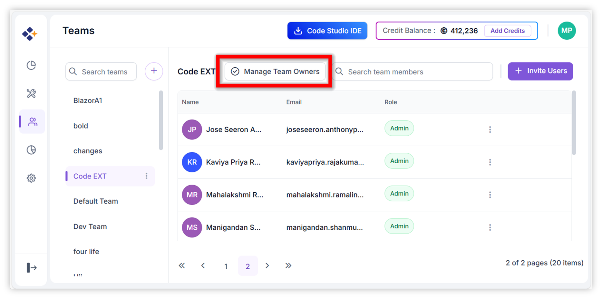

3. Open **Manage Team Owners Dialog**.

   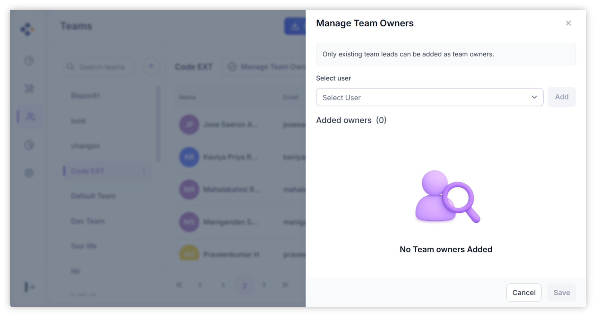

4. Use the dropdown to select one or more leads.

   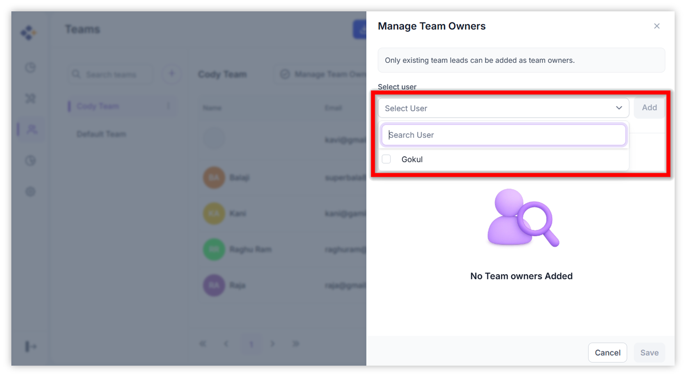

> **Note:** Only existing Team Leads are available for selection.

5. Click **Add** to assign them as owners.

   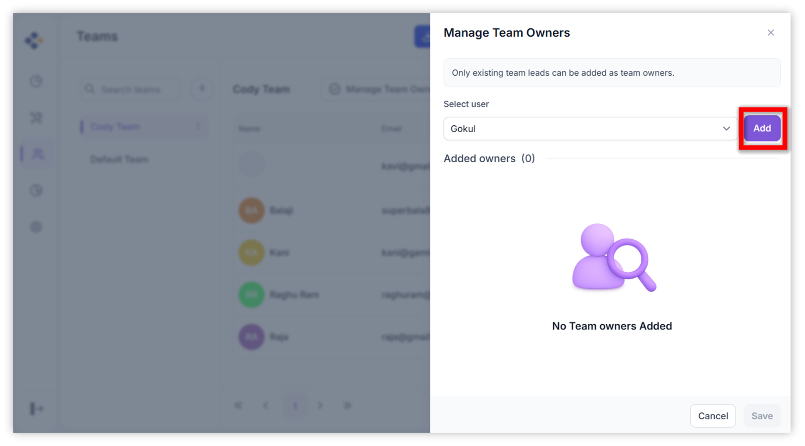

6. Review the list of added owners.
      - Additional owners can be removed if needed.

   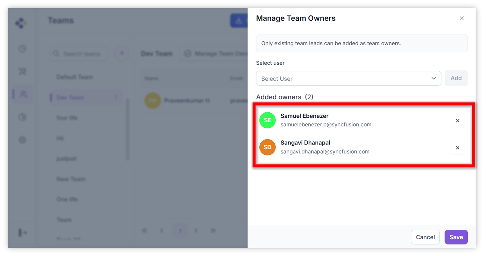

7. Click **Save** to confirm changes.

   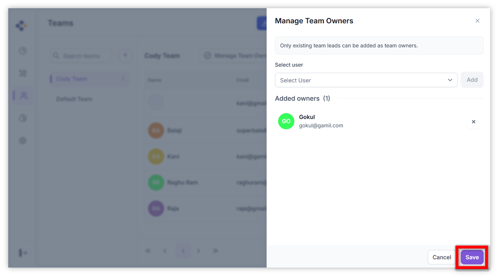

## 4. Best Practices
- **Maintain Clear Roles:** Assign roles based on responsibilities.
- **Audit Teams Regularly:** Ensure team structures reflect current projects.
- **Monitor Usage:** Use integrated analytics to track activity and spending.
- **Secure Onboarding:** Verify user details before sending invitations.
