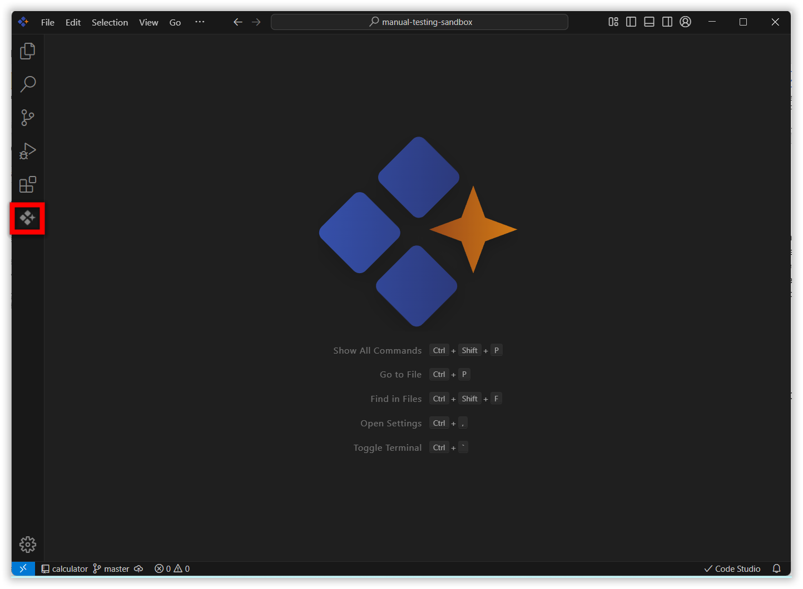
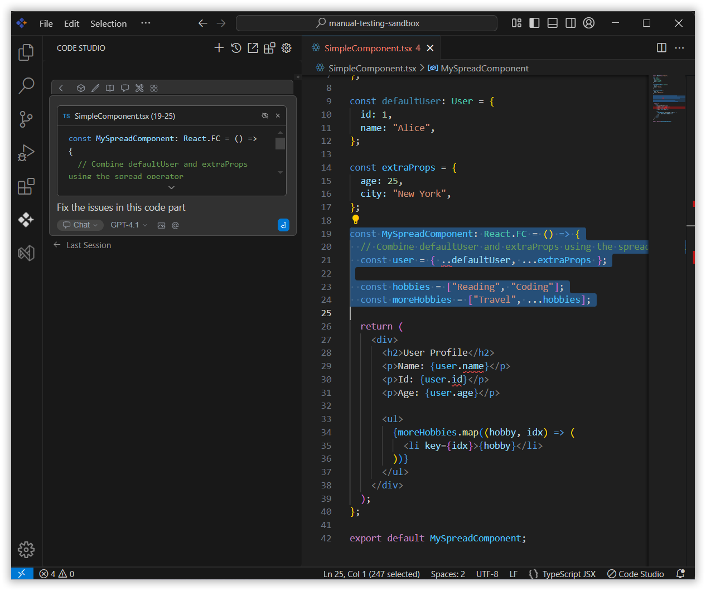
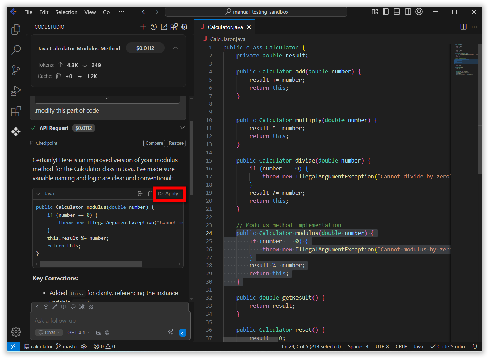
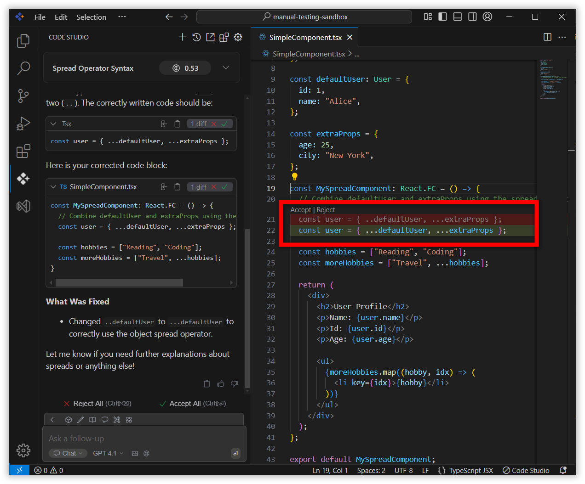

# Apply To Current File
 
The **Syncfusion Code Studio** provides an efficient way to apply suggested code directly into your currently opened file. With a single click, changes are applied in place so you can review, adjust, and continue coding without copy-paste.
 

## purpose
- **Insert Code Instantly:** Place AI-suggested code directly into your open file with one click.
- **Speed Up Workflow:** Reduce manual copy-paste and keep coding without interruption.
- **Review and Accept Easily:** Quickly check and apply code changes to your active project files.
- **Minimize Errors:** Ensure code is placed exactly where it’s needed, reducing mistakes during integration.
## How to Apply Changes to the Current File
 
### 1. Open Code Studio Extension
 
Click the **Syncfusion Code Studio** icon on the left toolbar to open the Syncfusion Code Studio chat window.
 

### 2. Enter Your Query
 
In the chat window, ask for specific tasks, such as code optimization, debugging, or adding documentation. After you receive a response containing code suggestions, you will have the option to apply the code directly.

 
### 3. Apply Changes
 
Once Syncfusion Code Studio provides a code solution or modification in the chat, review the changes to ensure they meet your requirements and click the **Apply** button to insert the provided code directly into the currently opened file in your IDE.

 
### 4. Verify the Changes
 
The code will be automatically applied to the correct location in your file. Review the file to confirm that the changes are implemented as expected.
 
- Click **Accept** to apply the AI-suggested solution to the selected code in the file.
- Click **Reject** to disregard the AI's suggested solution.
