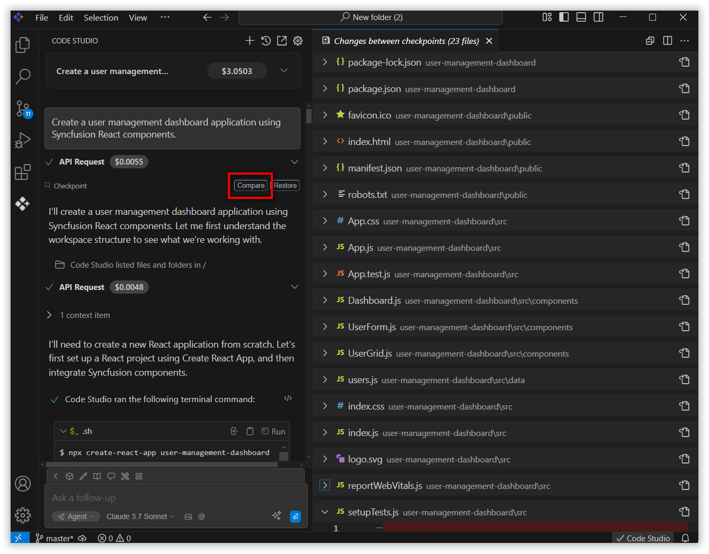

# Checkpoints Feature

## Overview
The Checkpoints feature in Syncfusion Code Studio automatically captures and preserves the state of your workspace at key moments. This allows you to:
- Track changes over time
- Preview modifications
- Revert to previous states

Checkpoints help ensure your work remains safe, traceable, and manageable throughout the development process.

## How to Use the Checkpoints Feature

### Step 1: Triggering Checkpoints
1. Enter a query in the chat (e.g., "Create a user management dashboard application using Syncfusion React components.") and press Enter.
2. A checkpoint is automatically created at the start of the response.
3. Additional checkpoints are created after each tool execution, such as:
    - Create New File
    - Edit File
    - Run Terminal Command

### Step 2: Comparing Checkpoints
- Click the Compare button next to a checkpoint to view a detailed diff of the workspace files.
- This shows which files will be modified or affected if you restore to that checkpoint.

### Step 3: Restoring a Checkpoint
- Click the Restore button to revert your workspace to the state captured in the selected checkpoint.
- This action will overwrite your current workspace files with the versions saved in that checkpoint.
- Before restoring, you can preview the changes using the Compare button to ensure accuracy.

