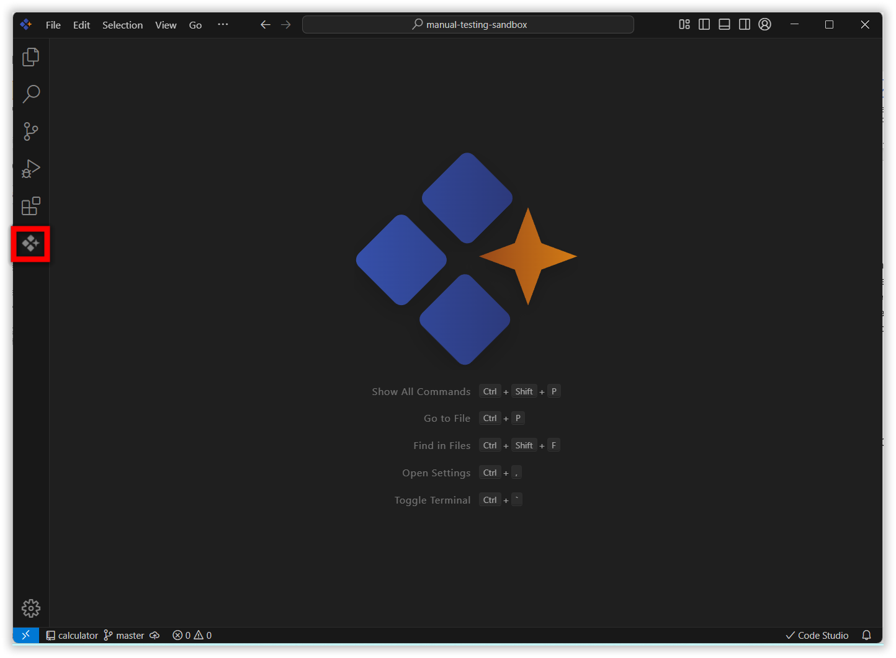
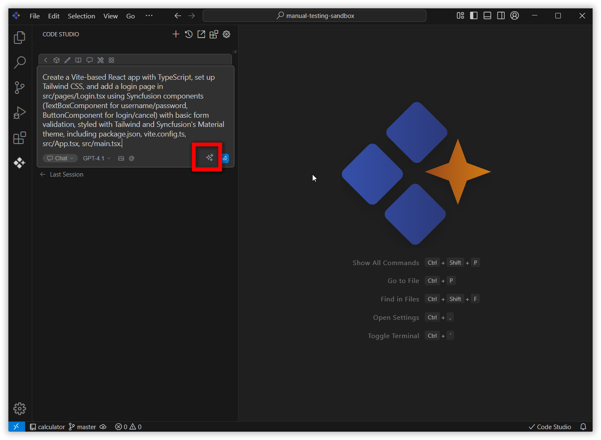
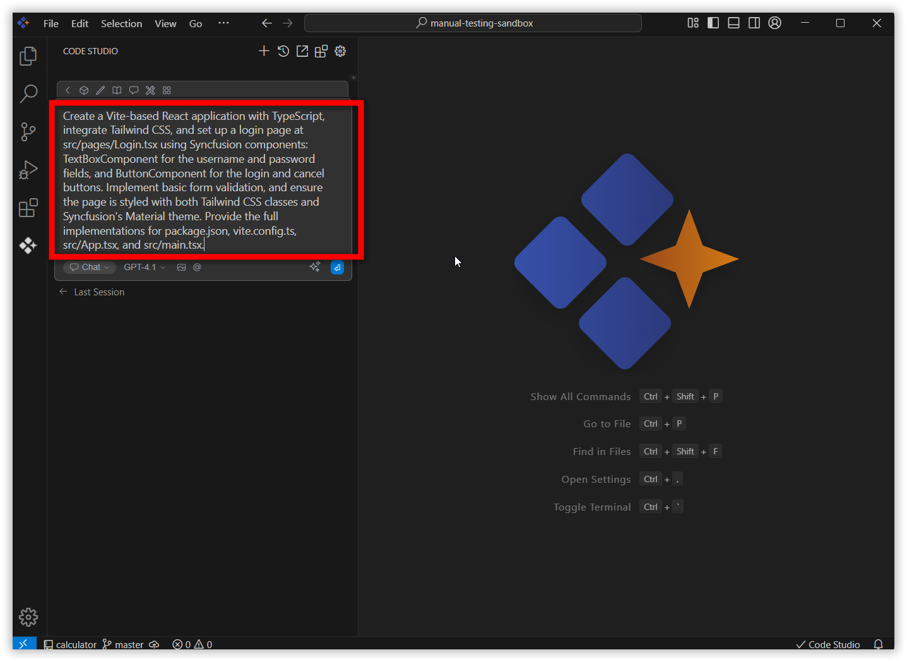
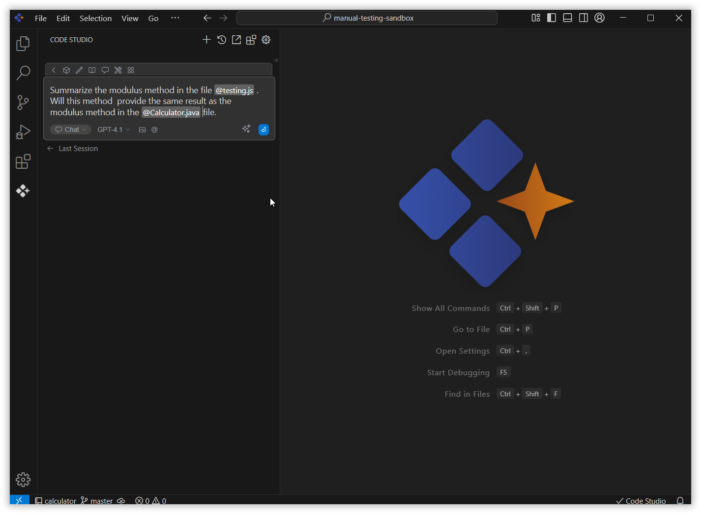
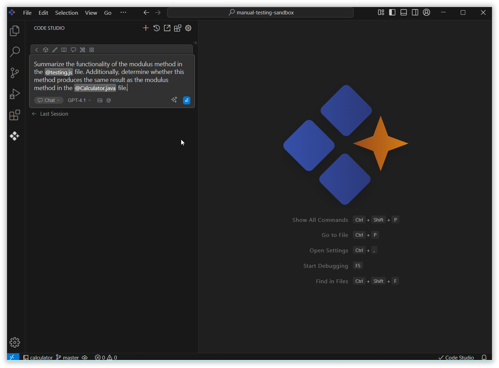

# Enhance Prompt
 
The **Enhance Prompt** feature in Code Studio improves your queries to maximize the quality of AI-generated responses. It refines, clarifies, and restructures prompts to ensure they are clear, relevant, and comprehensive. By optimizing the way questions are presented, Enhance Prompt helps the AI deliver more accurate, insightful, and context-aware answers. Users benefit from clearer, more effective queries, enabling the AI to understand their intent and respond with greater precision.
 

## purpose
- **Refine Queries:** Make your prompts clearer and more precise for the AI to understand.
- **Increase Response Quality:** Get more relevant, accurate, and context-aware answers.
- **Save Time:** Spend less effort rephrasing questions and get to your solution faster.
- **Reduce Miscommunication:** Lower the risk of misunderstandings between you and the AI.
## How to Use Enhance Prompt
 
### 1. Open Code Studio Extension
 
Click the **Syncfusion Code Studio** icon on the left toolbar to open the Syncfusion Code Studio chat window.
 

### 2. Enhancing Prompt
 
Enter the prompt that you want to enhance in the input field and click the **Enhance Prompt** icon button.

> **Note:** The Enhance Prompt button will be disabled when the chat box is empty. It will become enabled once the user starts typing a query.

The enhanced version of the prompt will appear in the input field as a response. You can then use this enhanced prompt to receive a response from the AI.
 

### 3. Enhancing a Prompt with Context Providers
 
You can also provide a text prompt along with **Context Providers** such as File, Folder, Code, GitDiff, Codebase, Docs, Terminal, Web, or Problems.
Enter the query with context provider and click the **Enhance Prompt** icon.
 

The enhanced version of the text prompt, including the Context Providers, will appear in the input field as a response.
