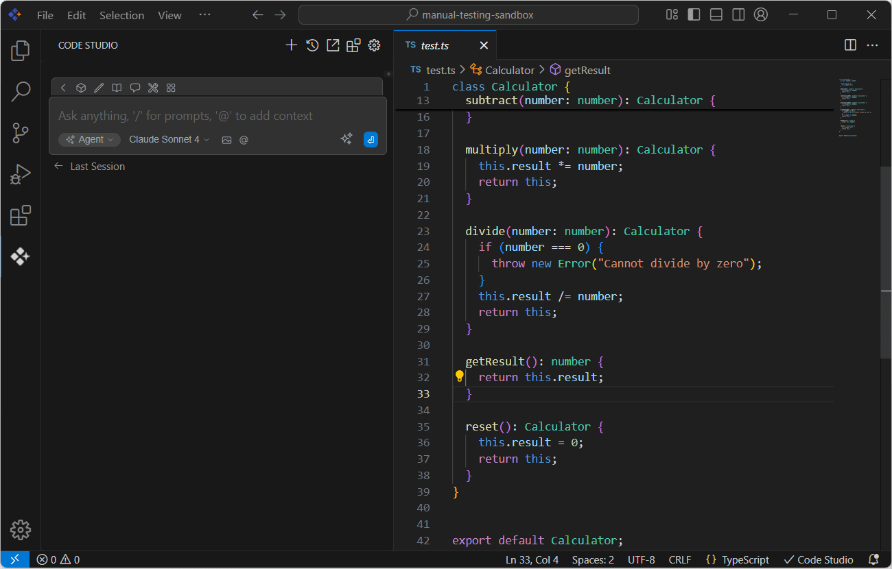

#  Inline Edit
Syncfusion Code Studio's Inline Edit feature delivers **instant AI-powered code improvements** directly within your editor. This intelligent system enables developers to enhance code quality, fix issues, and optimize performance through contextual right-click actions.

## Purpose

The inline edit feature is designed to accelerate development and improve code quality by providing contextual AI assistance without switching away from the code editor. Its key purposes are to:

- **Increase Efficiency**: Quickly fix issues, write documentation, or optimize code with a single click.
- **Maintain Focus**: Keep developers in the flow by providing AI assistance directly in the editor.
- **Standardize Code Quality**: Ensure consistent code quality and documentation across the team.

## Available Actions

### Core Edit Functions
| Action | Purpose | Use Case | Business Value |
|--------|---------|----------|----------------|
| **Fix this code** | Error resolution | Debug syntax/logic issues | Reduced debugging time |
| **Optimize this code** | Performance enhancement | Improve efficiency | Better application performance |
| **Write docstring** | Documentation generation | Add comprehensive comments | Improved code maintainability |
| **Add to context** | Custom analysis | Send to chat for detailed help | Flexible problem-solving |
| **Write command** | CLI/script generation | Create executable commands | Automation acceleration |

### How to Use Inline Edit
1. **Select** code in your editor
2. **Right-click** on highlighted section  
3. **Choose** "Code Studio" from context menu
4. **Select** desired action from dropdown
5. **Review** AI suggestions and accept/reject changes

