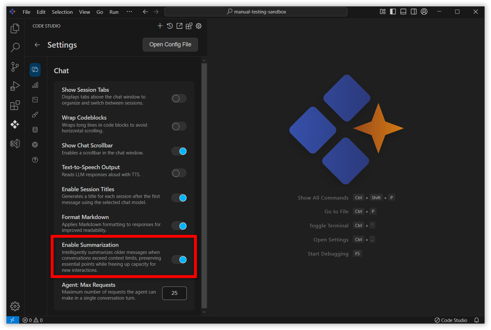

# Summarization Feature in Code Studio

## Overview
As coding sessions and conversations extend over time, managing the increasing volume of context becomes crucial for maintaining efficiency and clarity. Code Studio addresses this challenge with its Summarization feature, designed specifically to keep your development chats streamlined, relevant, and effective regardless of their length.

## Purpose
The Summarization feature ensures that, as conversations grow and exceed the AI's model context window, older messages are intelligently summarized. This process preserves the essential points and technical history while freeing up capacity for new interactions.

## How It Works

- **Automatic Monitoring:** Code Studio tracks the length of each conversation and the usage of context tokens.
- **Triggering Summarization:** Once the chat approaches the context window limit, the system automatically summarizes earlier messages.
- **Summarization Output:** Only essential details — technical decisions, requirements, and actions taken — are retained in concise summary format.
- **Makes Space for New Chats:** By compressing older conversation content, Code Studio ensures space for current and future interactions.
- **Enable/Disable Summarization:** Users can toggle summarization based on their project needs and preferences.

