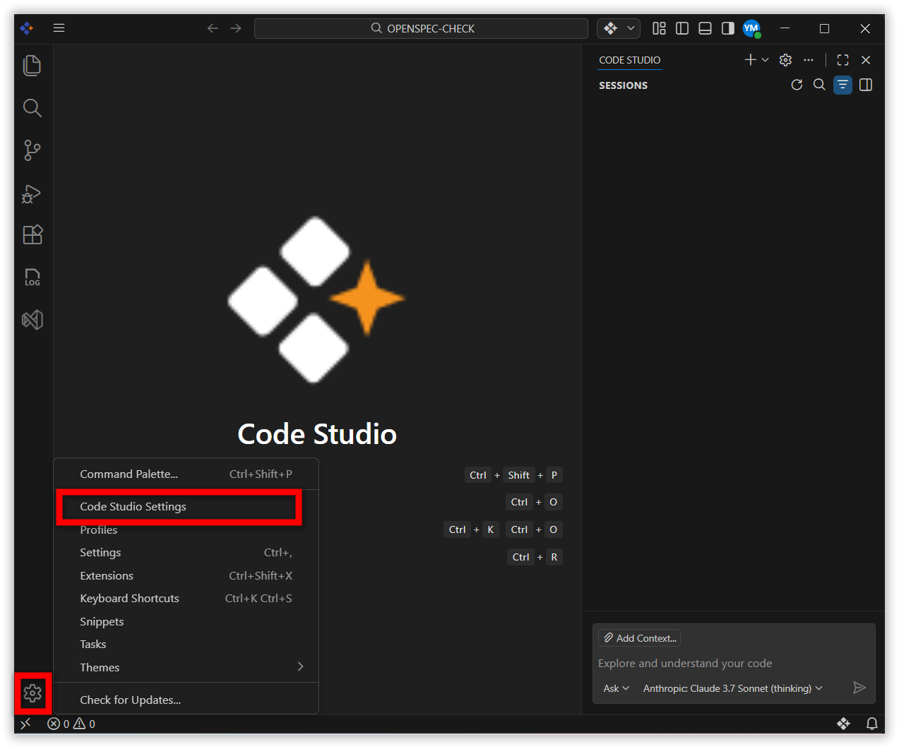
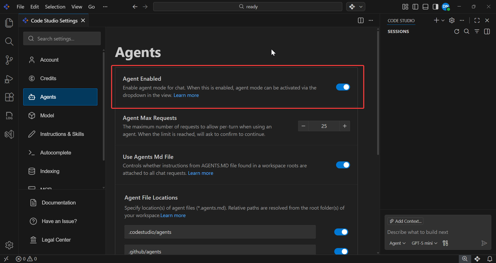
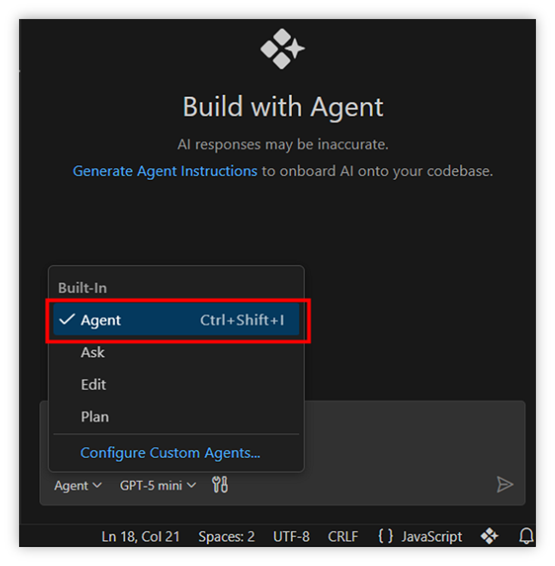
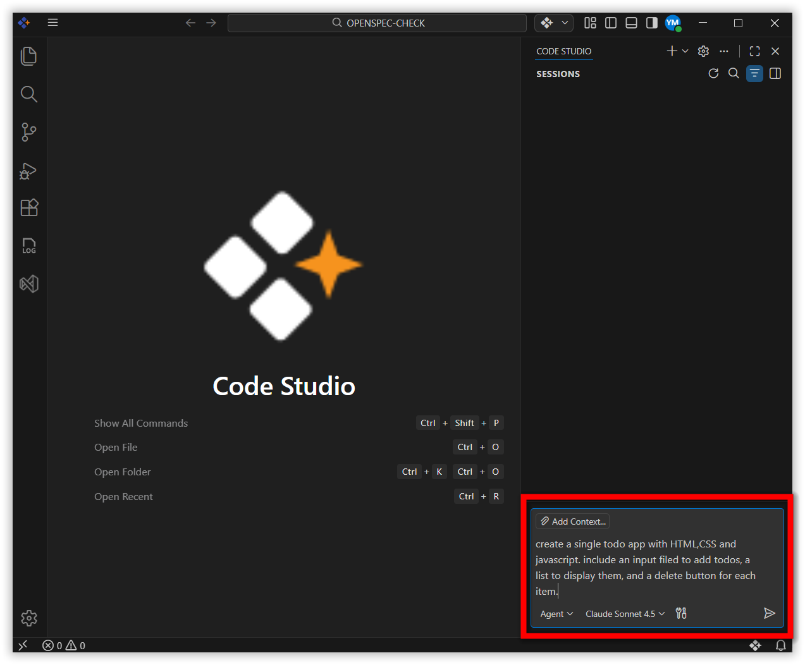
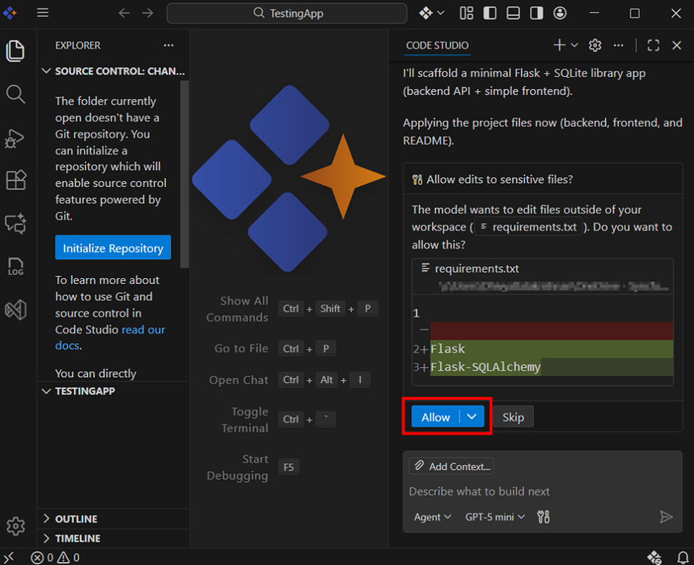
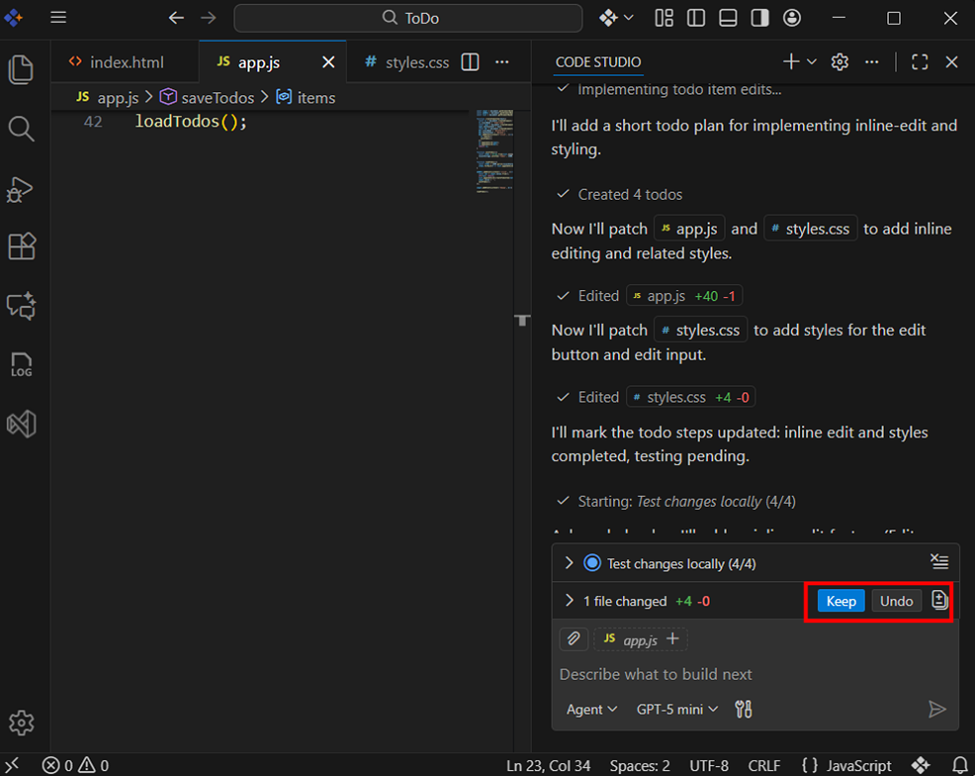

# Agent

 Agents are intelligent, goal oriented AI assistants that can perform complex, multistep tasks across your project. Unlike simple prompt-based editing, agents can understand high-level instructions, analyze your codebase, and decide what actions need to be taken to achieve the desired outcome.

## How are agents differ from custom agents?

Agents and Custom Agents both act as AI assistants that can perform coding tasks for you, but they differ mainly in how they behave and how much control you have over them.
An **Agent** is a builtin, general-purpose assistant that works automatically. You give it a goal, and it figures out how to complete it by exploring your project, reading files, planning updates, and applying changes.
A **Custom Agent**, however, is something you create with your own rules, instructions, or constraints—so it behaves exactly the way you want every time.
Learn more about **creating custom agents**.

## Key benefits

Automates complex, cross-file tasks.
Speeds iterative development and scaffolding.
Review and approve changes at each step.

## Agent Capabilities

**Autonomous Operation** - Agents can independently explore your codebase, identify the files related to your request, and determine what needs to be changed. Instead of requiring detailed, step-by-step instructions, they plan the workflow automatically and execute tasks in a structured sequence. This allows them to handle complex operations with minimal user input.

**Tool Access** - Agents can use all available workspace tools — including file search, editors, and integrated terminals — to complete tasks end to-end. They can open files, apply modifications, generate new code, run commands, and orchestrate multi-step actions by leveraging your existing development environment.

**Contextual Understanding** - Agents analyze surrounding code, project structure, naming conventions, and dependencies to understand how different parts of your project relate to each other. This awareness helps them make changes that fit your code style, avoid breaking existing logic, and maintain consistency across modules.

**Error Handling & Adjustment** - If the agent encounters issues like missing dependencies or conflicting code, it adjusts its plan and continues working toward your goal. It can retry steps, fix errors, or adapt its approach based on what it observes in your project. This flexibility helps maintain smooth execution, even in complex codebases.

**Cross-File Reasoning** - Unlike simple editing tools, agents can work across your entire project rather than just the active file. They identify every file impacted by your instruction, update them consistently, and ensure that changes in one part of the codebase do not break another. This makes them ideal for large-scale refactoring or feature upgrades.

## Workflow of Agent

**Understand Request** - Read the user's prompt and current project context to identify goals, constraints, and acceptance criteria. Clarify ambiguities or required outputs before making changes.

**Explore Codebase** - Scan open files and repository structure to find relevant code, dependencies, and tests. Note entry points, state flows, and places likely to require edits.

**Plan Changes** - Break the task into discrete steps (edits, new files, tests, commands) with an order and minimal risk strategy. Estimate impacts and list required tools or permissions.

**Execute Changes** - Apply the edits, create files, or run commands in the workspace; update code and tests as planned. Use the IDE/terminal to implement changes and commit or stage them if appropriate.

**Verify Results** - Run the application and unit tests, inspect logs/output, and fix runtime or lint errors found. Confirm the behavior matches requirements and edge cases are handled.

**Task Complete** - Summarize what was changed, why, and how to reproduce or undo it; provide next steps or follow-ups if needed. Hand control back to the user for review or further instructions.

## How to Enable Agent mode?

**Step 1** : Open settings and select Code Studio settings.

**Step 2** : Select Agents in sidebar list items and Enable agent mode.

**Step 3** : Switch to Agent mode in chat panel.

## How to Use Agent?

Consider creating the ToDo application,
- Create a new project folder.
- Open the project folder in Code Studio.
- Enter the prompt in the chat input field to scaffold the todo app. For example:
  *“Create a simple todo app with HTML, CSS and JavaScript. Include an input field to add todos, a list to display them, and a delete button for each item”* and Click Send.

   Note: Make sure agents are enabled in your Code Studio settings.

    

- By default, Agent mode will ask for your permission before using any tool. Click **“Allow”** to approve the action, or **“Skip”** to deny it.

    

- Review the agent generated files for the app. Use Keep or Undo to accept or reject changes as needed.

    

- Run your application in terminal; now you have a working ToDo app. By using an agent, you can interactively generate and refine your code in real-time.

## Best Practices

1. **Give Clear, Goal-Focused Instructions** – Provide high-level objectives rather than step-by-step commands.
2. **Break Large Tasks into Manageable Parts** – While the agent can handle multi-step workflows, extremely large tasks are easier to manage when divided into smaller, logical segments.
3. **Review Each Action Before Approving** – Agent Mode provides step-by-step previews for every operation. Always review each action to confirm it matches your expectations.
4. **Provide Additional Context When Needed** – If your goal involves interconnected modules, shared utilities, or cross-file dependencies, consider adding relevant files to the context.
