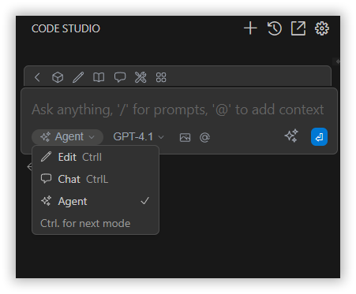
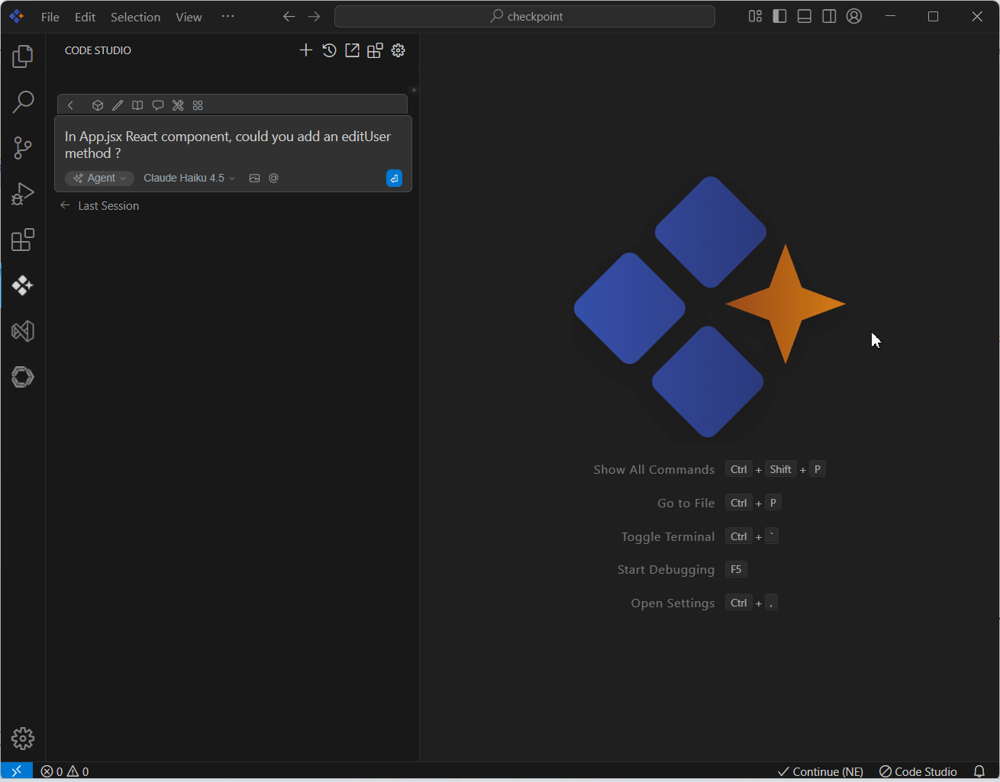

# Agent Mode

## Purpose
Agent mode in Syncfusion Code Studio is an AI coding assistant that works independently to explore your code, plan updates, and complete complex tasks. It’s designed to save you time by reading files, editing code, running commands, and using available tools — all with minimal input from you.

## When to Use
- You need an assistant to autonomously plan and carry out multi-step coding tasks (refactors, feature additions, migrations).  
- You want the AI to read files, make edits, run tools/commands, and verify results with minimal hand-holding—while keeping you in control through approvals and permissions.  
- You prefer a safety net that records checkpoints so you can review or roll back any change.

## Prerequisites
- Syncfusion Code Studio open with a workspace.

## Steps

### 1. Switch to Agent Mode
- Use the mode selector in the chat input to choose **Agent** mode.

### 2. Provide the Task
- State a clear goal and constraints: scope, style guidelines, frameworks, performance or API stability requirements.

### 3. Plan (with Approval)
- The agent drafts a stepwise action plan describing files to read/edit, commands to run, and expected outcomes.  
- Review the plan and approve or request revisions before execution begins.

### 4. Execution
Upon approval, the agent:
- Reads relevant files and searches the codebase  
- Applies diffs/edits and creates new files as needed  
- Runs commands (build, test, format) to validate progress  
- Uses tools (search, edit, terminal) within your allowed permissions

### 5. Checkpoints and Progress
- The agent creates checkpoints at logical milestones so you can review or roll back to a known good state.  
- Progress updates appear in the chat with diffs, command outputs, and next intended actions.Learn more about checkpoints [here](/code-studio/features/checkpoints) .

### 6. Task Complete
- Summarizes all changes and hands back control once the task is completed.

## Validation
- Start with a task. Confirm you see a clear plan with files to change and verification steps.  
- Approve once; verify a checkpoint is created and diffs match the plan.  
- Run your project/tests to ensure behavior aligns with the acceptance criteria.  
- If needed, restore from a checkpoint to confirm safe rollback.

## Troubleshooting
- **Unwanted edits across many files**: use compare to inspect multi-file diffs; restore from the previous checkpoint and refine the plan to limit scope.  
- **Insufficient token limits**: reduce scope and provide exact file paths or relevant snippets. Ask for a “plan-only” pass first.
