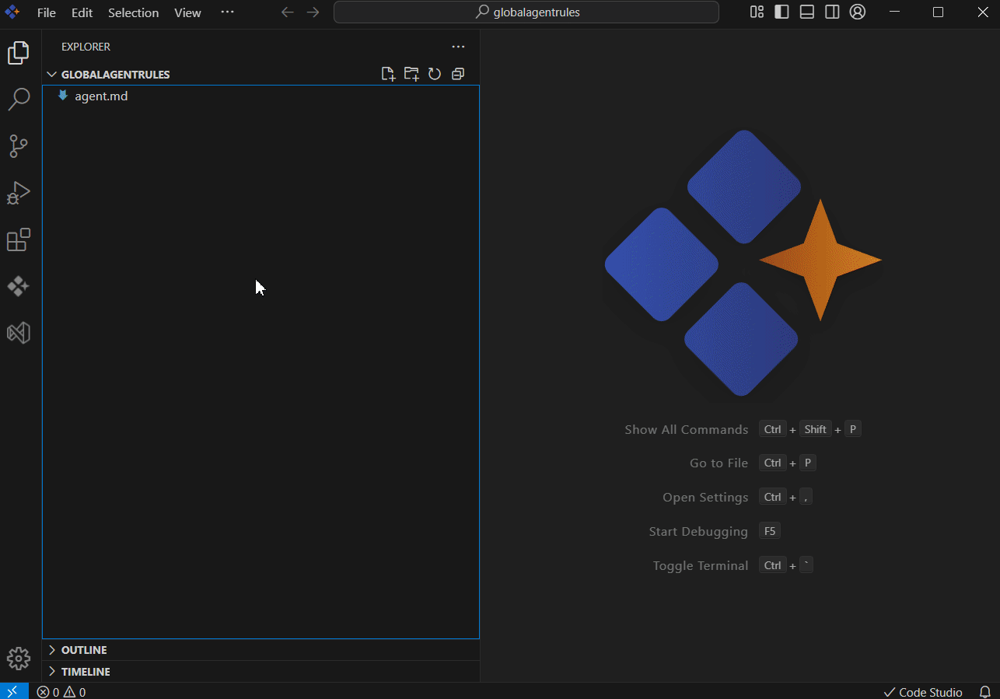

# Global Agents Rule

## Overview
Global Agent Rules is a simple, Markdown based file format designed to provide structured, project specific instructions for AI coding agents in **Syncfusion® Code Studio**. When added to your project, Code Studio automatically detects, parses, and applies these rules, ensuring that AI driven coding workflows follow your guidelines.  

Global Agent Rules are lightweight, easy to set up, and can be placed in the project root or any subdirectory. This makes them ideal for maintaining consistent instructions across your project without repeating the same context in every chat.

## Purpose
The goal of Global Agent Rules is to give developers a clear and consistent way to guide AI code generation and tasks.

- They provide readable, structured instructions that the AI follows during code generation. They help maintain uniform coding standards across the project.  
- They eliminate the need to reexplain context in every chat, saving time and effort.  
- They enhance the accuracy and relevance of AI responses by supplying project specific guidance.  

## How to Use
Using Global Agent Rules in Code Studio is straightforward:

### 1. Create an `AGENTS.md` file
- Place it in your project root or any subdirectory.  
- **Notes:** Keep the total lines across all `AGENTS.md` files under 500 to avoid context length issues.  

### 2. Enable Agent Rules in Settings
- Go to the **Settings** menu under chat category in Code Studio.  
- Toggle the **Enable/Disable Agent Rules** option to activate or deactivate them.  

### 3. Automatic Integration
- Once enabled, Code Studio automatically detects and applies the instructions from your `AGENTS.md` file.  
- The AI will use these rules to guide its responses and code generation, ensuring consistency across your project.  

## Troubleshoot
- If your `AGENTS.md` files go over the **500‑line limit**, you could run into context length issues.  

- To fix this, try simplifying your instructions, removing any repeated or unnecessary rules, or splitting the content into smaller `AGENTS.md` files placed in different subdirectories.  
- Focus on keeping only the most important guidelines in the file so the AI can apply them effectively without errors.  

