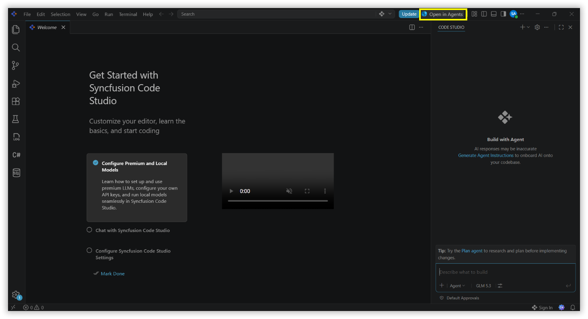
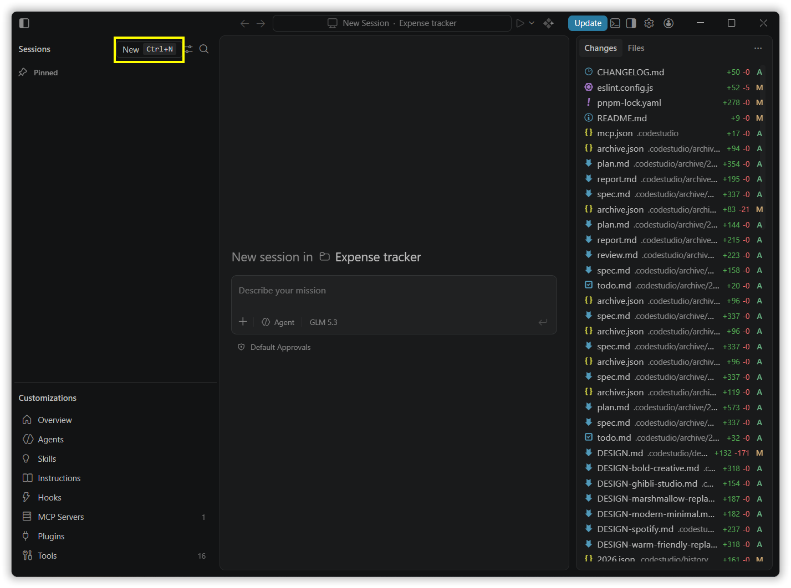
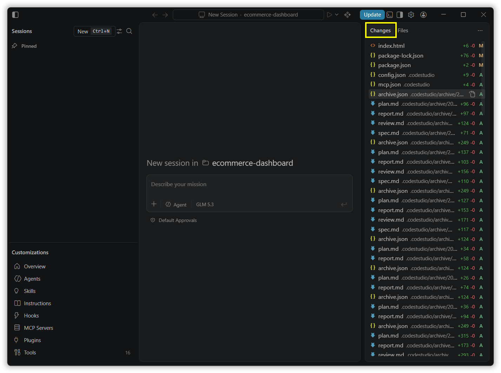
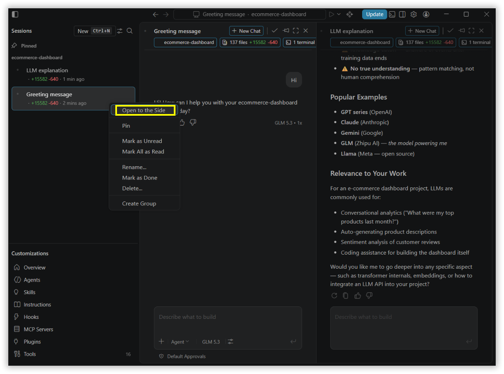
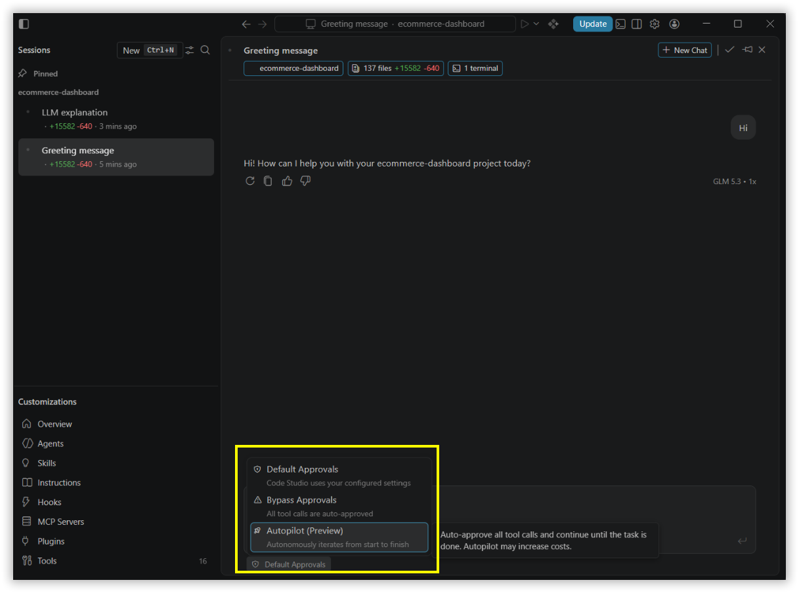
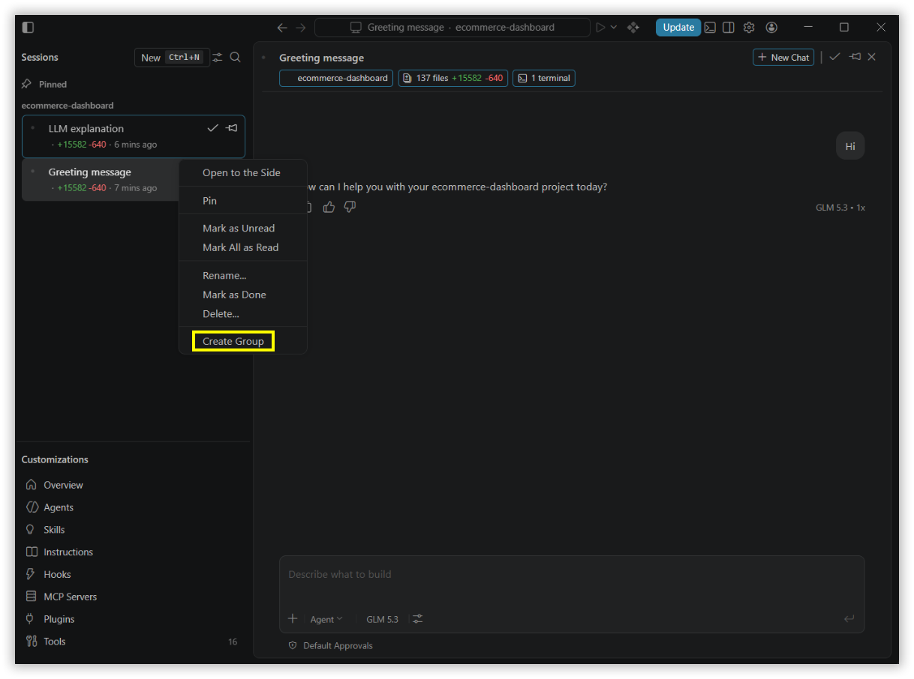

# Agents Window

## Overview

The Agents Window is a dedicated, agent-first companion window in **Syncfusion Code Studio** that gives you a focused space to start, monitor, and review AI agent sessions across multiple local projects at once. Unlike the Chat view in the main editor, the Agents Window is purpose-built for agent-driven workflows: you can run parallel sessions for different local folders, review all code changes in one place, and switch between tasks without losing your conversation history. The window opens alongside your existing editor and shares your authentication, settings, and extensions.

## Use Cases

- Run AI agent sessions for multiple local projects side by side without switching workspaces.
- Review and commit agent-generated code changes from a single Changes panel before merging.
- Start sessions for any local folder on your machine.
- Run Quick Chats for standalone questions or research tasks not tied to a specific project.
- Organize related sessions into custom groups to keep a busy sessions list manageable.
- Enable Autopilot to let the agent proceed through multi-step tasks with fewer manual approvals.

## How to Use the Agents Window

### Step 1: Open the Agents Window

Select the **Open in Agents** button in the Code Studio title bar. The Agents Window opens as a dedicated companion window alongside your main editor.

> **Note:** You can also open the Agents Window from the Command Palette (**Ctrl+Shift+P**) using **Chat: Open Agents window**, or from a terminal with `sfcode --agents`.

The window has five main areas: the **Sessions list** on the left (sessions grouped by workspace by default), the **Chat area** in the center (the active conversation), the **Changes panel** (code diffs for the active session), the **Files panel** (a file browser for the session's workspace), and the **Terminal** bar at the bottom.

### Step 2: Start an Agent Session

Select **New** at the top of the Sessions sidebar (or press **Ctrl+N**) to start a new session. Select a **Local** folder as the primary workspace — this is where the agent runs and writes files.

> **Note:** When opening a folder for the first time, Code Studio may display a Workspace Trust prompt. Review and confirm trust before the agent begins work in that folder.

Type a prompt that describes what you want the agent to accomplish, then press **Enter** to submit it. For example: *"Add input validation and a unit test for the registration form."* The session appears in the Sessions list with a live status indicator while the agent works.

### Step 3: Monitor and Review Agent Changes

Select a session in the Sessions list to make it active. The Chat area displays the full conversation and tool calls. The **Changes** panel shows which files the agent has modified.

Use the **Changes** tab to see all the changes. Select any file to open a diff view. To give the agent precise feedback on a specific line.

### Step 4: Open Multiple Sessions Side by Side

You can open more than one session at a time to compare agent outputs or review work in parallel. To open a session next to the currently active one, right-click it in the Sessions list and select **Open to the Side**, drag it into the view area, or hold **Alt** and select it.

Only one session is active at a time — select anywhere inside a session view to make it active. The active session determines what appears in the Files, Changes, Terminal, and Browser panels.

To switch between sessions quickly, press **Ctrl+R** to open the Sessions picker — a searchable Quick Pick listing your sessions by title and workspace. Press **Enter** to open the selected session, or **Ctrl+Enter** to open it to the side. Use **Ctrl+1** through **Ctrl+9** to jump to a session by its position in the grid from left to right.

### Step 5: Enable Autopilot for Autonomous Tasks

Autopilot is the permission level that allows the agent to proceed through tool calls — editing files, running terminal commands, and adapting to errors — without prompting you at every step. Autopilot is enabled by default for new chats.

To change the permission level, select the permissions dropdown in the Chat input area and choose **Autopilot**, **Default Approvals**, or **Bypass All** depending on how much autonomy you want to grant.

For long or complex tasks where you want the agent to keep working until the goal is truly complete — not just until a turn limit is reached — enable **Advanced Autopilot** via `chat.autopilot.advanced.enabled` in Settings. Advanced Autopilot uses a background evaluation model that checks whether the task is finished and loops up to three additional times if work remains. The current objective is shown in a tooltip above the chat so you always know what the agent is working toward.

> **Note:** Advanced Autopilot is disabled by default. Enable it in Code Studio Settings under `chat.autopilot.advanced.enabled`.

### Step 6: Organize Sessions with Groups and Quick Chats

When running several agent tasks at once, organize the Sessions list into **groups** to keep related sessions together. Right-click anywhere in the Sessions list and select **Create Group**, give it a name, and drag sessions into it. Collapse a group header to tidy the list. Each group also has a dedicated **+ New Session** shortcut so you can queue work directly into the right project bucket.

> **Note:** If a Quick Chat grows into project-specific work, ask the agent to continue the task in a local folder. It prompts you to confirm the folder and carries the full conversation history into a new workspace session automatically.

## Best Practices   

### 1. Use Quick Chats to explore an approach before starting a full session

Before committing to a full agent session with a workspace, use a Quick Chat to compare approaches, draft a plan, or research an API. Once the direction is clear, attach a folder and the Quick Chat converts to a workspace session without losing conversation history.

### 2. Pin sessions you return to often

Pin a session by hovering over it in the Sessions list and selecting the pin icon (or right-clicking and selecting **Pin**). Pinned sessions stay at the top of the list and are not replaced when you open other sessions side by side.

### 3. Organize concurrent work into named groups

Create named groups from the Sessions list context menu and drag related sessions into each one. Collapsing a group hides all its sessions in one click, keeping the list readable when many agent tasks are in progress at the same time.

### 4. Keep Default Approvals mode enabled for safer terminal commands

When the permission level is set to **Default Approvals**, Code Studio automatically sandboxes agent-run terminal commands on macOS and Linux — blocking outbound network access and restricting filesystem writes to your workspace folder. The agent escalates to an approval prompt only when a command needs to operate outside the sandbox. Use Default Approvals for day-to-day tasks to get this protection without giving up agent autonomy.

## Related Features

- [Agent Mode](/code-studio/features/agent) - The core autonomous agent capability that powers sessions in the Agents Window. Use Agent Mode directly in the Chat view when you prefer to stay in the main editor.
- [Plan Mode](/code-studio/features/plan) - Request a step-by-step plan before the agent executes changes. Plan Mode works inside Agents Window sessions as well.
- [Checkpoints](/code-studio/features/checkpoints) - Automatically created at each agent turn, checkpoints let you roll back to any earlier state during a session.
- [Context Compaction](/code-studio/features/context-compaction) - Use `/compact` to summarize long sessions and keep the agent focused on what matters as conversation history grows.
- [Autopilot and Agent Permissions](/code-studio/tutorials/autopilot-and-agent-permission) - A step-by-step walkthrough of permission levels and approval flows across Code Studio agent modes.
