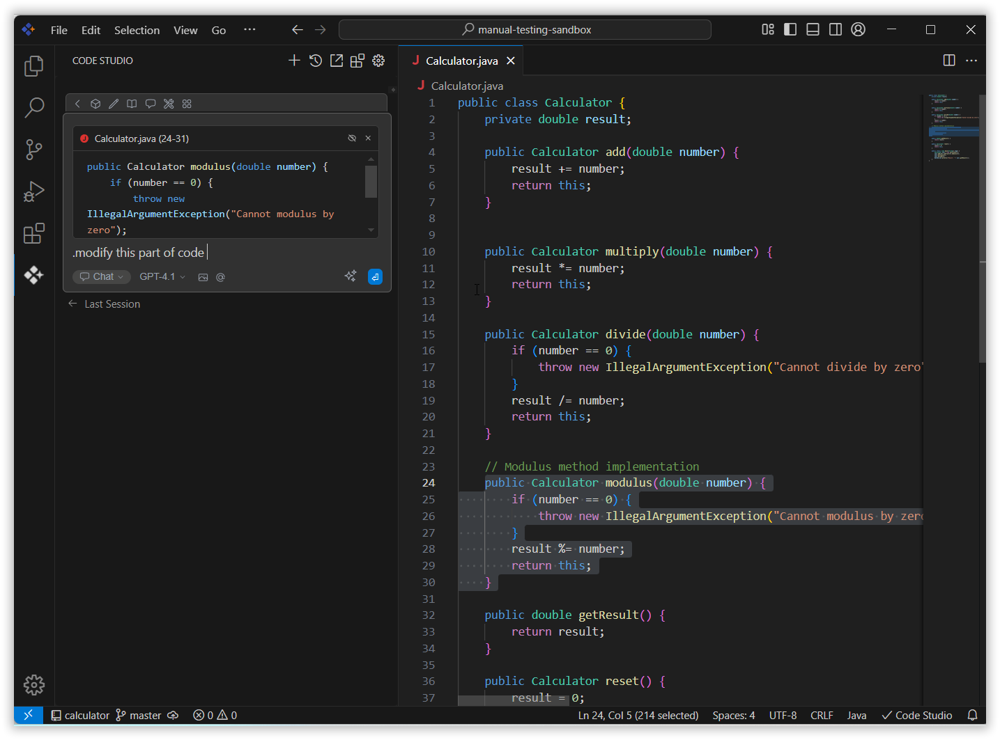
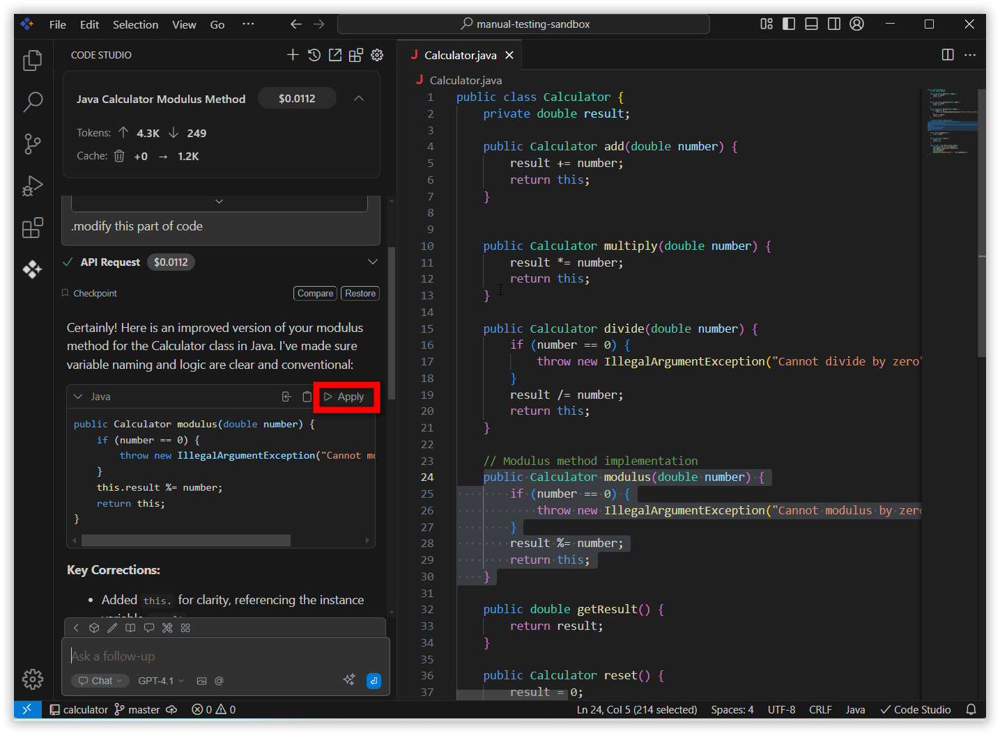

# Apply To Current File
 
## Purpose 

The Syncfusion Code Studio provides an efficient way to apply suggested code directly into your currently opened file. With a single click, changes are applied in place so you can review, adjust, and continue coding without copy-paste.
 
- **Insert Code Instantly:** Place AI-suggested code directly into your open file with one click.
- **Speed Up Workflow:** Reduce manual copy-paste and keep coding without interruption.
- **Review and Accept Easily:** Quickly check and apply code changes to your active project files.
- **Minimize Errors:** Ensure code is placed exactly where it’s needed, reducing mistakes during integration.

## When to Use
- When you want to apply AI-generated code suggestions or fixes directly into your source file.
- To quickly implement improvements such as code optimization, bug fixes, or documentation.
- When you wish to review, accept, or reject AI-proposed changes without switching contexts or manually copying code.

## Prerequisites
 - An active coding project with a file opened and focused in the editor.

## Steps
 
### 1. Enter Your Query
 
In the chat window, ask for specific tasks, such as code optimization, debugging, or adding documentation about the current opened file in the editor. After you receive a response containing code suggestions, you will have the option to apply the code directly.

 
### 2. Apply Changes
 
Once Syncfusion Code Studio provides a code solution or modification in the chat, review the changes to ensure they meet your requirements and click the **Apply** button to insert the provided code directly into the currently opened file in your IDE.

 
### 3. Verify the Changes
 
The code will be automatically applied to the correct location in your file. Review the file to confirm that the changes are implemented as expected.
 
- Click **Accept** to apply the AI-suggested solution to the selected code in the file.
- Click **Reject** to disregard the AI's suggested solution.

## Validation
- Ensure the AI-suggested code appears at the intended position in your currently open file after you click Apply.
- Your file reflects the changes or enhancements as proposed by the AI.
- The Accept and Reject options are available for final decision-making.

## Troubleshooting
- **Apply Button Not Visible**:Ensure you have received a code suggestion block from the AI chat and that a file is open and focused in your editor.