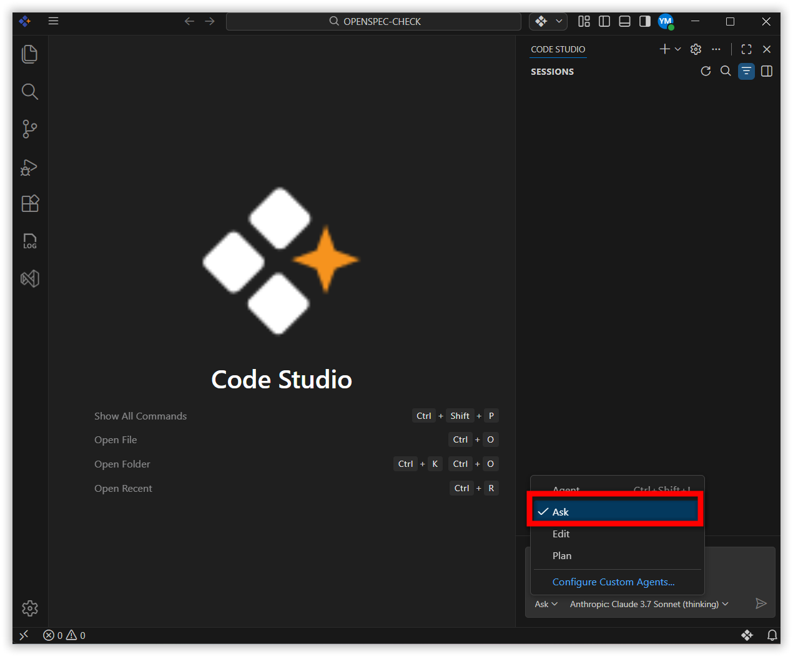
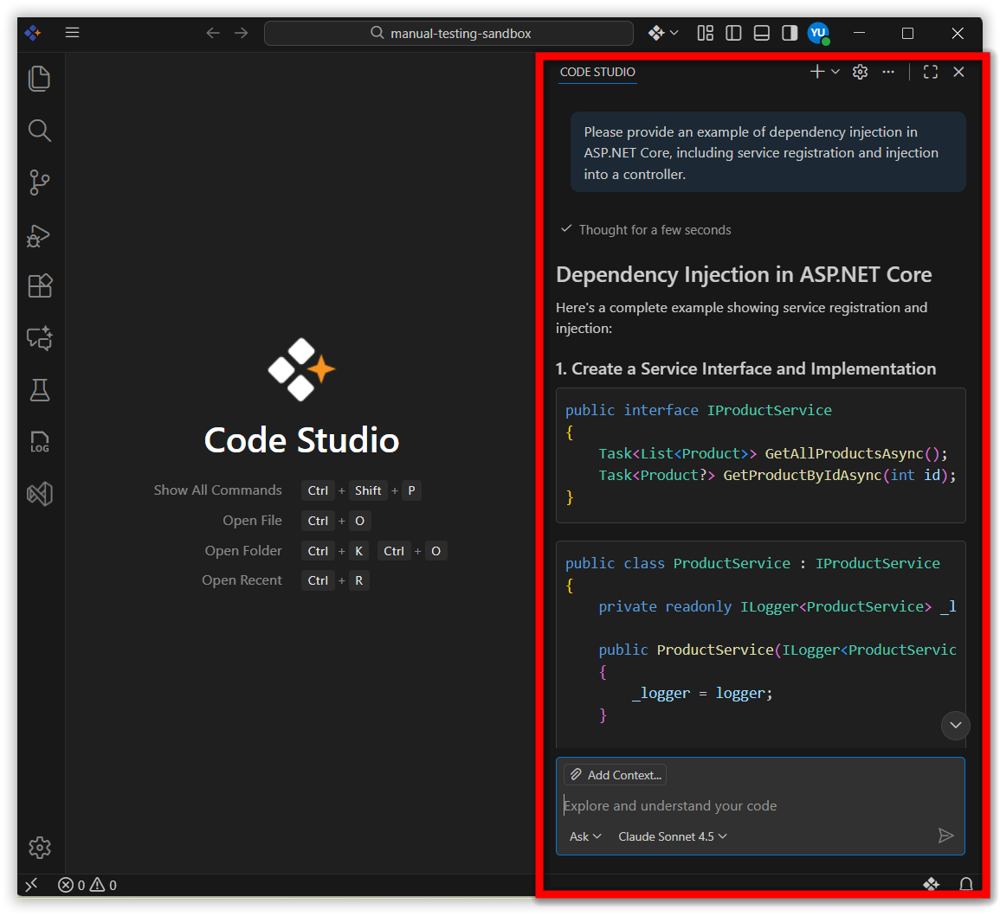

# Ask

## Feature Overview

Ask Mode is a conversational interface within Code Studio that provides immediate technical guidance without modifying your workspace. It delivers explanations, code examples, and best practice recommendations based on your queries, operating independently of your project files. This mode is designed for knowledge acquisition and exploration rather than direct code manipulation.

## Prerequisites

1. **Syncfusion Code Studio Account** - Create and sign in at [Syncfusion Code Studio](https://app.sfcodestudio.com)
2. **Code Studio Installation** - Download and configure the IDE: [Install and Configuration](/code-studio/getting-started/install-and-configuration)

## Use Cases

**Use Ask Mode when you need:**

- **Quick Technical Clarifications** - Resolve coding questions without external documentation searches
- **Code Snippet Generation** - Obtain ready-to-use code examples for specific programming tasks
- **Concept Explanations** - Understand design patterns, framework architectures, or language features through concise technical summaries
- **Non-Invasive Exploration** - Test ideas and validate logic without workspace file modifications or context dependencies

## How to Use Ask Mode in Code Studio

### Step 1: Activate Ask Mode

- Launch Code Studio IDE
- Open the Code Studio chat panel
- Select **Ask** from the agent dropdown menu

    

### Step 2: Submit Your Query

Type your question using natural language. For optimal results:
- State the programming language or framework explicitly
- Include relevant error messages or stack traces when troubleshooting
- Specify the desired output format (e.g., "provide a TypeScript example")

**Example Query:**

### Step 3: Review the Response

Code Studio processes your query and returns:
- Technical explanations with relevant context
- Executable code snippets with syntax highlighting
- Best practice recommendations specific to your query
- References to related concepts when applicable

**Example Response:**

### Step 4: Apply or Iterate

- **Copy snippets** directly into your editor for immediate use
- **Refine queries** with follow-up questions to clarify edge cases
- **Request alternatives** by asking for different approaches or implementations

## Best Practices

- **Be Specific** - Include framework versions, error codes, and technical constraints in your query
- **Provide Context** - Share minimal code snippets that demonstrate the problem or requirement
- **Single-Purpose Queries** - Ask one focused question per prompt for clearer responses
- **Verify Outputs** - Review generated code for security, performance, and compatibility before integration
- **Iterate When Needed** - Refine queries with additional details if the initial response is insufficient
- **Use Proper Terminology** - Technical accuracy in your question improves response quality

## Related Features

- [Edit Mode](/code-studio/features/edit) - Context-aware file editing with workspace integration
- [Agent Mode](/code-studio/features/agent) - Multi-step task automation with tool execution
