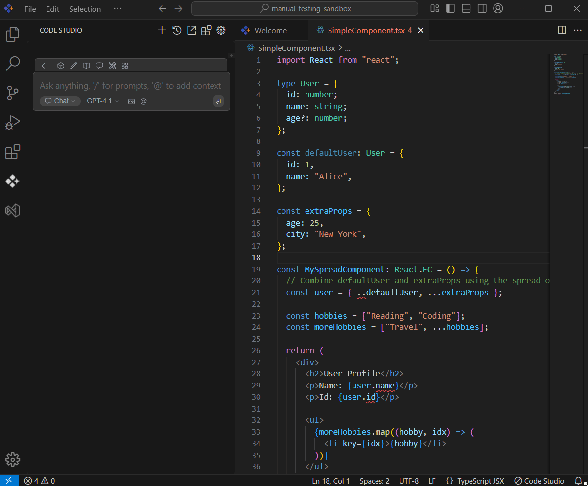

# Ask Code Studio

## Purpose
Syncfusion Code Studio’s Ask Code Studio feature delivers instant AI-powered error resolution directly within your development environment. This intelligent debugging assistant reduces troubleshooting time while maintaining code quality standards across development teams.

## When to Use
- You encounter code errors, warnings, or undefined behaviors and need instant AI-powered explanations and fixes.  
- You want to understand the root cause of an error without interrupting your workflow or context-switching.  
- You're learning best practices for error handling and want verified, knowledge-backed solutions.

## Prerequisites
- Syncfusion Code Studio open with an active editor file.  
- File with visible error indicators (red/yellow underlines, syntax errors, runtime warnings).

## Steps

### 1. Detect Errors and Share the Context to AI
- Hover the error indicators (red/yellow underlines) in your code and click the quick fix button.  
- Select “Ask Code Studio” from the quick actions menu.  
- The 3 lines above and below the error are automatically sent to the chat followed by the question:  
  “Please explain the cause of this error and how to solve it: [ERROR_MESSAGE]” and click Enter.

### 2. Review Suggestions and Verify the Answer
- Read the suggestions provided by the AI.Apply the fix in your code if it matches your problem.  
- Before applying a fix, make sure it fits your project.

### 3. Knowledge Transfers and Limitations
- Knowledge includes language semantics, common debugging strategies, and the 3+3 lines surrounding the error plus the diagnostic message.  
- Context is limited to 3 lines above/below the error; for larger code blocks, use manual code selection and "Add to context" in chat.

## Validation
- When you hover the error, click the lightbulb icon; verify the error and surrounding context appear in chat.  
- Review the AI suggestion and confirm it accurately identifies and explains the issue.  
- Apply the fix and verify the error indicator disappears.

## Troubleshooting
- **Ask Code Studio lightbulb icon doesn't appear**: ensure the file has visible errors (red/yellow underlines), the editor is focused, and Code Studio is active.  
- **Suggestion doesn't apply cleanly**: verify the suggestion matches your code structure; if not, ask the assistant for an alternative or clarification in chat.
