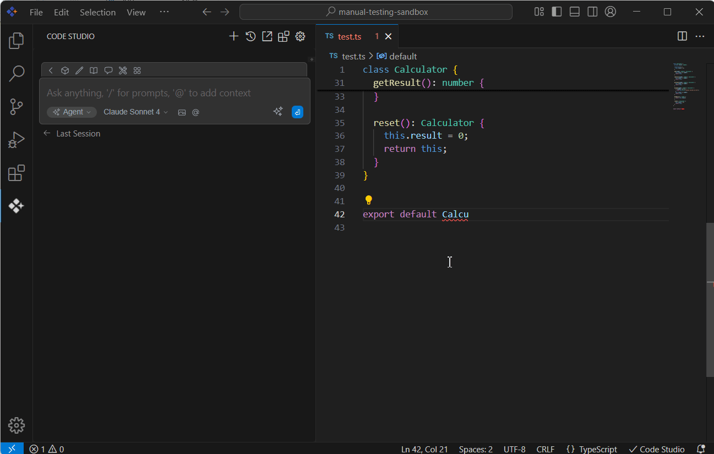

# Ask Code Studio

Syncfusion Code Studio's **Ask Code Studio** feature delivers **instant AI-powered error resolution** directly within your development environment. This intelligent debugging assistant reduces troubleshooting time while maintaining code quality standards across development teams.

## Purpose

The Ask Code Studio feature is designed to reduce the time developers spend on debugging and error resolution. Its main purposes are to:

- **Provide Instant Solutions**: Get immediate, actionable suggestions for fixing code errors.
- **Improve Code Quality**: Learn from AI-powered explanations and apply best practices for error handling.

## How To Use Ask Code Studio
1. **Detect**: Notice error indicators (red/yellow underlines) in your code
2. **Activate**: Click lightbulb icon or press `Ctrl/Cmd + .`
3. **Select**: Choose "Ask Code Studio" from the quick actions menu
4. **Context Transfer**: The 3 lines above and below the error are automatically sent to the chat followed by the question "How do I fix the following problem in the above code?: [ERROR_MESSAGE]"
5. **Resolve**: Review AI suggestions → Apply fix

