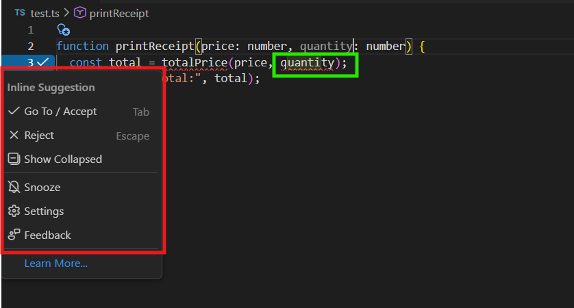
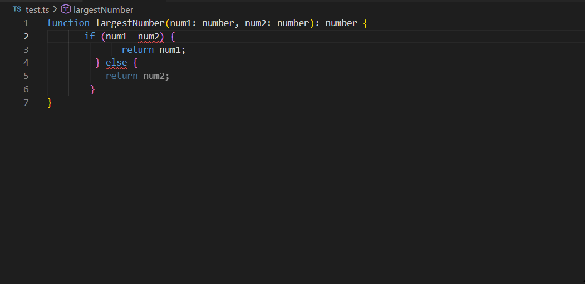
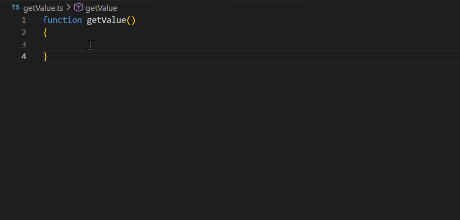
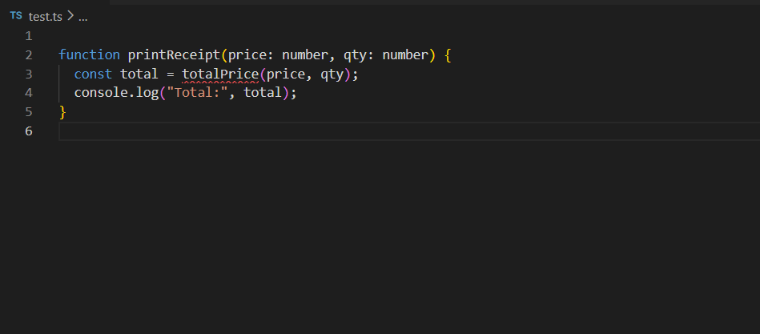

# Autocomplete

## Overview
Syncfusion Code Studio provides an AI‑powered Autocomplete system designed to accelerate coding by offering intelligent inline suggestions and completing code based on context. The feature supports multiple programming languages and frameworks, helping developers write faster, cleaner, and more consistent code.
Key capabilities include:

- Inline code suggestions (ghost text)
- Automatic code completion for functions, loops, and patterns
- Code generation from comments
- Style‑aware suggestions that match your existing coding patterns
- Multi‑suggestion alternatives
- Next Edit Suggestions for guided sequential editing and refactoring

## Use Cases
1. Faster Code Writing
Autocomplete reduces repetitive typing and automatically completes structures like loops, functions, and common patterns.
2. Maintaining Coding Style Consistency
Code Studio analyzes your codebase and aligns suggestions with your naming conventions, patterns, and structure.

3. Code Generation from Comments
By writing descriptive comments, Code Studio can generate classes, fields, and method logic automatically.

4. Error Correction and Refactoring
Next Edit Suggestions help predict and guide your next change.

5. Sequential Edits Across Code
When performing multi‑step updates—like renaming, refactoring, or modifying patterns—Code Studio highlights and suggests the next best edit to maintain flow.

## Prerequisites 

- Syncfusion Code Studio installed and configured on your system. If you have not yet downloaded Code Studio, please refer to this link [Install and Configure](/code-studio/getting-started/install-and-configuration) for step-by-step instructions on downloading and configuring Code Studio.

## How Autocomplete Works
## Inline Suggestion
Inline suggestions appear as light, faded (ghost) text directly at the cursor while you type. These suggestions help you complete code quickly without interrupting your flow.

### How to get your first inline suggestion in Code Studio
**Steps:**
1. Start typing normally inside the Code Studio editor.
2. A faded (ghost) suggestion will appear based on your context.
3. **Accept full suggestion:** Press `Tab`
4. **Dismiss suggestion:** Press `Esc`
5. **Accept suggestion word-by-word:** Press `Ctrl/Cmd + →`

   

### Maintaining Coding Style Consistency
Code Studio analyzes your existing code patterns—such as parameter names, method structure, and naming conventions—and automatically suggests completions that match your style. This ensures consistent code quality across your project.

**Example:**
If your method `calculateTotal` uses parameters like **price** and **quantity**, then when you start writing a new method such as `calculateDiscountedTotal`, Code Studio will suggest the same parameter names to maintain consistency.


### Alternative Suggestions
Code Studio may provide multiple inline suggestions. Hover over a suggestion to view alternatives and choose the one that best fits your code.


### Code Generation from Comments
You can instruct Code Studio to generate code by simply writing a comment that describes what you want.

**Example:**
If you write comment like,
```
// Create a PriceCalculator class in Typescript with methods to calculate total price and discounted price
```
Code Studio may automatically generate the corresponding class with:
- Fields
- Methods
- Default logic matching your description


## Next Edit Suggestion
- Next Edit Suggestions in Syncfusion Code Studio help you move quickly through related edits by predicting where your next change should occur and suggesting what that change might be.

- This feature keeps you in the flow of editing—especially when making sequential updates, correcting mistakes, or refactoring code across multiple lines.

### How Next Edit Suggestions Work

**1. Predicting the Next Edit:**
When you start editing a block of code, Code Studio analyzes the intent and predicts where your next edit is likely needed.
For example, if you rename a variable in one place, Code Studio suggests updating other references automatically.

**2.	Navigating to the Suggested Edit**
   - A small arrow icon appears in the gutter to indicate an upcoming edit suggestion.  
   - Press `Tab` to accept the suggestion. 
   - Press `Esc` to reject the suggestion.ng

   

### Use Cases for Next Edit Suggestions

### 1. Correcting Mistakes
   **Correcting incorrect comparison operator:** Code Studio identifies cases where an incorrect comparison operator is used and suggests a correction based on the intended logic of the code.

   **Example:** A developer intends to compare numbers to find the largest value, but mistakenly uses the `<` operator instead of `>`. Code Studio identifies this logical mistake and suggests replacing the incorrect operator:

   

   **Correcting incorrect variable declaration:** Code Studio identifies cases where the developer’s intent is clear, but the code is written incorrectly due to a typo or swapped identifier.

   **Example:** The developer intends to return a constant value, but accidentally types `cont` instead of `const` and refers to the function name instead of the variable. Code Studio infers the intended logic and suggests the corrected declaration and return value:

   

### 2. Updating variable names consistently  

Code Studio identifies when a variable has been renamed and suggests updating all related references to keep the code consistent.

**Example:** When a developer renames a variable or introduces a new naming pattern, Code Studio detects the intent and recommends updating subsequent occurrences of the variable to match the new name:




## Configuration Options
### Enable or Disable Autocomplete
**Steps:**
1. Click the **Gear icon** at the bottom-left corner.
2. Select **Code Studio Settings**.

   

3. In the left panel, select **Autocomplete**.
4. Toggle **Enable Autocomplete** ON or OFF.

   

### Select a Completion Model
**Steps:**
1. Click the dropdown next to the Code Studio icon.
2. Select **Configure Inline Suggestions**.

   

3. Click **Change Completion Model**.

   

4. Choose the model you prefer from the dropdown list.

   

> **Note:** By default, only the premium autocomplete model is available. If you want to use other models for autocomplete, you must add them through BYOK (Bring Your Own Key). When configuring BYOK, ensure that the model is added with the Autocomplete model option enabled on the server. You can follow the instructions provided in the [BYOK help link](/code-studio/enterprise-server/providersandmodels) to complete this setup. Once a model is added via BYOK with autocomplete enabled, it will automatically appear in the Autocomplete model dropdown, allowing you to switch from the default premium model to another supported model.

## Best Practices
- **Write meaningful comments:** Better clarity leads to more accurate code generation.
- **Review suggestions carefully:** Avoid unintended logic.
- **Maintain consistent coding style:** Improves the accuracy and quality of suggestions.
- **Make intentional edits:** When you rename, reorganize, or modify code with a clear purpose, Code Studio can more accurately infer your intent and provide aligned follow up suggestions.
- **Validate propagated changes:** Next Edit Suggestions may update related code across the file or project. Review these changes to ensure they match your design intent.

## Releted Features
 - [Inline Chat](/code-studio/features/inlinechat) Inline Chat in Syncfusion Code Studio lets you talk to AI directly inside your code or terminal without switching screens.
 - [Generate Code](/code-studio/features/generatecode) The Generate Code feature speeds up development by automatically handling repetitive tasks and giving instant AI-powered help right inside your editor.


