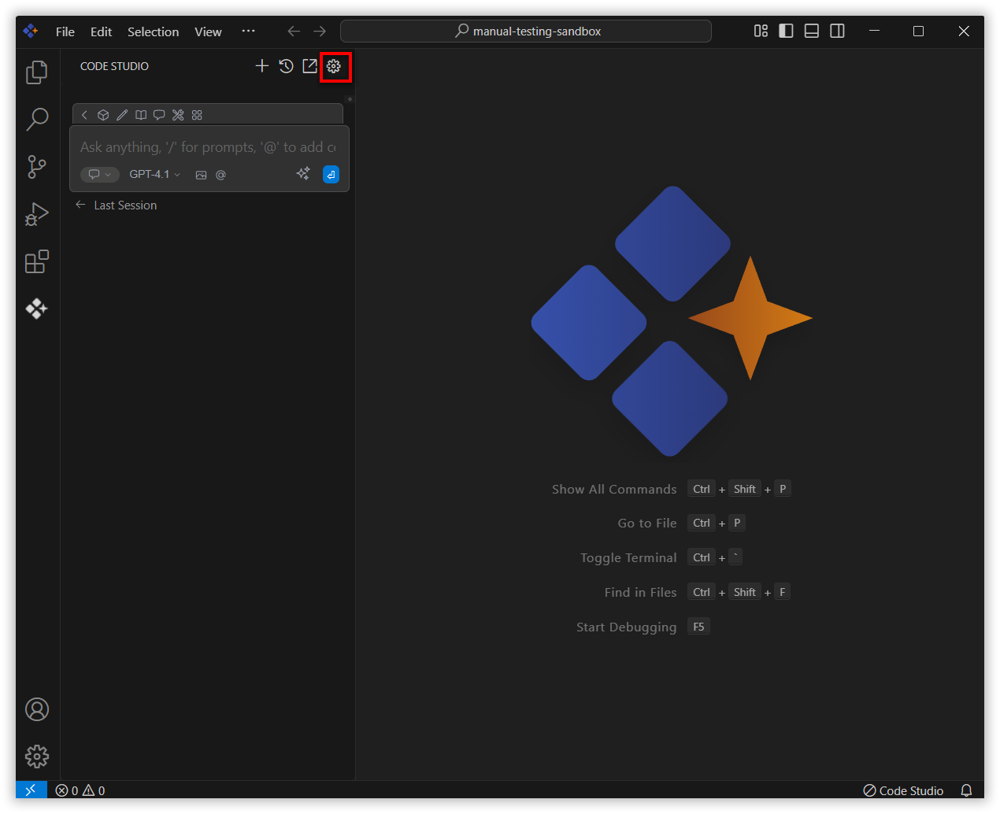

# Autocomplete

## Purpose
Autocomplete provides inline code suggestions as you type. It provides real-time, inline code suggestions as you type, helping you write code faster and with fewer errors. As you begin typing, it predicts and displays context-aware completions directly. This feature enhances productivity by reducing repetitive typing and offering intelligent suggestions based on your current code and project context.

## When to Use
- You want inline, context‑aware code suggestions as you type to speed up routine coding and reduce typos.  
- Works well across all common languages (for example: JS/TS, Python, Java, C#, Go, Rust, C/C++, Ruby, PHP, Kotlin, Swift; plus, HTML/CSS/JSON/YAML/Markdown/shell).  
- Quality improves with clear intent and open project context.

## Prerequisites
- Syncfusion Code Studio An open file and an active project/workspace.
- Access to an autocomplete model in the Models section (premium, BYOK, or local models).  

## Steps

### 1. Open the Models section in Chat
- Open the Models section at the top of chat.

### 2. Choose the Autocomplete model
- Choose the Autocomplete model under the Autocomplete category (pick premium/BYOK/local models).

### 3. Autocomplete Suggestions
- Start typing in an editor file. Inline ghost text suggestions will appear.  
- Typical triggers include short pauses while typing, starting a new line, after typing function names/parentheses/brackets, imports, or recognizable patterns.

### 4. Acceptance Shortcuts
**Accepting a full suggestion:**

Press the **"Tab"** key on your keyboard.

**Rejecting a full suggestion:**

Press the **"Esc"** key on your keyboard.

**Partially accepting a suggestion:**

Press **"Cmd/Ctrl + →"** on your keyboard to accept parts of the suggestion word-by-word.

## Validation
- In a file, begin a common construct (e.g., define a function or start a loop) and pause briefly.  
- Confirm an inline suggestion appears that matches your code context.  
- Press Tab to accept and verify the code is inserted correctly; press Esc to dismiss; press Cmd/Ctrl + Right Arrow to accept incrementally.  

## Troubleshooting
- **Irrelevant suggestions**: Provide clearer intent (function signature, variable names), and open related project files so context is available.  
- **Slow suggestions**: Use a faster/local model, ensure a stable network.
