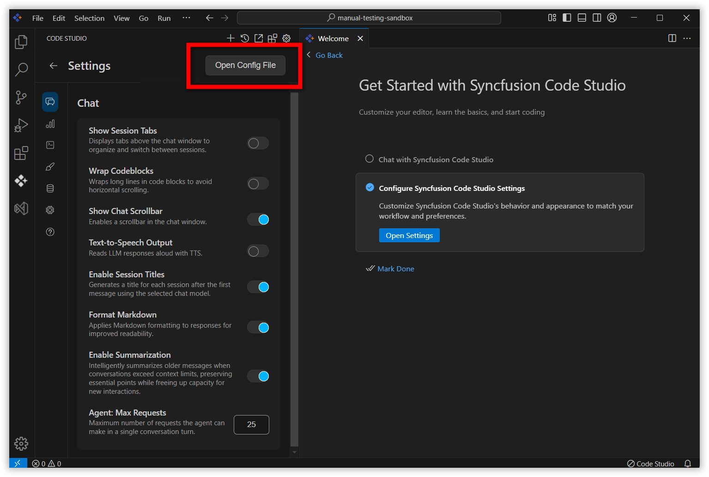

# Autocomplete in Code Studio

## Description
Syncfusion Code Studio includes an AI-powered autocomplete system that assists you while writing code. As you type, it suggests relevant code completions, comments, and patterns directly inside the editor based on the context of your current file, and it supports a wide range of programming languages and frameworks.

## Purpose
The purpose of Autocomplete is to make coding faster, more accurate, and easier by:
- Reducing repetitive typing
- Completing functions, loops, and patterns automatically
- Maintaining coding style consistency
- Generating code from comments

## Prerequisites
1. **Create and sign in** to your Syncfusion Code Studio account, visit: [Syncfusion Code Studio](https://app.sfcodestudio.com)
2. **Download and open Syncfusion Code Studio**, visit: [Install and Configuration](/code-studio/getting-started/install-and-configuration)

## How Autocomplete Works
### Inline Suggestion
Inline suggestions appear as light, faded (ghost) text directly at the cursor while you type. These suggestions help you complete code quickly without interrupting your flow.

### How to get your first inline suggestion in Code Studio
**Steps:**
1. Start typing normally inside the Code Studio editor.
2. A faded (ghost) suggestion will appear based on your context.
3. **Accept full suggestion:** Press `Tab`
4. **Dismiss suggestion:** Press `Esc`
5. **Accept suggestion word-by-word:** Press `Ctrl/Cmd + →`

   

### Maintaining Coding Style Consistency
Code Studio analyzes your existing code patterns—such as parameter names, method structure, and naming conventions—and automatically suggests completions that match your style. This ensures consistent code quality across your project.

**Example:**
If your method `calculateTotal` uses parameters like **price** and **quantity**, then when you start writing a new method such as `calculateDiscountedTotal`, Code Studio will suggest the same parameter names to maintain consistency.

 

### Alternative Suggestions
Code Studio may provide multiple inline suggestions. Hover over a suggestion to view alternatives and choose the one that best fits your code.

 

### Code Generation from Comments
You can instruct Code Studio to generate code by simply writing a comment that describes what you want.

**Example:**
If you write comment like,
```ts
// Create a PriceCalculator class in Typescript with methods to calculate total price and discounted price
```
Code Studio may automatically generate the corresponding class with:
- Fields
- Methods
- Default logic matching your description

 

## Configuration Options
### Enable or Disable Autocomplete
**Steps:**
1. Click the **Gear icon** at the bottom-left corner.
2. Select **Code Studio Settings**.

   

3. In the left panel, select **Autocomplete**.
4. Toggle **Enable Autocomplete** ON or OFF.

   

### Select a Completion Model
**Steps:**
1. Click the dropdown next to the Code Studio icon.
2. Select **Configure Inline Suggestions**.

   

3. Click **Change Completion Model**.

   

4. Choose the model you prefer from the dropdown list.

   

> **Note:** By default, only the premium autocomplete model is available. If you want to use other models for autocomplete, you must add them through BYOK (Bring Your Own Key). When configuring BYOK, ensure that the model is added with the Autocomplete model option enabled on the server. You can follow the instructions provided in the [BYOK help link]((/code-studio/enterprise-server/providersandmodels)) to complete this setup. Once a model is added via BYOK with autocomplete enabled, it will automatically appear in the Autocomplete model dropdown, allowing you to switch from the default premium model to another supported model.

## Best Practices
- **Write meaningful comments:** Better clarity leads to more accurate code generation.
- **Review suggestions carefully:** Avoid unintended logic.
- **Maintain consistent coding style:** Improves the accuracy and quality of suggestions.

