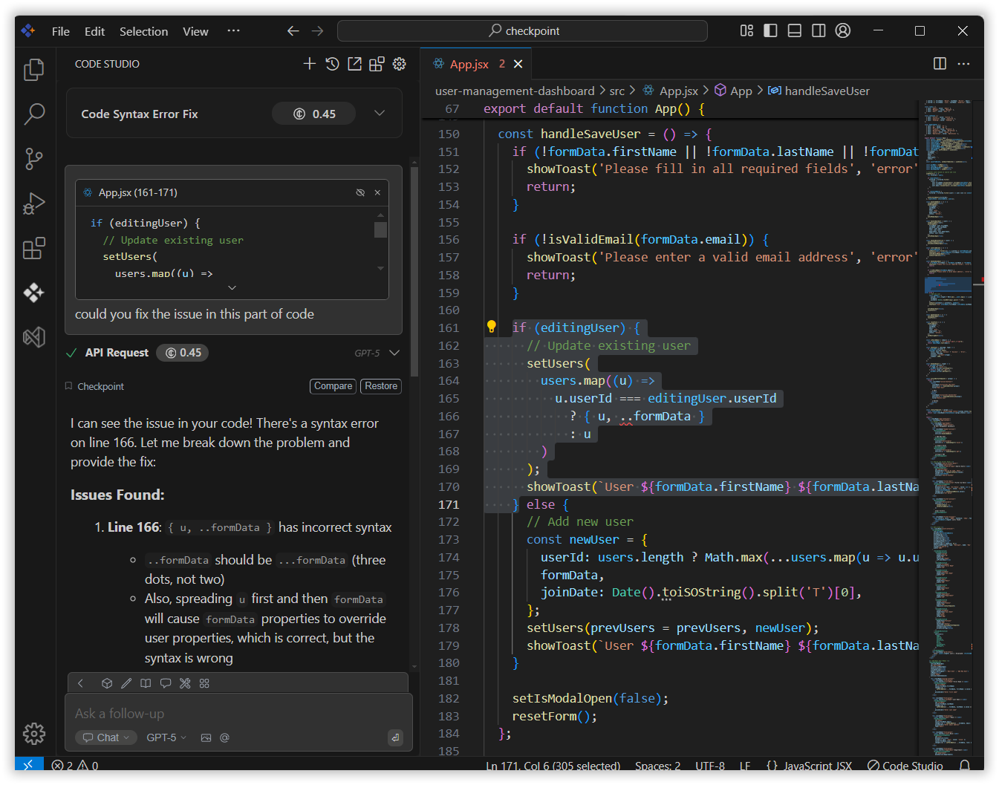

# Chat

## Purpose
Chat Mode lets you interact with an AI assistant using natural language to boost your productivity. You can ask coding questions, get explanations, generate code, or troubleshoot issues. The AI understands your project’s context, so its help is always relevant and tailored to your current work.

## When to Use
- You want conversational AI assistance for coding questions, explanations, and troubleshooting without leaving your workflow.  
- You need context-aware responses tailored to your project's codebase and development environment.  
- You prefer natural language interaction to explore ideas, generate snippets, or debug complex logic.

## Prerequisites
- Syncfusion Code Studio open with chat.

## Steps

### 1. Attach Context
- Select code in your editor and press **Command+L** (Mac) or **Control+L** (Windows/Linux) to automatically send the selected code to the chat.  
- The AI uses this context for tailored responses.

### 2. Code-aware Prompts
- Ask questions or requests about the attached code—explain logic, suggest improvements, generate alternatives, or troubleshoot bugs.  
- The AI responds with explanations, suggestions, or new code snippets.Type follow-up questions or refine requests in natural language.  
- The AI maintains context across the conversation and understands your project structure, so responses remain relevant and accurate.

## Validation
- Select a code segment and press Command+L / Control+L; confirm it appears in the chat with context preserved.  
- Ask a question about the attached code (e.g., "Explain this function") and verify the response is specific to your code, not generic.

## Troubleshooting
- **Code doesn't attach to chat**: ensure you've selected text in an active editor file and pressed the correct keyboard shortcut (Command+L or Control+L).  
- **AI responses feel generic**: provide more context by attaching relevant files or clarifying your project structure in the prompt.
