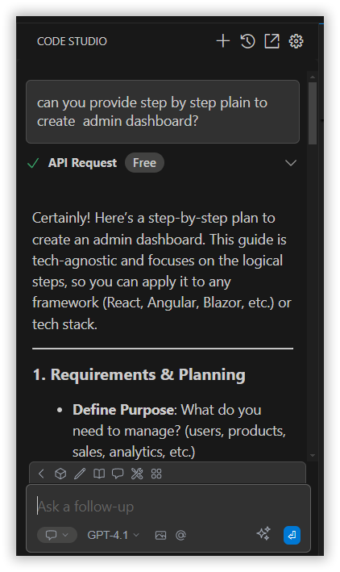
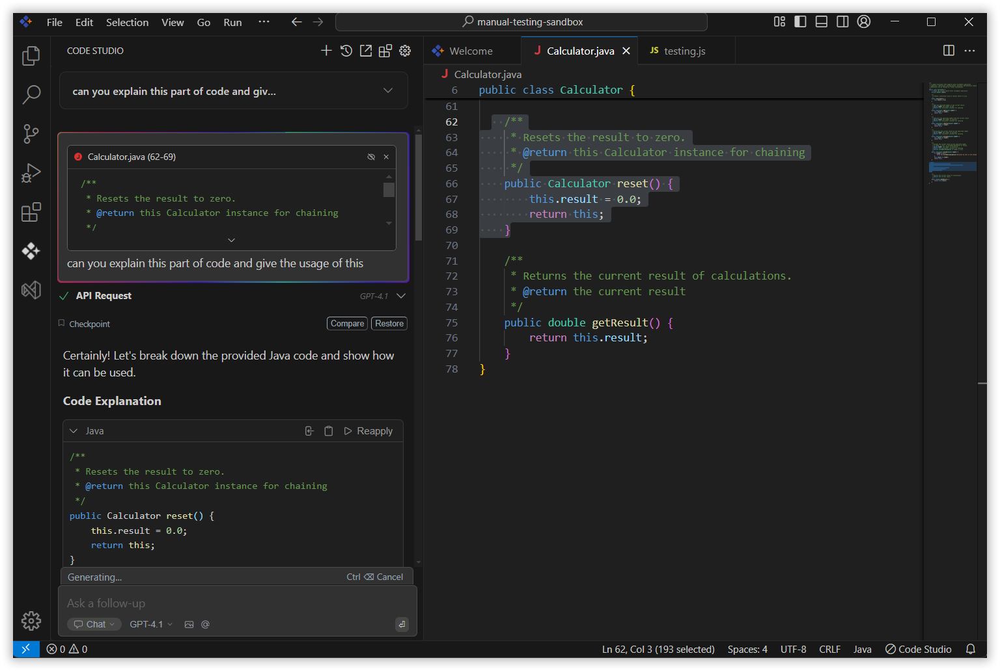

# Chat
Engage in a natural language conversation with the AI to boost productivity. You can ask coding questions, request explanations of complex logic, generate new code snippets, or troubleshoot bugs. The AI understands your project’s context, so its responses are relevant, accurate, and tailored to your current files and development environment. It's like having an expert developer always ready to assist.

## Code Selection & AI Assistance Feature

You can easily get AI help with specific code segments by:

Using your mouse to select any portion of code in your editor
Pressing `Command+L (on Mac)` or `Control+L (on Windows/Linux)`
This action will automatically send the selected code to the AI assistant via chat
You can then type questions or requests about the selected code, and the AI will respond with explanations, suggestions, or improvements

