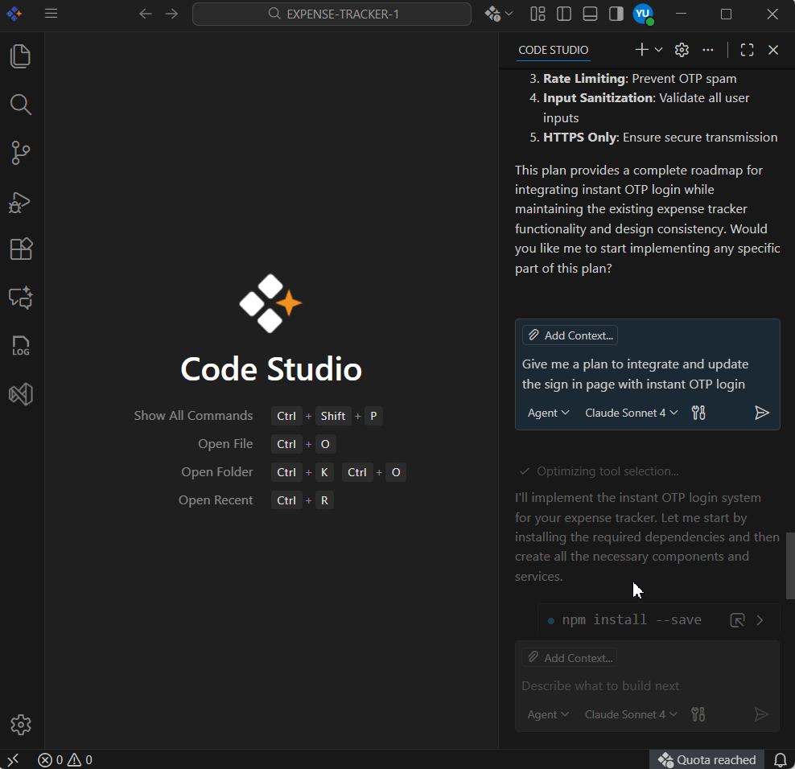

# Checkpoints and Editing requests in Code Studio

## Description
The Checkpoints and Editing Requests features in Syncfusion Code Studio provide powerful tools for managing your development workflow. Checkpoints automatically record the state of your workspace at important moments, while Editing Requests allows you to revise previous chat instructions and revert the workspace to the state before those instructions were applied. Together, these features create a safe, traceable, and flexible environment that supports iterative development and experimentation. 

## Purpose
The purpose of these features is to help developers maintain control over their workspace as they interact with AI-driven coding assistance. This Checkpoints and Editing Requests provides reliable history tracking, predictable behavior, and safer AI-assisted updates. 

## Editing a Previous Chat Request
Code Studio allows you to edit any previous chat request in your conversation history. When you modify an earlier request, Code Studio treats it as a new instruction and sends it again to the AI model. The workspace is then reverted to the state it was in before the original request—undoing any file changes made by that request and the requests that came after it.

### How to Edit Previous Char request

**Steps**:

1. To edit a previous chat request, navigate to the chat request.

2. Click the chat request to modify and then resend it.

## Restoring a Checkpoint
When you restore a checkpoint, Code Studio returns your workspace to the exact state it was in when that checkpoint was created. Any file changes made after that point are undone, allowing you to safely roll back to a known good version.

### How to use Restore Check Point in Code Studio

**Steps**:

1. In the Chat view, navigate to a previous request in the chat session.

2. Hover over the request and select **Restore Checkpoint**.

3. Confirm the action to restore the workspace and undo changes made after that point.

## Redo Changes After Restoring a Checkpoint
After restoring the previous checkpoint, Code Studio allows you to redo the changes that were undone. This is helpful if you restored the checkpoint by mistake or want to reapply the edits you rolled back.

### How to redo changes After Restoring a Checkpoint

1. To redo these changes, simply select Redo from the Chat view after the checkpoint has been restored.

## Best Practices

### 1. Review checkpoints before restoring
Always confirm which point in your project timeline you're reverting to so no important changes are unintentionally lost.

### 2. Use editing requests to refine earlier instructions
If an AI-generated update wasn't what you expected, modify the earlier request instead of creating new ones on top of it—this keeps your workspace clean and consistent.

### 3. Restore and redo changes carefully
When restoring a checkpoint, verify the impact on recently edited files. If needed, use the **Redo** option to reapply reverted changes safely.
