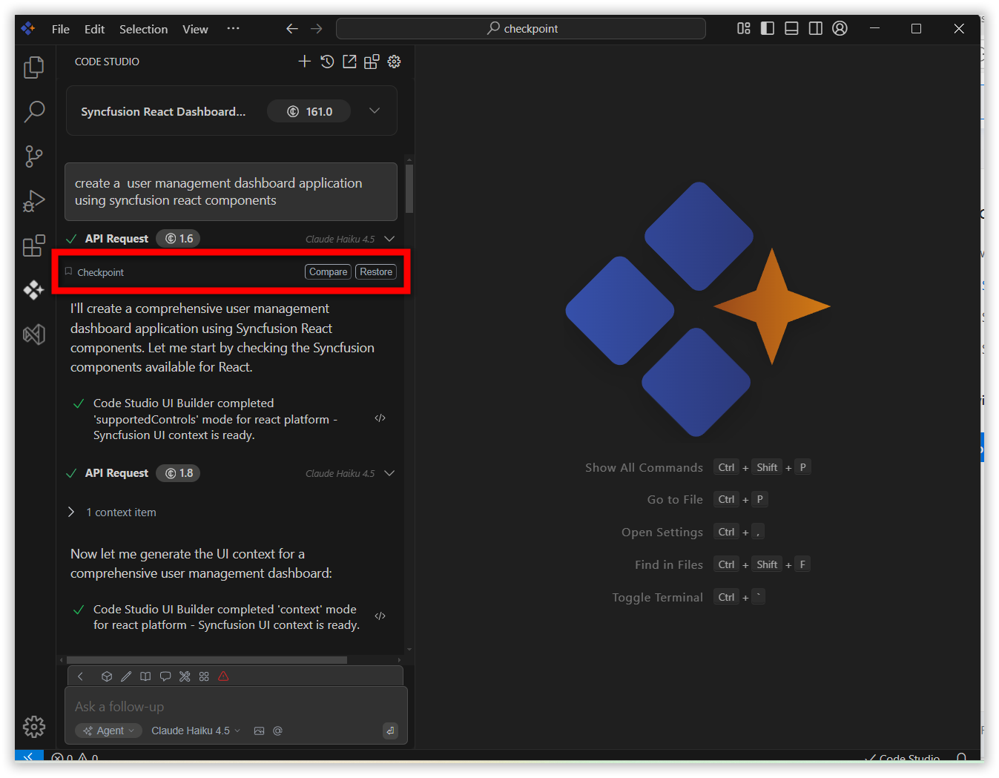
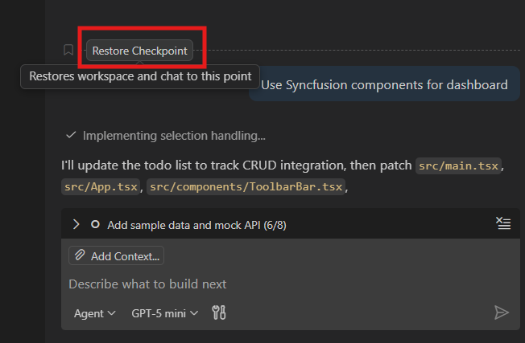
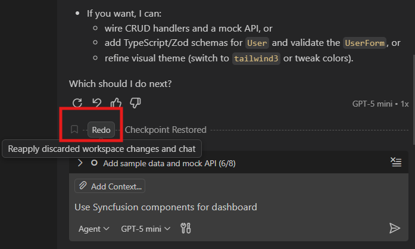
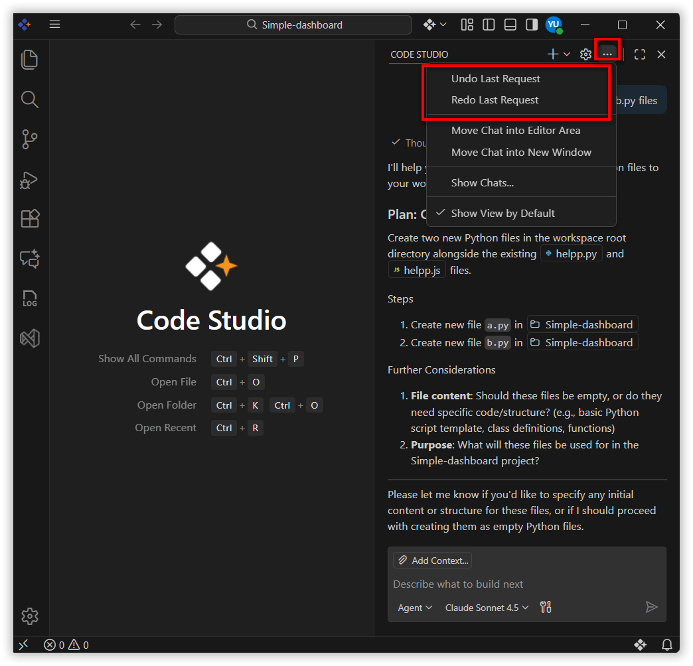

# Checkpoints 

## Purpose
The Checkpoints feature in Syncfusion Code Studio automatically captures and preserves the state of your workspace at key moments. This allows you to:

- Track changes over time  
- Preview modifications  
- Revert to previous states  

Checkpoints help ensure your work remains safe, traceable, and manageable throughout the development process.

## When to Use
- You want automatic snapshots of your workspace to track changes, preview diffs, and quickly roll back.  
- You’re experimenting, running tools, or applying large edits and need a safe restore point.

## Prerequisites
- Working in Syncfusion Code Studio with an open workspace.  
- Stable environment to avoid interrupted snapshots.

## Steps

### 1. Creating Checkpoints
- Enter a query in the chat (e.g., “Create a user management dashboard application using Syncfusion React components.”) and press Enter.  
- A checkpoint is automatically created at the start of the response.  
- Additional checkpoints are created after each tool execution, such as:  
  - Create New File  
  - Edit File  
  - Run Terminal Command

### 2. Comparing Checkpoints
- Click the Compare button next to a checkpoint to view a detailed diff of the workspace files.  
- This shows which files will be modified or affected if you restore to that checkpoint.

### 3. Restoring Checkpoints
- Click the Restore button to revert your workspace to the state captured in the selected checkpoint.  
- This action will overwrite your current workspace files with the versions saved in that checkpoint.  
- Before restoring, you can preview the changes using the Compare button to ensure accuracy.

## Validation
- Trigger a checkpoint by running a chat command; confirm a new entry appears in the list.  
- Make a small edit in a file, then use Compare on the latest checkpoint to see the diff.  
- Click Restore to revert; verify the file content returns to the checkpointed version.

## Troubleshooting
- **No checkpoints appear**: ensure an action ran and the workspace is writable.  
- **Diff looks empty or incomplete**: confirm files were saved and not ignored by tooling.  
- **Restore didn’t change files**: you may be restoring to the current state; pick an older checkpoint.  

