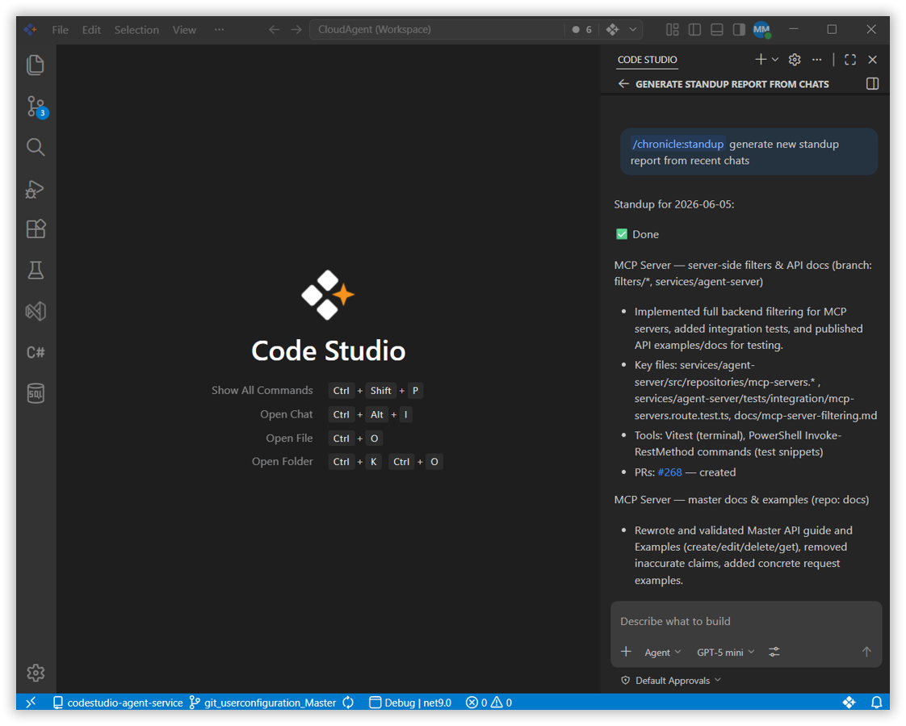
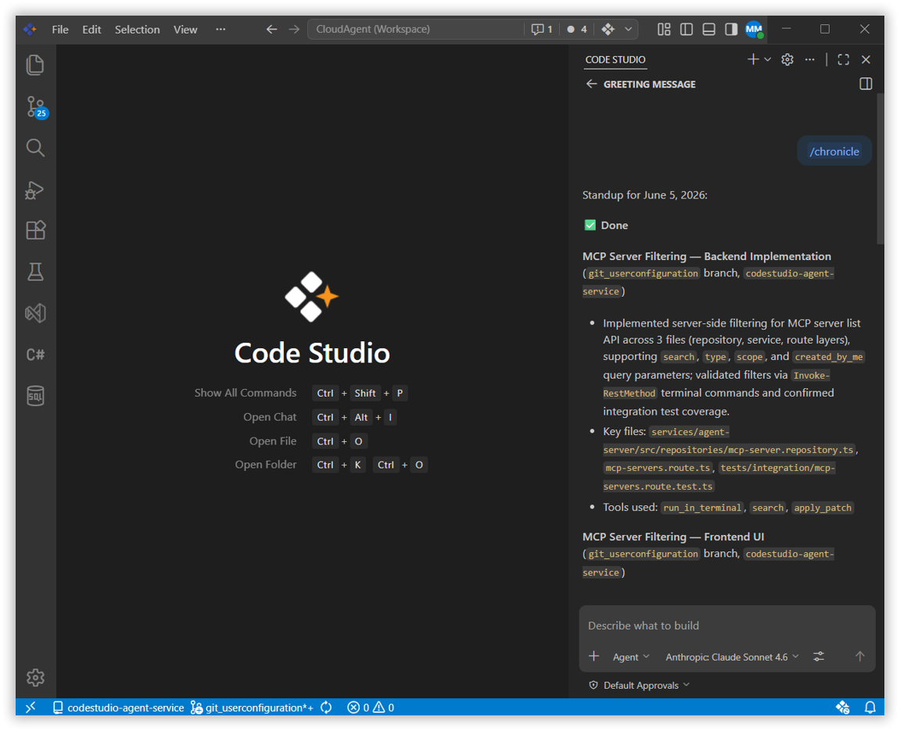

---
title: Chronicle Coding History and Productivity Insights in Code Studio
description: Discover how Chronicle in Syncfusion Code Studio tracks your coding history, provides standup summaries, and delivers personalized productivity tips to enhance your workflow.
platform: syncfusion-code-studio
keywords: chronicle, coding-history, productivity-tips, standup-report, workflow-analysis, code-studio
---


# Chronicle

## Overview

Chronicle is a feature in Syncfusion Code Studio that keeps a detailed history of everything you do in your workspace. It records your changes, actions, and the context around your coding so you can review, retrace steps, or share exactly what happened. Chronicle makes your coding journey visible and easy to review, helping you learn, debug, and collaborate better.

## Use Cases

- Quickly see your recent coding history without digging through logs or version control.
- Generate a standup summary of your last 24 hours of coding activity to share with your team.
- Get personalized tips to improve your prompting, tool usage, and overall workflow.
- Ask natural-language questions about your recent coding sessions.

## Chronicle Commands

Chronicle is accessed through slash commands in the chat panel. Each command targets a specific type of insight from your session history.

### Standup Summary

Type `/chronicle:standup` in the chat to get a summary of your coding sessions from the last 24 hours. The summary is organized by feature or branch and includes file lists and PR links.



### Productivity Tips

Type `/chronicle:tips` in the chat to get personalized suggestions based on your last 7 days of work. Chronicle analyzes your workflow and shares tips to improve your prompting, tool usage, and habits.


### Custom Questions

Type `/chronicle` followed by any natural-language question to query your session history directly.

**Example:**

```
/chronicle what files did I edit yesterday?
```

Chronicle will answer in plain language based on your coding sessions.



> **Tip:** You can ask anything about your recent work — for example, `/chronicle what PRs did I work on this week?`

## Best Practices

### 1. Use standup summaries before team meetings
Run `/chronicle:standup` before your daily standup to get a ready-to-share summary of what you worked on, organized by branch or feature.

### 2. Review tips regularly to build better habits
Run `/chronicle:tips` weekly to get actionable feedback on your workflow patterns and refine how you use Code Studio`s AI tools.

### 3. Use custom questions to trace decisions
If you are not sure when or why a change was made, ask Chronicle directly — for example, `/chronicle when did I last edit the auth module?`

## Related Features
- [Agent Mode](/code-studio/features/agent) - Chronicle helps you trace what the agent did across sessions. Use it to review agent-driven changes or reconstruct the sequence of edits made during an autonomous task.
- [Checkpoints](/code-studio/features/checkpoints) - Use Checkpoints alongside Chronicle to both restore workspace states and understand what changed between sessions.
 the AI explain error messages and suggest solutions in detail.
 