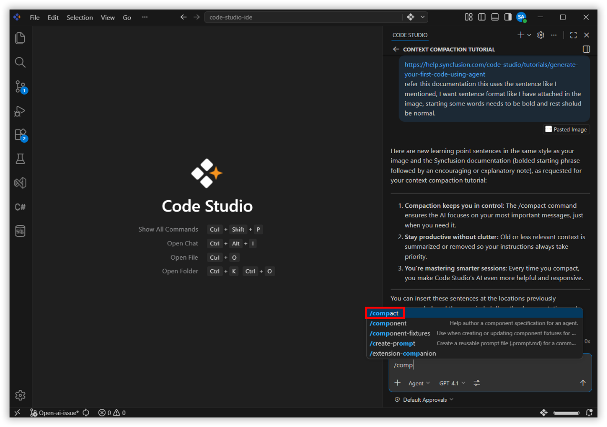
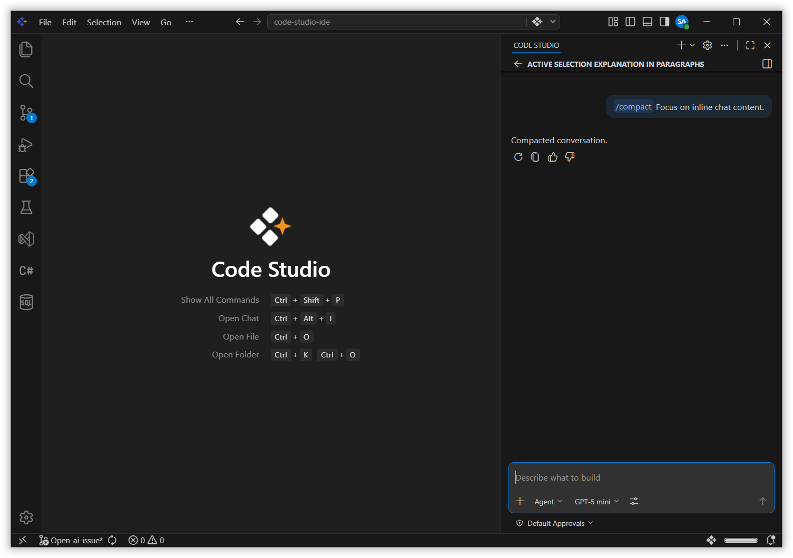
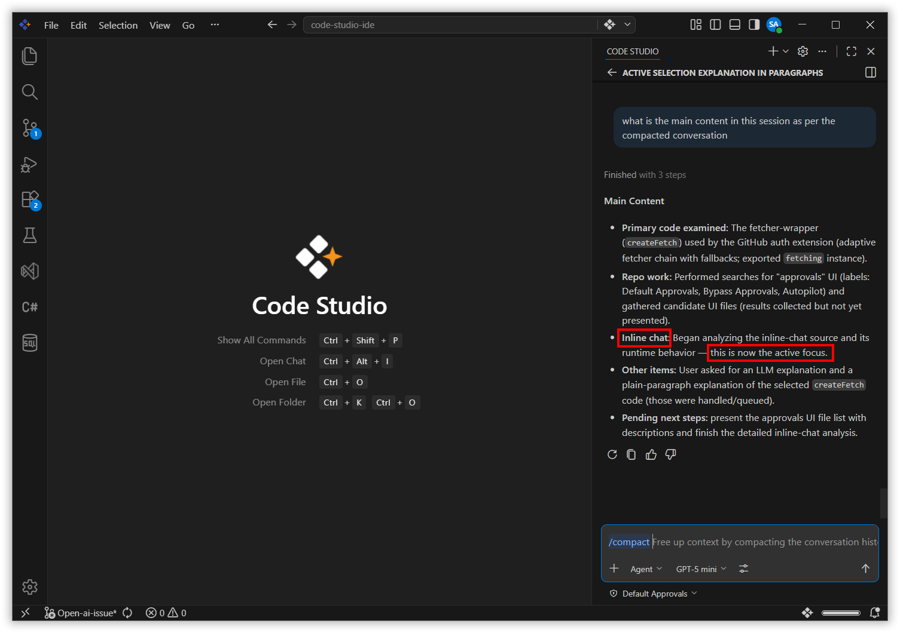

---
title: Context Compaction - Optimize Chat Context for Sharper AI in Code Studio
description: Master the /compact command in Syncfusion Code Studio to streamline chat history, maintain relevant context, and boost AI performance during long coding sessions.
platform: syncfusion-code-studio
keywords: context-compaction, chat-history, ai-context, compact-command, productivity, code-studio
---

# Context Compaction

## Overview

As your chat sessions in Code Studio grow, the conversation history can become lengthy, making it harder for the AI to focus on the most relevant information. Context Compaction lets you streamline your chat context by summarizing or removing less important messages using the `/compact` command, ensuring the AI remains efficient and accurate throughout long sessions.

## Use Cases

- Reduce noise in long chat sessions so the AI focuses on what matters most.
- Recover AI accuracy when responses start drifting due to an overloaded context window.
- Trim outdated conversation threads while keeping critical instructions and recent decisions.

## How to Use the /compact Command

### Step 1: Identify When Compaction Is Needed

If your chat session becomes long, or if the AI is losing track of recent instructions, it is a good time to use the `/compact` command.

### Step 2: Run the /compact Command

Type `/compact` in the chat input and press **Enter**.

> **Note:** You can optionally add specific instructions after the command to customize the compaction process.

The agent will analyze the conversation and automatically compact the context by summarizing or removing older messages.

### Step 3: Continue Working with Optimized Context

After compaction, your chat will retain the most important and recent information. Continue your development tasks with improved AI focus and performance.

## Best Practices

### 1. Compact before switching to a new task
When you move on to a different part of your project, run `/compact` to clear out earlier conversation history and give the AI a clean, focused context.

### 2. Add custom instructions when compacting
If there is critical context you want preserved, pass it as a note after the command — for example, `/compact keep the authentication flow requirements`.

### 3. Use compaction proactively, not reactively
Do not wait for the AI to lose track. Compact regularly during long sessions to maintain consistent, high-quality responses.

## Related Features
- [Agent Mode](/code-studio/features/agent) - Long agent sessions can accumulate a large amount of context. Use `/compact` to trim the history and keep the agent focused on the current task.