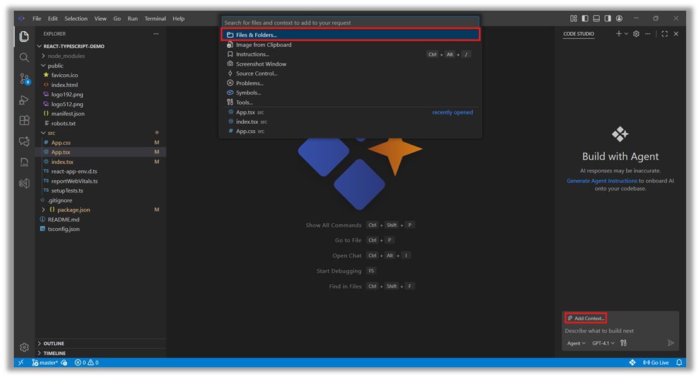
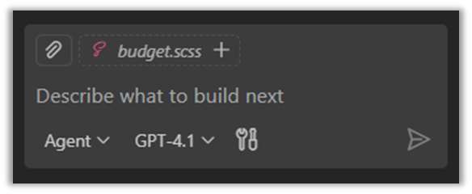
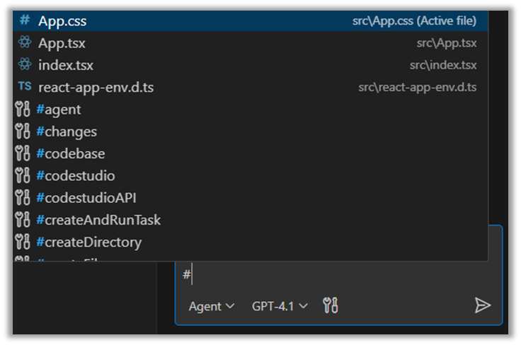
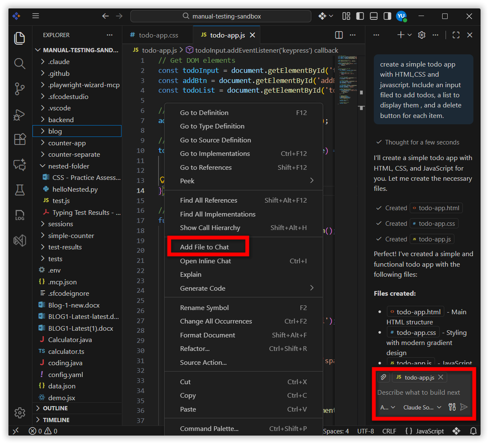
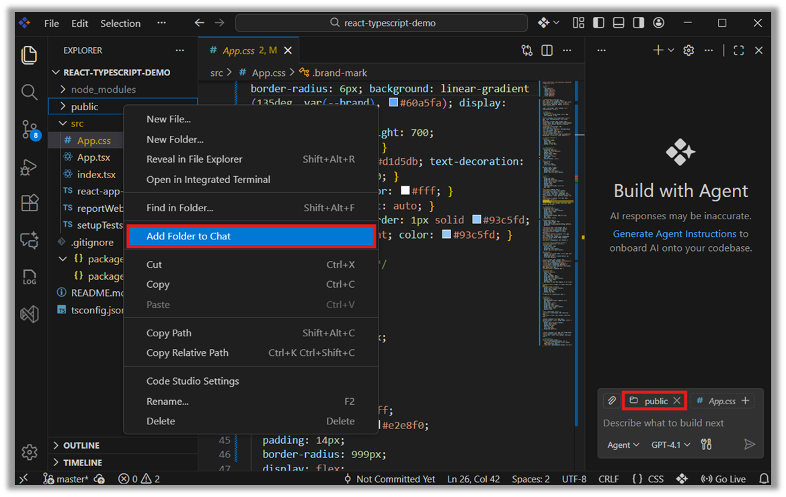
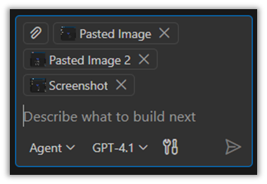
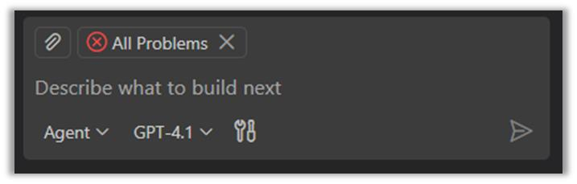
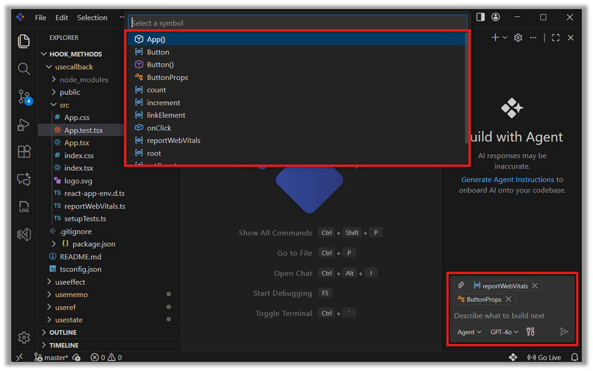
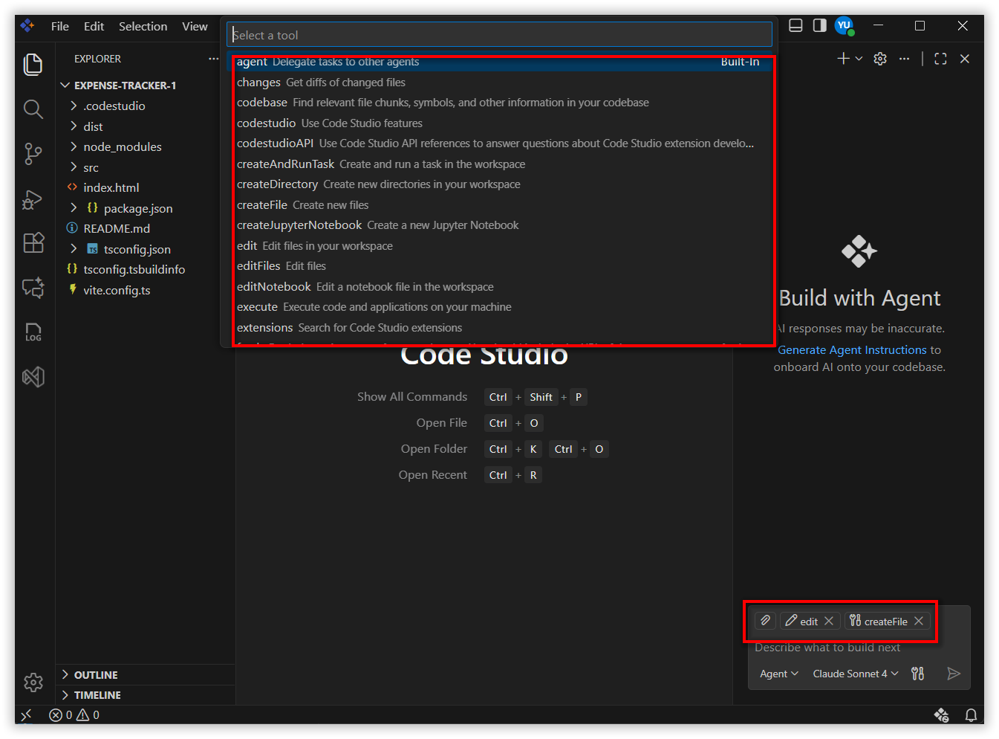
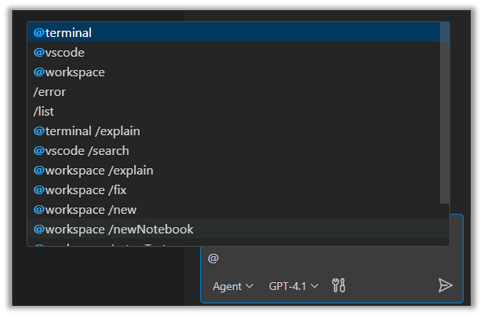

# Provide Context to Chat

## Overview

Code Studio includes an AI powered chat that can help you understand your project, write code, fix issues, and answer questions. For the chat to give the best and most accurate responses, it needs to understand what you are currently working on. This is where providing context helps. By adding the relevant files, folders, or code snippets—such as the file you’re editing or the parts of your project related to your question—you allow the chat to see the right information. The more context you provide, the better the chat can analyze your code, understand your problem, and guide you effectively.

This document explains:

- What “Context” means  
- Different types of contexts (files, folders, screenshots, problems, symbols, tools)  
- How to add context to the chat  
- How to use `@` and `#` to attach context  

## What “Context” Means (and Why It Matters)

**Context** is the extra information you attach to your chat message—such as a file, an error, a screenshot, or a terminal log—so the AI analyzes the **right** thing and responds precisely. You’ll get **better answers** when Chat can look at **the specific code**, **the exact error,** or **the UI you’re seeing**
Examples
•	Asking about a function? Attach the file or symbol.
•	Seeing a build error? Attach the Problems item or terminal output.
•	Confused by the UI? Attach a screenshot.

### Examples
- Asking about a function? → Attach **the file or symbol**  
- Seeing a build error? → Attach **the Problems item** or **terminal output**  
- Confused by the UI? → Attach **a screenshot**

> **Note — Privacy & scope**  
> Chat only sees what you explicitly include (plus what’s implicitly added from your active editor).  
> If a file is **not** attached or implicitly included, Chat won’t analyze it.

## Types of Context in Code Studio

You can use the **Add Context** button to include extra information that helps the chat understand your request better. When you click this button, you will see options like:

- **Files** – select individual code files  
- **Folders** – select your entire project folder or a specific folder  
- **Instructions** – add any instruction files shown in your workspace  
- **Screenshot Window** – capture your screen and attach it  
- **Problems** – add issues that appear in the Terminal or Problems panel  
- **Symbols** – choose functions, components, variables from your project  
- **Tools** – attach tool‑related contexts if needed  

You can select **any** of these based on what you want to share with the chat.

## How to Use These Context Options

### 1. Automatic Context

Implicit context is the context that Code Studio adds automatically. When you have a file open in the editor, Code Studio will suggest that **active file** at the bottom of the chat. You can simply click it to include the file as context without doing anything extra. This makes it easy for the chat to understand which file you’re working on and give better answers.

### 2. File and Folders Context

#### Steps: You can add context in three easy ways

#### **1. Type # in the chat**
- Type **#** in the chat input  
- Code Studio shows a list of open files and workspace files  
- Click the file or folder you want to add  

#### **2. Right‑click a file or folder**
- Right‑click the file or folder  
- Select **“Add File to Chat”** or **“Add Folder to Chat”**

#### **3. Use the “Add context” button**
- Click **Add context** in the chat  
- Choose **Files & Folders**  
- A list of available items appears  
- Select the file or folder you want  

### 3. Screenshot Context

Screenshot Context allows you to capture your screen or use an image from your clipboard and attach it to the chat. This helps the chat understand visual issues much more accurately.

#### Steps to Add Screenshot Context

1. Capture a screenshot or copy an image to your clipboard  
2. Open the chat panel in Code Studio  
3. Click **Add Context**  
4. Select:
   - **Screenshot Window** (to capture a new screenshot)
   - **Image from Clipboard** (to use a copied image)

The selected screenshot/image will be added as context.

---

### 4. Problems Context

Problems Context lets you add errors or warnings from your project to the chat. This helps the AI understand what issue you are facing.

#### Steps to Add Problems Context
1. Click the **Add Context** button  
2. Select **Problems**  
3. Choose the error or warning you want to attach  

This includes TypeScript errors, build errors, ESLint issues, and more.

### 5. Symbols Context

Symbols Context lets you add specific parts of your code—like functions, variables, or components—to the chat. This helps the AI understand exactly which code piece you are asking about.

#### Steps to Add Symbols Context
1. Click **Add Context**  
2. Select **Symbols**  
3. Choose the function, component, or variable you want to attach  

### 6. Tools Context

Tools Context lets you add information from different tools inside Code Studio—such as the terminal, debugger, or build tools. This helps the AI understand issues that are related to your development tools instead of your code.

#### Steps to Add Tools Context
1. Click the **Add Context** button  
2. Select **Tools**  
3. Choose the tool output you want to attach  

## #‑mentions in chat

**#** is the **context variable** trigger.# is the context variable trigger. Type # in the chat box to **insert files, folders, symbols, tools, terminal output, source control changes,** and more—without leaving the keyboard. You can also drag and drop files/folders into Chat. 

### Quick patterns
- `#file:<name>` – attach a specific file  
- `#folder:<name>` – attach a folder  
- `#symbol:<name>` – attach a symbol (open its file first for best results)  

> **Tip — Whole‑project questions**  
> Prefer **@workspace** or **#codebase** when the question truly needs the **entire** project context.  
> Otherwise, keep context **focused** to improve answer quality.

## @‑mentions in chat

**@-mentions** allow you to directly invoke specialized chat participants in Code Studio. These participants act as **domain experts** that you can route your question to. When you @ mention one of them, your message is handed off to that expert assistant, and it provides a response based on its specific area of knowledge.
Chat participants are **not the same as tools**. Tools are triggered automatically as part of an agent flow, whereas chat participants respond only when you explicitly mention them using **@**.

### How @mentions work
To use a chat participant, simply type **@** in the chat input box. Code Studio will show a list of available participants such as:
- **@terminal** – for shell/CLI questions  
- **@workspace** – for project files, structure, dependencies  
- **@vscode** – for editor settings & features  

Selecting one routes your request to that domain expert.

