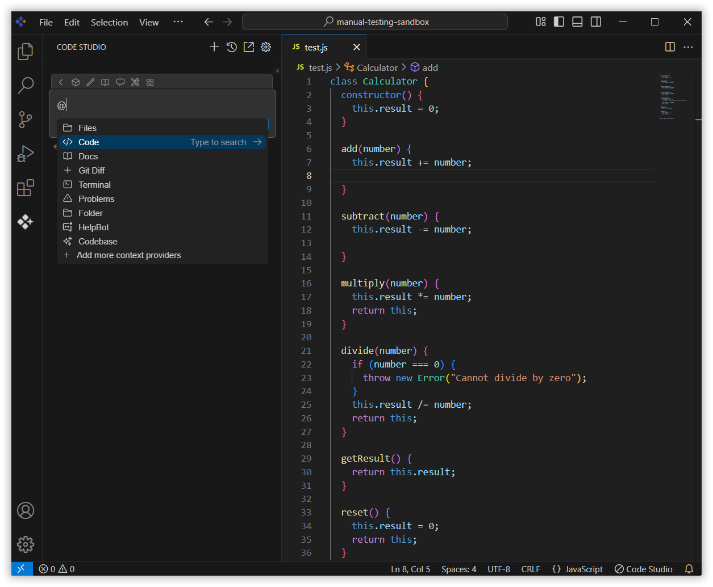
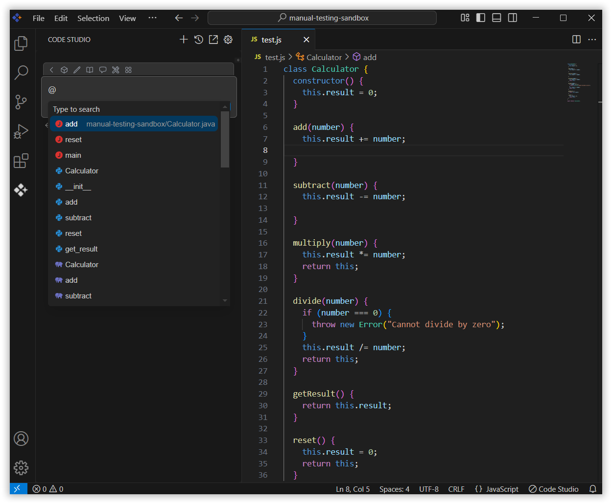
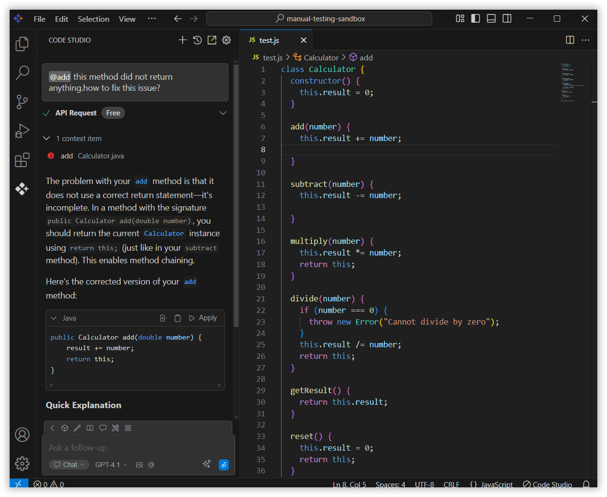

# Code

The Code context option in the Syncfusion Code Studio lets you reference specific code from your project directly in the chat. This helps you quickly troubleshoot, edit, or review code without copying it manually.

## How to Use the Code context

### 1. Open Syncfusion Code Studio

In the Syncfusion Code Studio, the chat interface is located on the left-hand side. This is where you can interact with AI and ask questions or get assistance.

### 2. Select Code context

 In the chat window, click the `@` button.  	
 > **Note:** If you cannot locate the code context option in the list, you will need to add it manually to include this context provider in config.yaml file. Please follow the steps outlined in this [link](https://help.syncfusion.com/code-studio/features/context-providers/add-more-contextproviders/How-to-configure-more-contextproviders) to do so.

 A menu will appear—select Code.  

### 3. Choose the code

 Now choose the code which you want to ask the query about it.

### 4. Use Code Context with Query

 The Syncfusion Code Studio analyzes the selected code and offers help based on its content.  
 It can point out issues, suggest improvements, or guide you in making specific changes.  This makes reviewing and editing code faster and more efficient.
