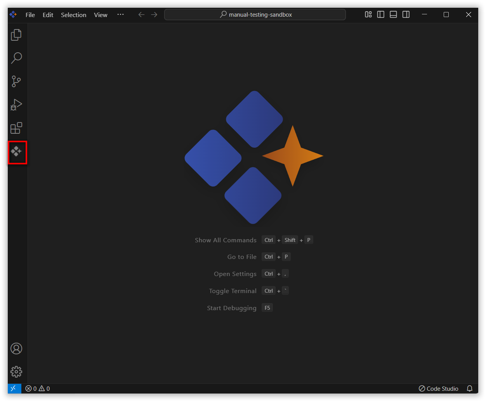
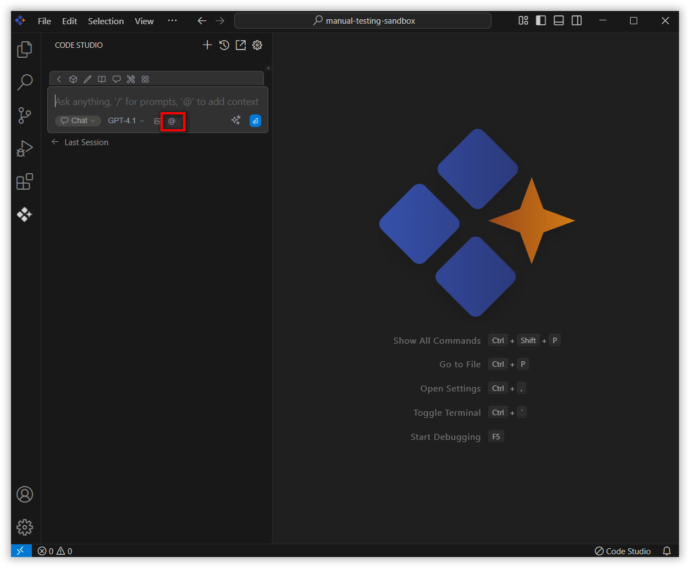
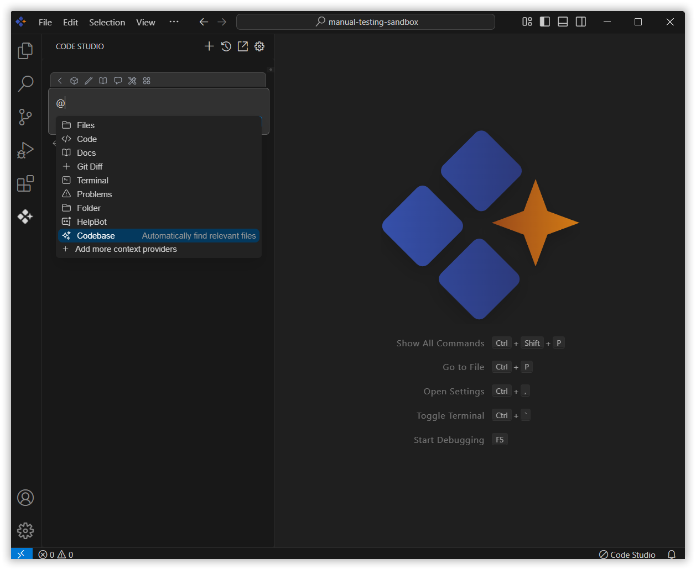
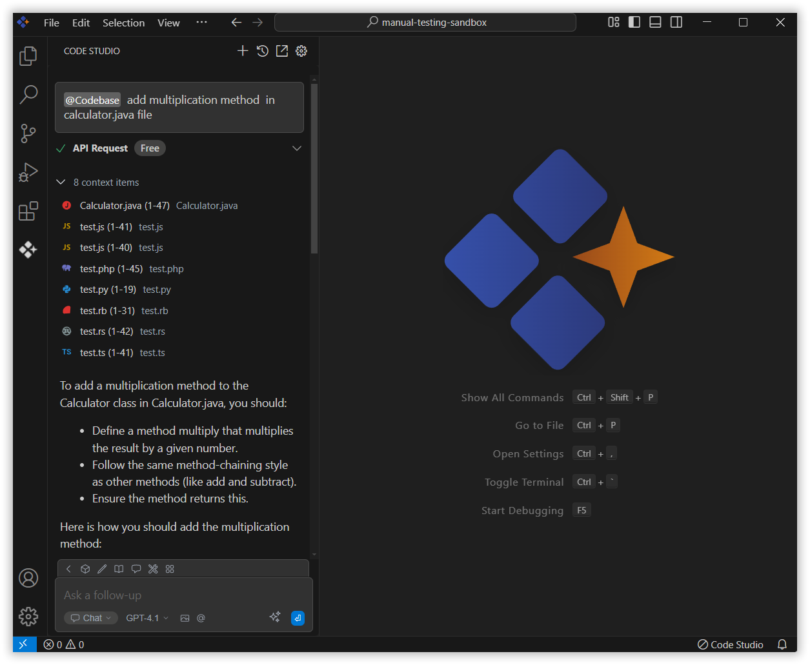

# Codebase

The Codebase context in Syncfusion Code Studio lets you share your codebase with the AI so it can understand your project better. You can ask it to explain a file, help with an error, or guide you in adding new features. Just mention codebase with the relevant query, and it will give you useful answers based on that.

## How to Use Codebase context

### 1. Open the Chat Window

Click the Syncfusion Code Studio icon on the left toolbar to open the Syncfusion Code Studio chat window.

### 2. Select Codebase context

In the chat window, click the `@` button.

> **Note:** If you cannot locate the codebase context option in the list, you will need to add it manually by including this context provider in the config.yaml file. Please follow the steps outlined in this [link](/code-studio/features/context-providers/add-more-contextproviders/How-to-configure-more-contextproviders) to do so.

From the context menu that appears, choose codebase.

### 3. Use codebase Context with Query

When asking about your code, try to include details like Which file you need help with ,The part of the code causing the issue, Details for a new feature you want to add ,Specific functions, methods, or classes you're working on. 

This helps the AI understand your problem better and give you the right solution. Once you add the details, press Enter.

The Syncfusion Code Studio will use that info to give more accurate and helpful answers.

