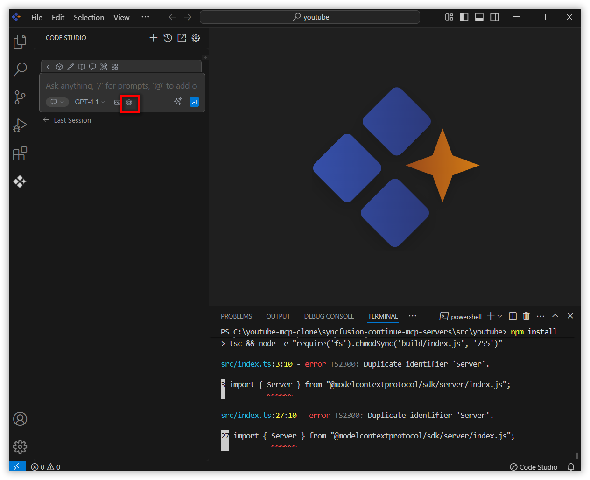
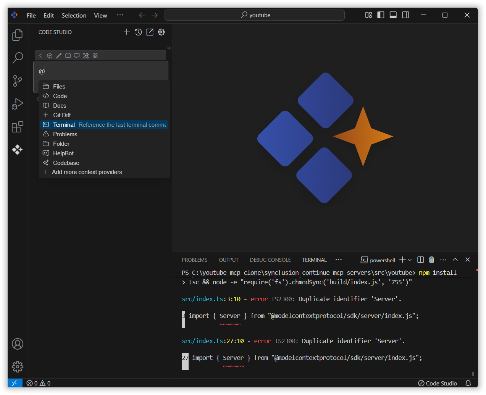
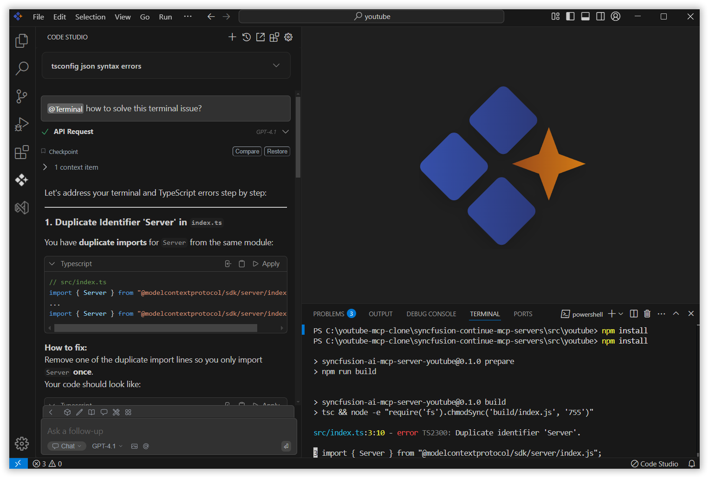

# Terminal

The Terminal context in Syncfusion Code Studio helps you fix errors shown in your terminal. It reads the latest output from the terminal and gives helpful suggestions or solutions based on what it finds. This makes it easier to understand and solve terminal issues quickly.

## How to Use Terminal context

### 1. Open the Chat Window

Click the Syncfusion Code Studio icon on the left toolbar to open the Syncfusion Code Studio chat window.

### 2. Select Terminal context

In the chat window, click the `@` button.

> **Note:** Before using the terminal context, ensure that you have opened a terminal in VS Code and that it contains relevant information or error details necessary for proper functionality.

> **Note:** If you cannot locate the terminal context option in the list, you will need to add it manually by including this context provider in the config.yaml file. Please follow the steps outlined in this [link](/code-studio/features/context-providers/add-more-contextproviders/How-to-configure-more-contextproviders) to do so.

From the context menu that appears, choose terminal to embed terminal output into your conversation.

### 3. Use terminal Context with Query

Input relevant details about the issue in the chat model window and click Enter.

The AI will process the terminal data and present you with suggestions or solutions directly in the chat window. Review these recommendations to address the issue or error at hand.

