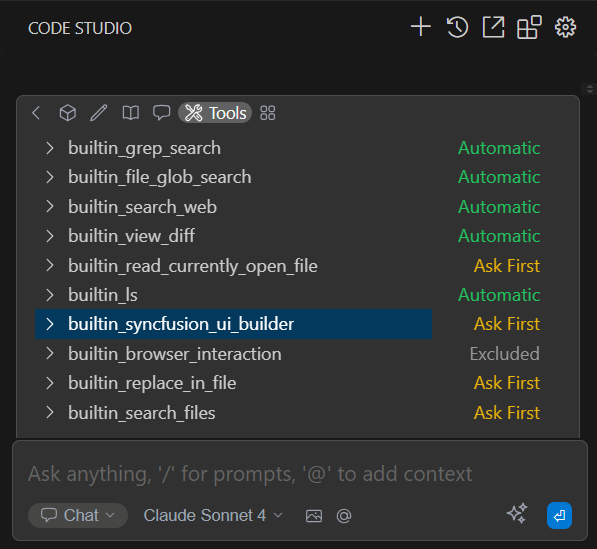
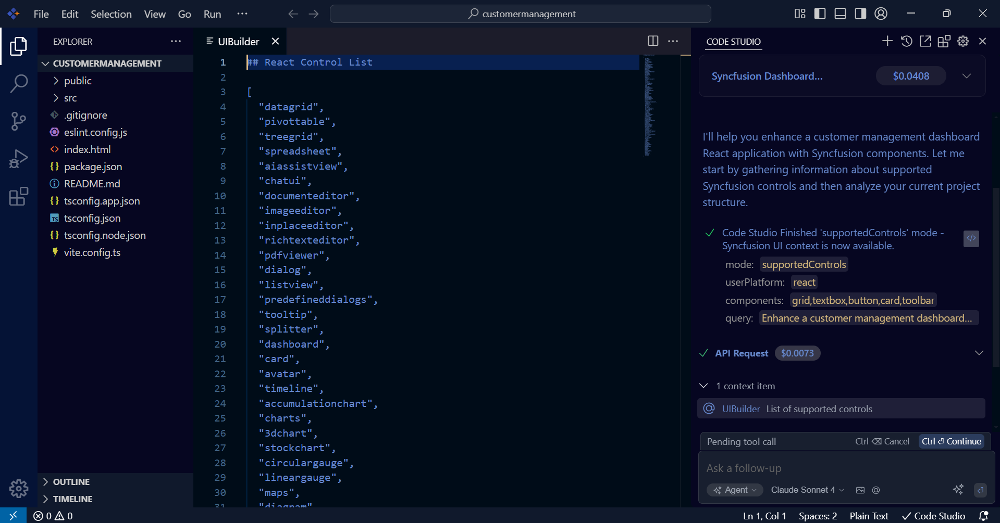
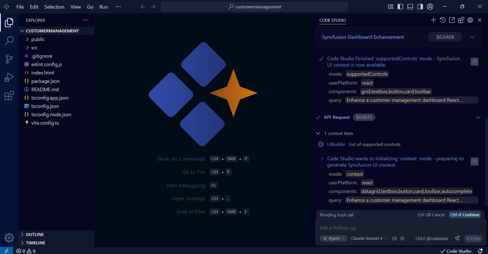
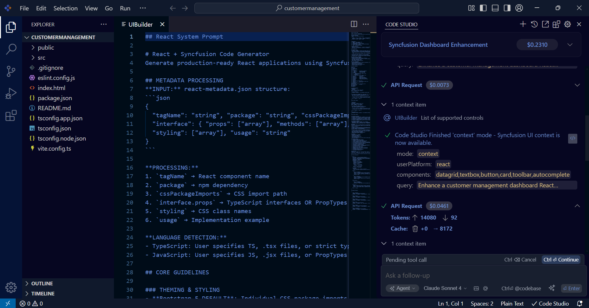
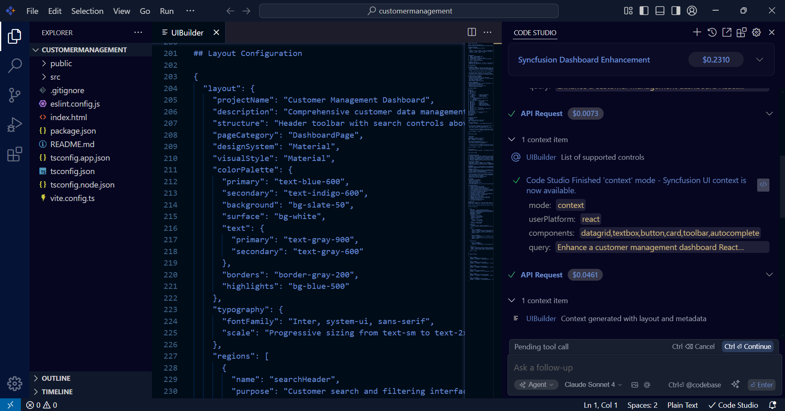
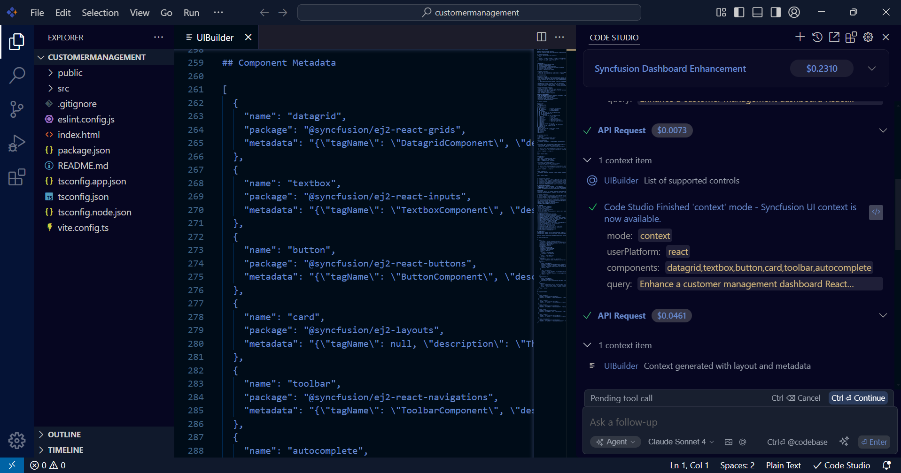

# UI Builder User Guide

## Overview

### What is UI Builder?

UI Builder is an AI-powered development assistant integrated into Syncfusion Code Studio that provides essential implementation data and component metadata to enable feature development using Syncfusion components. This intelligent tool analyzes your requirements through natural language prompts and supplies the necessary information for implementing your desired functionality with appropriate Syncfusion components.

### Key Benefits

- **Smart Implementation**: Uses Syncfusion components to build required features
- **Intelligent Component Selection**: Analyzes requirements and selects optimal Syncfusion controls
- **Multi-Platform Support**: Implements features across 14 platforms with platform-specific optimizations
- **Time-Saving**: Eliminates manual component research and configuration
- **Best Practices**: Applies Syncfusion's proven implementation patterns

## Getting Started

### UI Builder Setup

1. **Access Chat Interface**: Open the chat panel in Code Studio
2. **Enable UI Builder Tool**: Select "UI Builder" from the tools panel
3. **Choose Mode**: Select between Automatic or Ask First mode



### Syncfusion Component Licensing

After implementing features with Syncfusion components, proper licensing is required to run your application without licensing popups. If you installed the trial setup or NuGet packages from nuget.org, you must register the Syncfusion license key in your application. Without proper licensing, a licensing popup will appear when running your application. The license key can be obtained from the [My Account » License and downloads section](https://www.syncfusion.com/account/downloads) of the Syncfusion® website. To obtain a license key, you will need one of the following:

- **Trial License**: For evaluation purposes with trial installer or NuGet packages
- **Licensed Version**: For commercial use with licensed installer (no license key registration required)

### Quick Start Example

```
Enhance a customer management dashboard React application using Syncfusion components with data grid and search functionality
```

UI Builder will analyze your request and provide the necessary information for implementing the feature using appropriate Syncfusion components.

## How UI Builder Works

### The Intelligent Implementation Process

UI Builder operates through a sophisticated process where Code Studio handles initial analysis and UI Builder provides essential implementation data:

#### Step 1: Prompt Analysis (Code Studio)
Code Studio processes your natural language prompt to understand user intentions and feature requirements.

#### Step 2: Platform Detection (Code Studio)
Code Studio automatically identifies the target framework from project structure or prompt specification (defaults to React if not specified).

#### Step 3: Supported Controls API Response (UI Builder)
UI Builder responds to the supportedControls API call by providing a comprehensive list of available Syncfusion controls specific to the detected platform.



#### Step 4: Context API Response (UI Builder)
UI Builder responds to the context API call by providing three essential components:



##### System Prompt
- Converts business requirements into technical specifications
- Applies industry standards and Syncfusion recommended patterns
- Identifies potential integration considerations
- Maps user requirements to optimal Syncfusion controls



##### Layout Configuration
- Determines optimal layout structures for responsive design
- Calculates ideal positioning for selected controls
- Ensures consistent theming across components
- Maintains accessibility compliance throughout implementation



##### Controls Metadata
- Configures appropriate default values and properties for each control
- Establishes necessary event bindings and data source connections
- Manages all imports, references, and package requirements
- Ensures proper component lifecycle management



#### Step 5: AI Model Implementation
Based on the information provided by UI Builder (supported controls list, system prompt, layout configuration, and metadata), the AI model begins implementation in the application.

### AI Model Integration

#### Recommended Models

- **GPT-4**: Advanced feature implementation with complex component integration
- **Claude**: Precise implementation with optimization focus

## Supported Platforms

UI Builder provides implementation support for Syncfusion components across 14 platforms:

| Platform | Controls | Status |
|----------|----------|--------|
| React | 94 | ✅ Full Support |
| Angular | 97 | ✅ Full Support |
| Vue.js | 95 | ✅ Full Support |
| JavaScript | 97 | ✅ Full Support |
| TypeScript | 97 | ✅ Full Support |
| Blazor | 102 | ✅ Full Support |
| ASP.NET Core | 99 | ✅ Full Support |
| ASP.NET MVC | 99 | ✅ Full Support |
| MAUI | 74 | ✅ Full Support |
| WPF | 101 | ✅ Full Support |
| WinForms | 125 | ✅ Full Support |
| WinUI | 41 | ✅ Full Support |
| Flutter | 25 | ✅ Full Support |
| Java | 1 | ✅ Full Support |

## Available Controls

### Core Component Categories

- **Data Management**: DataGrid, TreeGrid, PivotTable, Spreadsheet
- **Charts & Visualization**: Charts (20+ types), Gauges, Maps, Diagram
- **Input Controls**: TextBox, DatePicker, ColorPicker, FileUpload
- **Navigation**: Menu, Toolbar, Tabs, Sidebar, Accordion
- **AI Components**: AIAssistView, ChatUI, SmartPaste, SmartTextArea
- **Editors**: RichTextEditor, PDFViewer, ImageEditor, WordProcessor

## Writing Effective Prompts

### Basic Structure
```
Develop [feature description] for [platform] application using Syncfusion components with [specific requirements]
```

### Effective Prompt Examples

```
Create a comprehensive sales dashboard with interactive charts and data filtering capabilities using Syncfusion React components
```

```
Build a user registration form with validation rules and error handling using Syncfusion WinForms controls
```

```
Develop a responsive product catalog with search and categorization using Syncfusion JavaScript components
```

```
Build a React-based employee management system with data grid, search capabilities, filtering options, and export functionality using Syncfusion React components
```

```
Create an employee management page using Angular Grid Component with CRUD operations
```

```
Enhance an inventory management dashboard Blazor application using Syncfusion components with search, filtering, and export capabilities
```

```
Create a project management application React using Syncfusion components with Kanban boards, Gantt charts, and team collaboration features
```

```
Enhance a mobile-optimized field service MAUI application using Syncfusion components
```

```
Build a healthcare management system Vue application using Syncfusion components with Material Design theme
```

### Prompt Requirements

#### ✅ Must Include:
- The word "Syncfusion" (required to activate UI Builder)
- The word "components" (ensures proper tool activation)
- Platform specification (React, Angular, Vue, Blazor, etc.)
- Clear description of functionality needed

## Step-by-Step Tutorial

### Building a Data Management Interface

#### Step 1: Define Requirements
```
Develop a customer management system Angular application using Syncfusion components with CRUD operations and search functionality
```

#### Step 2: AI Processing and Implementation
Following your prompt, the system processes your request through:

**UI Builder Analysis:**
- **supportedControls Mode**: Identifies available Syncfusion controls for Angular platform
- **context Mode**: Selects optimal components (DataGrid, TextBox, DropDownList, Dialog) and provides layout configuration

**Code Studio Implementation:**
- Generates Angular component with modern best practices
- Implements CRUD operations with proper data binding
- Configures search and filtering functionality
- Sets up responsive layout with consistent theming
- Includes proper error handling and validation

#### Step 3: Customize Implementation
```
Enhance the customer management system Angular application using Syncfusion components to include Excel export and form validation
```

#### Step 4: Platform-Specific Optimization
```
Optimize the customer management system implementation Angular application using Syncfusion components with TypeScript best practices
```

## Best Practices

### For Optimal Implementation

1. **Include "Syncfusion" Keyword**: Always include "Syncfusion" in your prompt to trigger UI Builder activation
2. **Be Specific**: Include detailed functionality requirements
3. **Specify Platform**: Always mention target framework for optimized implementation
4. **Include Data Context**: Describe data structure and relationships
5. **Request Features**: Specify needed capabilities (search, export, validation)

### Performance Optimization

- Request virtual scrolling for large datasets
- Specify lazy loading requirements
- Include caching strategies
- Mention responsive design needs

## Troubleshooting

### Common Issues

**UI Builder Not Activating**
- Ensure "Syncfusion" and "components" keywords are in prompt
- Verify UI Builder tool is selected
- Check AI model configuration and API key

**Incorrect Platform Implementation**
- Specify platform explicitly in prompt
- Request platform conversion: "Convert to Angular implementation"

**Generic Implementation**
- Provide more specific requirements
- Include business context and constraints
- Request detailed implementation examples

## FAQ

**Q: Does UI Builder create complete applications?**
A: UI Builder provides the necessary component information and metadata that enables Code Studio to implement specific features using existing Syncfusion components. You integrate these implementations into your application structure.

**Q: Can I modify the implemented features?**
A: Yes! The implemented code using Syncfusion components is yours to customize and extend as needed.

**Q: Which AI models work best?**
A: GPT-4 and Claude provide optimal results. Configure your preferred model in Code Studio settings.

**Q: Is there a limit on feature implementation?**
A: There are no limits on the number of features you can implement, subject to your AI model usage limits.

**Q: Can UI Builder work with existing projects?**
A: Yes! UI Builder provides the component information that enables implementation of features using Syncfusion components that integrate with existing codebases.