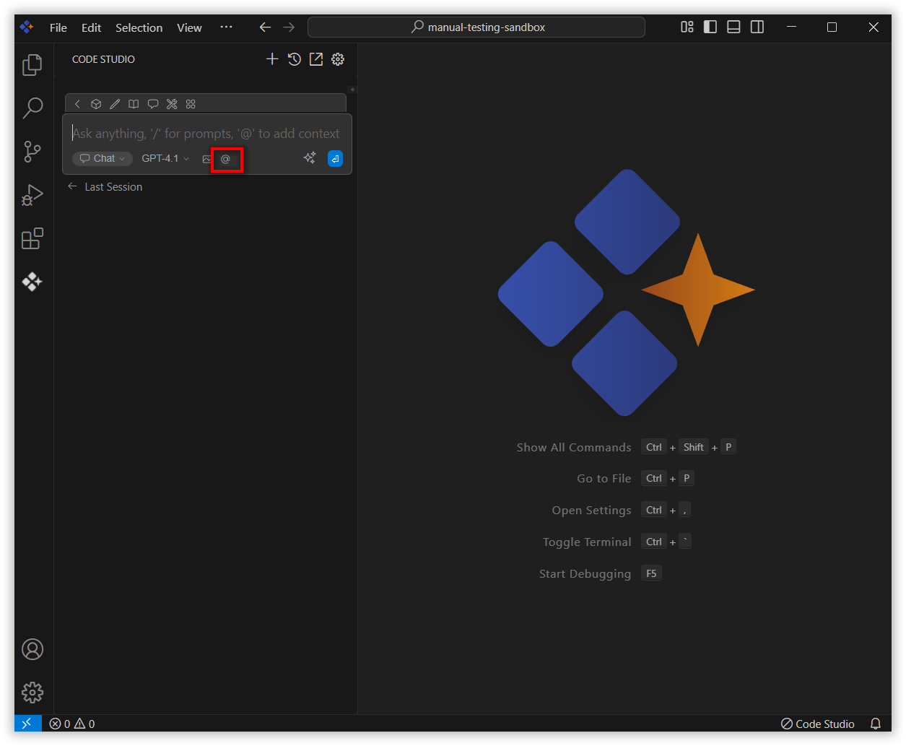
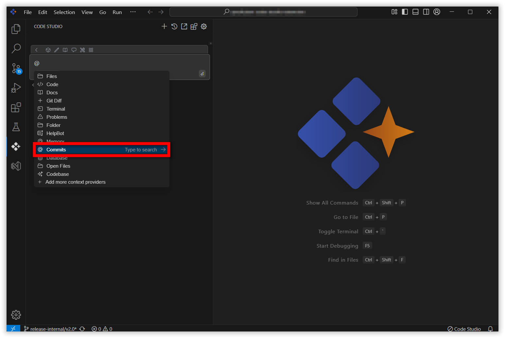
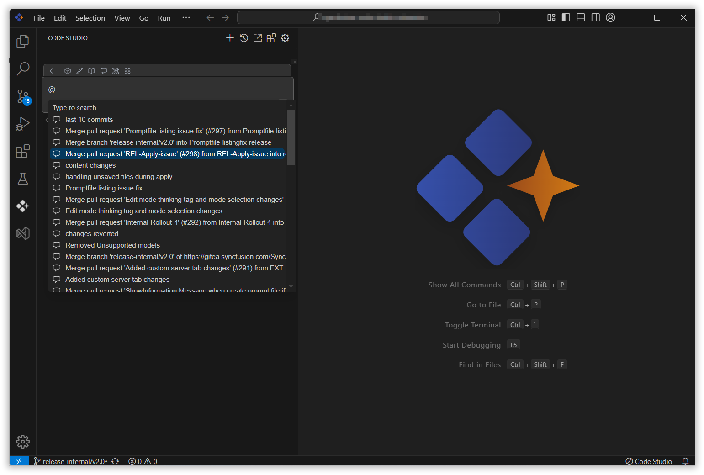
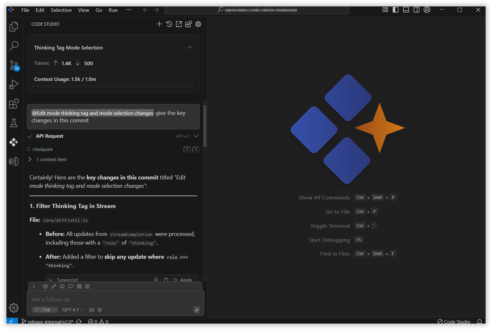

# Commit

The Commit context in Syncfusion Code Studio lets you bring recent Git commit information into your AI conversations. This helps the AI provide targeted assistance based on recent changes in your code, such as reviewing a commit, explaining what was modified, or verifying the impact of a change.

## How to use Commit context

### 1. Open the Chat Window

Click the Syncfusion Code Studio icon on the left toolbar to open the Syncfusion Code Studio chat window.

### 2. Select Commit context

In the chat window, click the `@` button.

> **Note:** If you cannot locate the commit context option in the list, you will need to add it manually by including this context provider in the config.yaml file. Please follow the steps outlined in the [link](https://help.syncfusioncody.com/syncfusion-code-studio/features/context-providers/add-more-contextproviders/How-to-configure-more-contextproviders)  to do so.

From the context menu that appears, choose commit.

### 3. Select the Commit

Choose the specific commit you want to ask about from the dropdown list that appears. This provides the AI with access to the details of that commit.

### 4. Use commit Context with Query

Once the commit is selected, enter a relevant query in the chat window. You can ask the AI to:

- Summarize what changed in the commit
- Explain the purpose of the modifications
- Check for potential issues introduced in the commit

The AI will analyze the commit content and respond with helpful insights.

