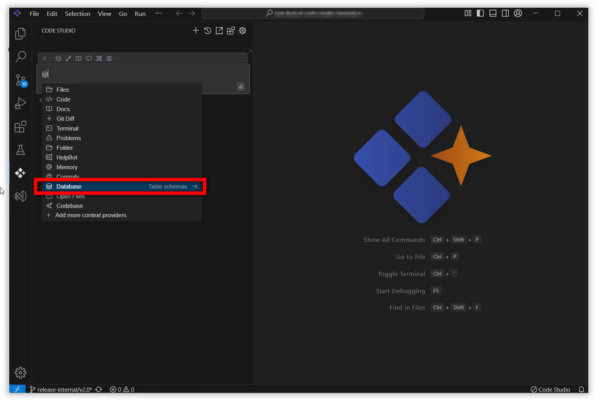
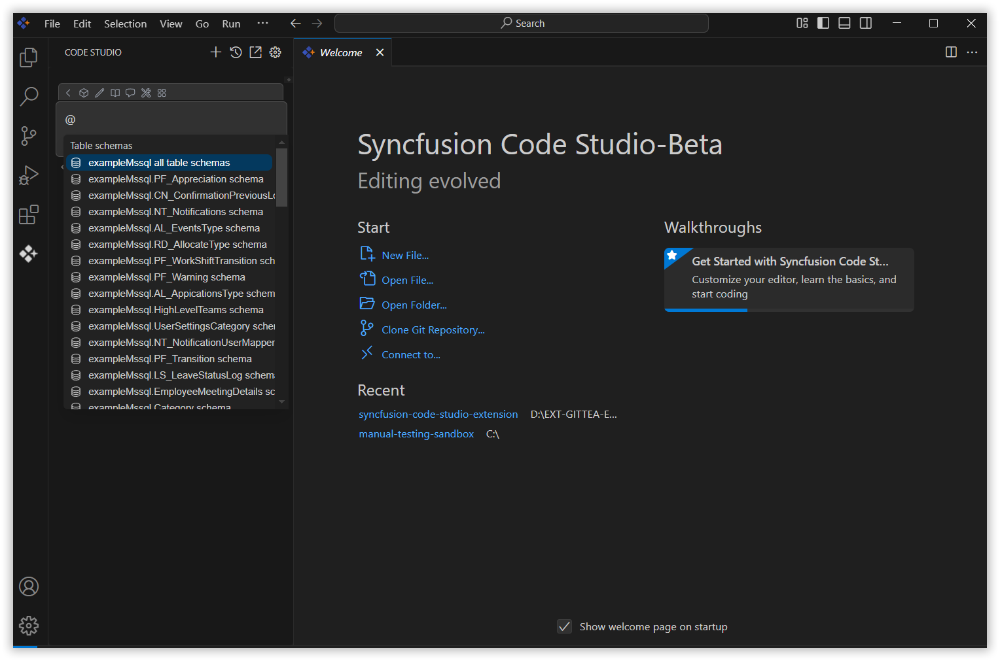
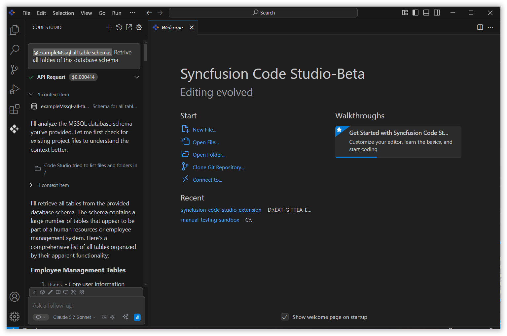

 
# Database 
 
The Database context option in Syncfusion Code Studio enables users to add database-related information directly into the chat, making it easier to access data during development.
 
## How to Use the Database context
 
### 1. Open the Syncfusion Code Studio
 
In the Syncfusion Code Studio, the chat interface is located on the left-hand side. This is where you can interact with AI and ask questions or get assistance.

 
### 2. Select Database context
 
In the chat window, click the `@` button.  
> **Note:** If you cannot locate the Database context option in the list, you will need to add it manually to include this context provider. Please follow the steps outlined in this [link](/code-studio/features/context-providers/add-more-contextproviders/How-to-configure-more-contextproviders) to do so.

 
A menu will appear—select Database context option to view the list of table schema.

 
### 3. Select Required Table Schema
 
Select the table schemas from the list to enable the AI to access the connected database and deliver accurate, data-driven responses.

 
### 4. Describe the Query
 
Input relevant details about the query in the chat model window and click Enter.  
The AI will generate the response based on the context datas.

