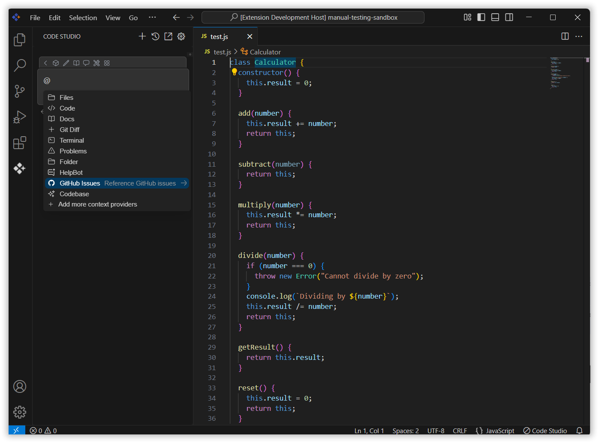
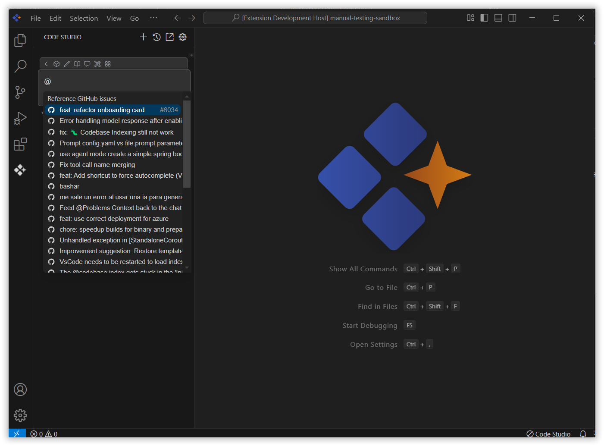
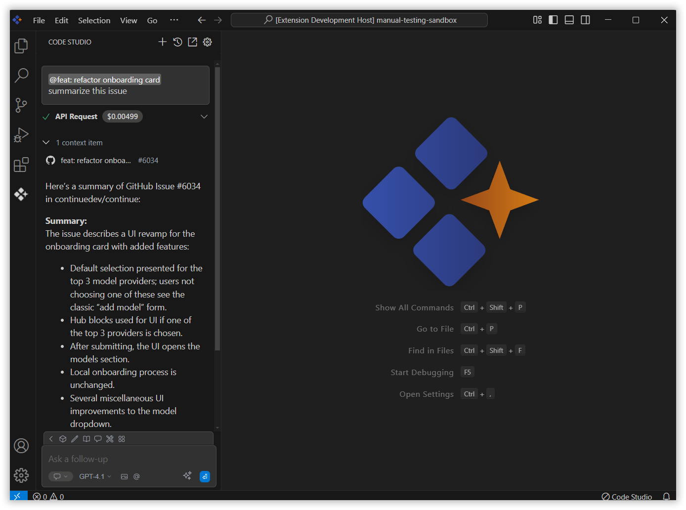

 
# GitHub Issues
 
The GitHub Issues context option in Syncfusion Code Studio allows users to bring GitHub issue data directly into the chat, enabling quick access to issue details and improving collaboration without switching context.
 
## How to Use the GitHub Issues context
 
### 1. Open the Syncfusion Code Studio
 
In the Syncfusion Code Studio, the chat interface is located on the left-hand side. This is where you can interact with AI and ask questions or get assistance.

 
### 2. Select GitHub Issues context
 
In the chat window, click the `@` button.  
> **Note:** If you cannot locate the GitHub Issues context option in the list, you will need to add it manually to include this context provider. Please follow the steps outlined in this [link](/code-studio/features/context-providers/add-more-contextproviders/How-to-configure-more-contextproviders) to do so.

 
A menu will appear—select GitHub Issues context option.

 
### 3. Select Required GitHub Issues
 
A list of your GitHub issues will be displayed. Click on the desired issue to insert it into the chat.  
 

Once inserted and click Enter, the AI will provide responses based on the GitHub issue context.

