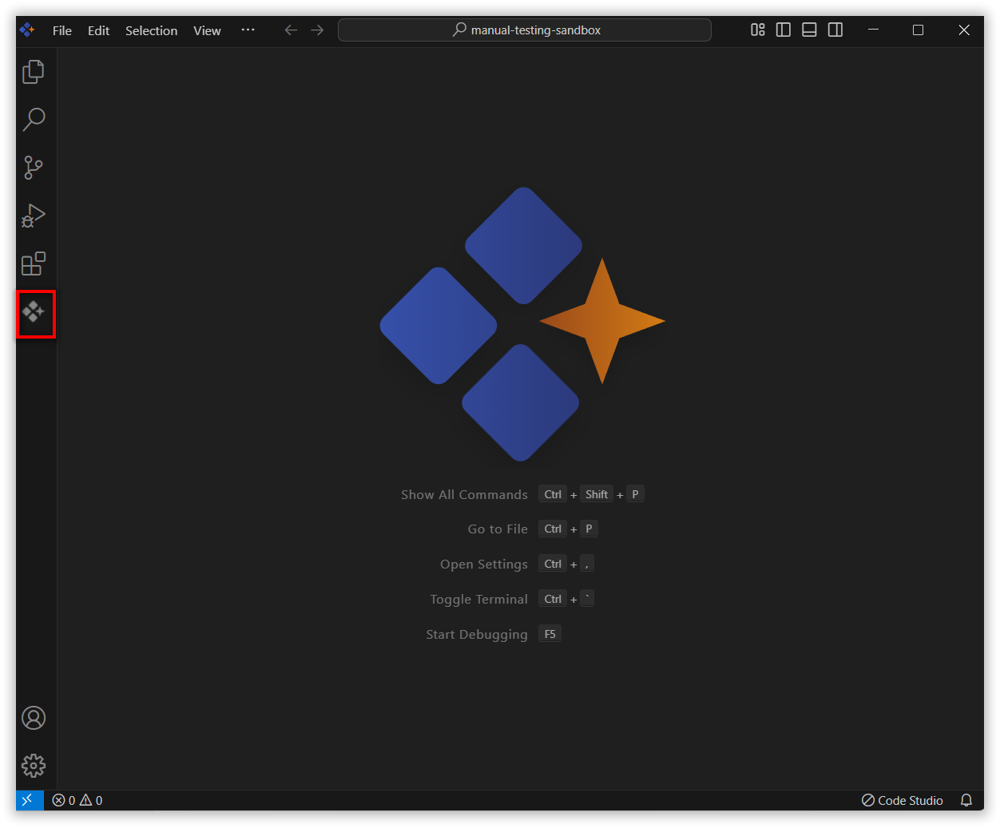
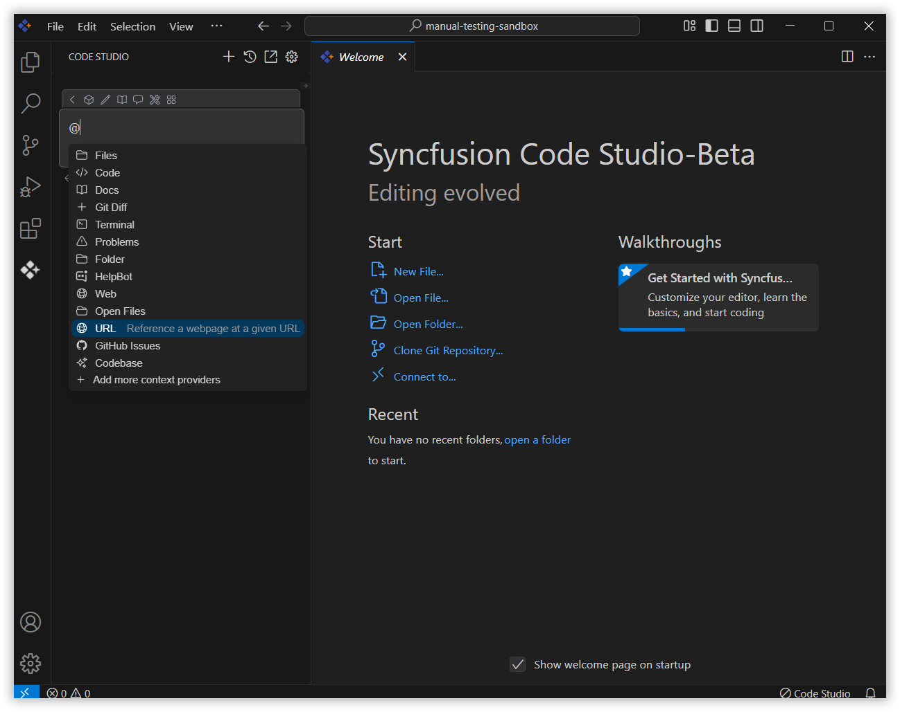
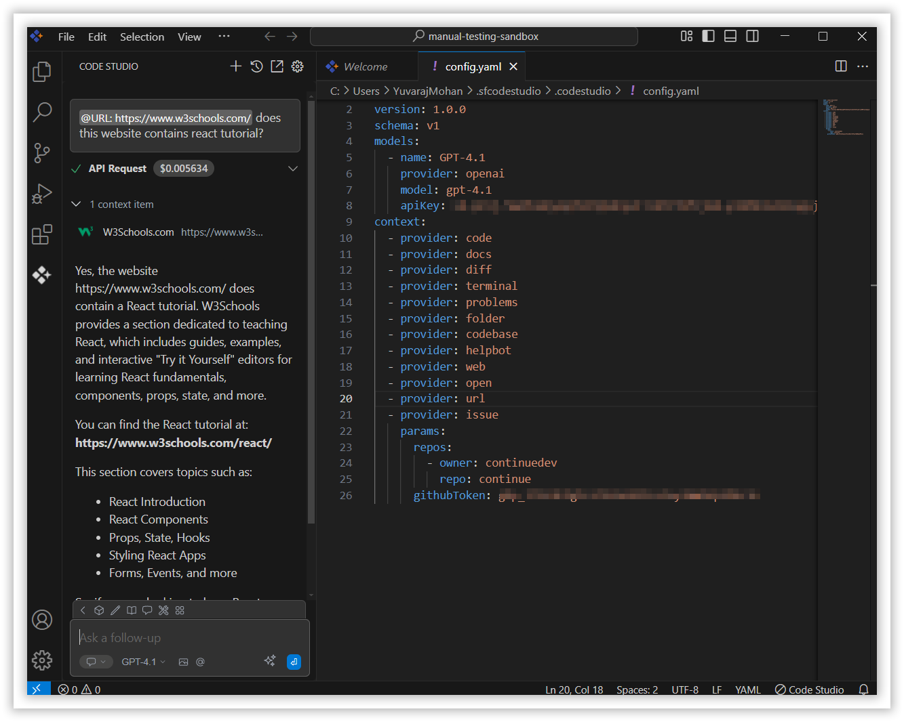

 
# URL 
 
The URL context option in Syncfusion Code Studio allows you to bring content from a web page directly into your conversation with the AI. By processing the page's information, the AI provides more accurate and relevant responses based on the linked content.
 
## How to Use the URL context
 
### 1. Open the Syncfusion Code Studio
 
In the Syncfusion Code Studio, the chat interface is located on the left-hand side. This is where you can interact with AI and ask questions or get assistance.
 

### 2. Select URL context
 
In the chat window, click the `@` button.  
> **Note:** If you cannot locate the URL context option in the list, you will need to add it manually to include this context provider, Please follow the steps outlined in this [link](/code-studio/features/context-providers/add-more-contextproviders/How-to-configure-more-contextproviders) to do so.

 
A menu will appear—select URL.

 
### 3. Use URL context with query
 
After selecting URL, a text box will appear. Paste the link to the webpage that contains the information you want the AI to consider.

After you submit a URL, AI retrieves and processes the webpage content, extracting and summarizing relevant information.

