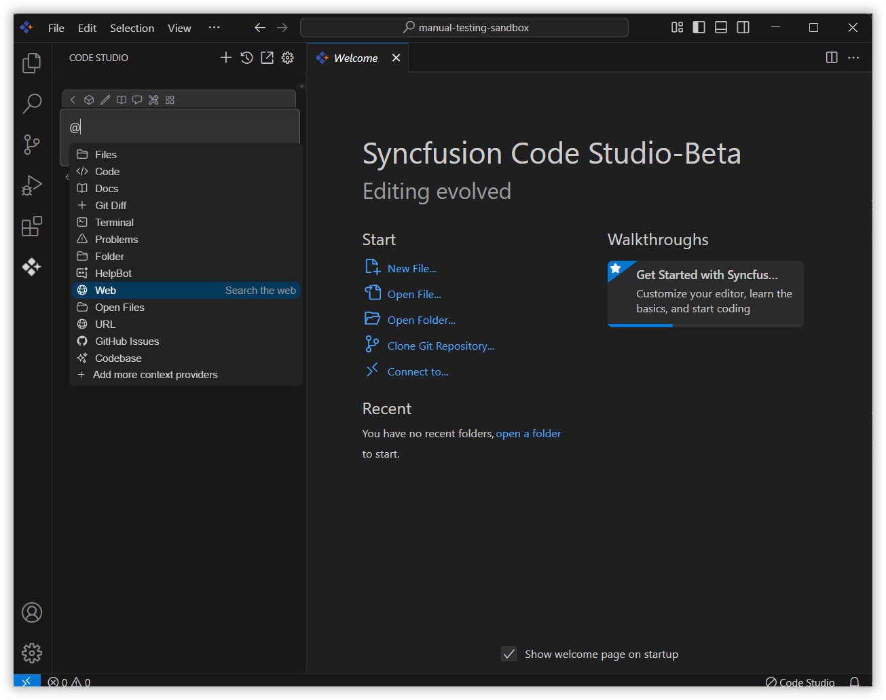
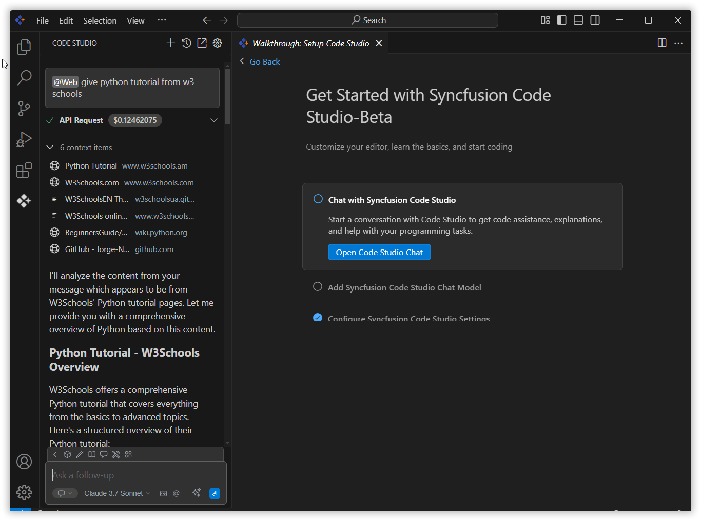

 
# Web 
 
The Web context provider in Syncfusion Code Studio allows the AI to access real-time web content, ensuring responses are accurate, current, and context-aware.
 
## How to Use the Web context
 
### 1. Open the Syncfusion Code Studio
 
In the Syncfusion Code Studio, the chat interface is located on the left-hand side. This is where you can interact with AI and ask questions or get assistance.

 
### 2. Select Web context
 
In the chat window, click the `@` button.  
> **Note:** If you cannot locate the Web context option in the list, you will need to add it manually to include this context provider, Please follow the steps outlined in this [link](https://help.syncfusion.com/code-studio/features/context-providers/add-more-contextproviders/How-to-configure-more-contextproviders) to do so.

 
A menu will appear—select Web

 
### 3. Use Web context with query
 
After selecting the Web context provider option, type your query for which you want the AI to provide the latest up-to-date information.  
Now, the web context provider will give the response from the latest web content and display the context items that are passed to the AI model, providing up-to-date information for the conversation.

